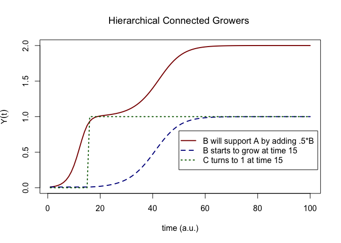
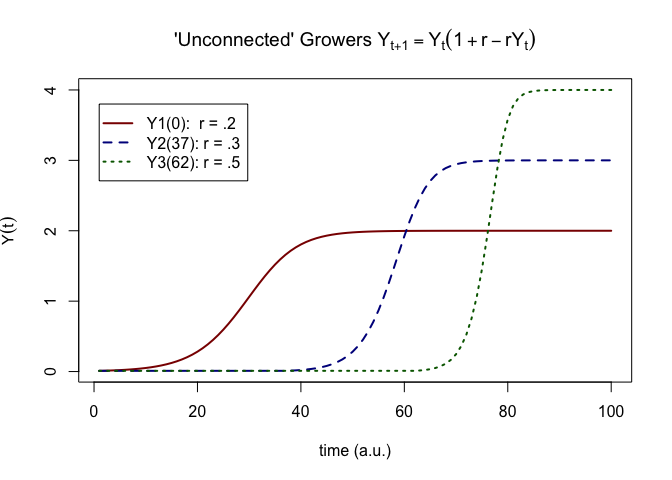
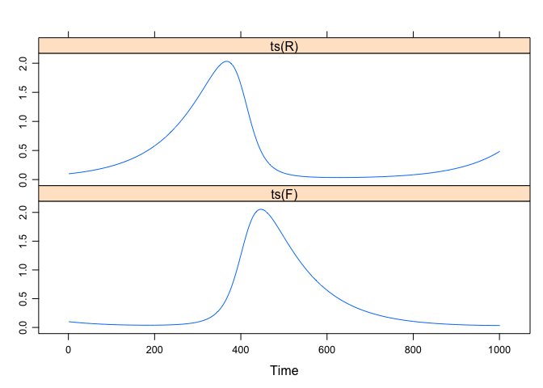
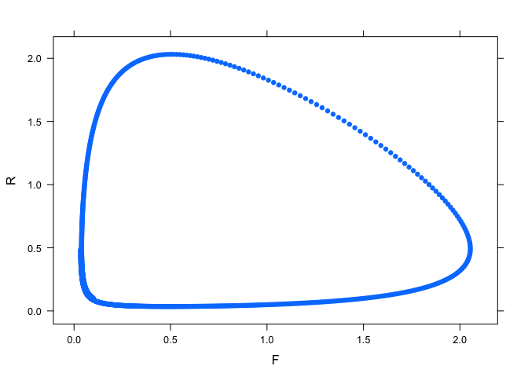
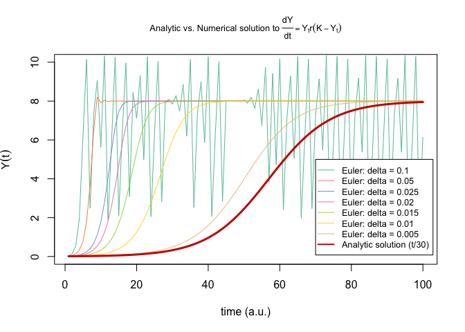

# **Multivariate systems**

By multivariate systems we do not simply mean there is more than 1 iterative process (dynamical variable), but that there is a coupling between at least two iterative processes that makes the outcomes of each individual process at each time step (partially) dependent on the previous time step of other processes.

We'll start by expanding on the previous assignment ([EXTRA: van Geert's growth model](https://docs.google.com/spreadsheets/d/1DAg0u-zMFOIvRSDOZDxqnzyS0HQJg4FIXzJIMvEMwiI/edit?usp=sharing)), in which changes in the parameter values were modelled by implementing an `IF ... THEN` rule that evaluated whether some threshold level was reached. In the first assignment you'll create a kind of **one-directional coupling**, or **supportive interaction**, which is just a precursor to modelling more interesting interaction dynamics.

You'll also model the so-called Lottka-Volterra equations, representing **competetive interactions** between two iterative processes, also known as **predator-prey dynamics**. You can imagine these equations represent populations of *Foxes* and *Rabbits* in which the population of the  predators (Foxes) depends on the available prey (Rabbits) and vice versa. To do model these equations, you'll need to learn a bit about modelling **flows**: Continuous time differential equations. 


## **One directional coupling**

A more realistic way to model a change of growth parameter `r` using `IF ... THEN` statements, is to make the growth of a variable depend on another process. The proper *dynamical* way to do this would be to define a coupled system of difference or differential equations in which the interaction dynamics completely regulate growth (or decay) of the variables directly, such as the predator-prey system in the next assignment. 

In this assignment we'll keep using at least one 'conditional' rule and try to implement emergent levels by creating **supportive interactions** between separate processes. This is probably the most simple version of *interaction dynamics*, *coupling dynamics*, or *multiplicative interactions* with more then one iterative process. Basically, the processes will still be rather independent from one another and the interaction simply means a 'shock' is delivered to an individual process, after which the system just continuous to evolve on its own. 


### Connected growers {.tabset .tabset-fade .tabset-pills}

For this assignment, we'll use a different way to achieve the levels created in the previous assignment in which   `IF ... THEN` statements were used to achieve changes in dynamics. The conditional rules that change the parameters were 'given', we'll try to be a bit more dynamical... 

Have a look at [this spreadsheet](https://docs.google.com/spreadsheets/d/1cbC58yTg-pOoThMQY0UyzIQ3ZiaTosJlqQFkRHt9LJg/edit?usp=sharing) in which a model is implemented that is discussed in the following chapter by Paul van Geert:

[Van Geert, P. (2003). Dynamic systems approaches and modeling of developmental processes. In J. Valsiner and K. J. Conolly (Eds.), Handbook of developmental Psychology. London: Sage. Pp. 640-672](http://www.paulvangeert.nl/publications_files/Handbook%20Valsiner%20and%20Conolly.pdf).

Relevant text pertaining to this assignment:

* BUILDING YOUR OWN MODELS: A SHORT TUTORIAL (p. 665)
    + The model is discussed in "A Model of Hierarchically Connected Growers"

#### Questions {-}

Try to model this example of supportive interaction in `R`. 

\BeginKnitrBlock{rmdnote}<div class="rmdnote">The spreadsheetmodel tries to mimic Figures 28.6 to 28.8 in van Geert (2003), but only column `A` receives a 'support' boost As noted in the text:
  
"A similar set of equations can be set up, applying to columns B and C respectively."
</div>\EndKnitrBlock{rmdnote}


* You can use the template function below
* You can look in the spreadsheet, or look in the chapter to find the right formula's for `A` and `B`
* Make a plot like in the spreadsheet
    + Note that the function returns a data frame with A, B and C


```r
vanGeert.support <- function(A0 = 0.01, Ar = .5, AK = 1, 
                             B0 = 0.01, Br = .2, BK = 1, 
                             C0 = 0, C1 = 1, Cr = 1, CK = 1, 
                             AtoC = 0.8, BsupportA = .5, N = 100){
  
  # Create a vector A,B,C of length N, which has value A0,B0,C0 at A[1],B[1],C[1]
  A <- c(A0, rep(NA, N-1))
  B <- c(B0, rep(NA, N-1))
  C <- c(C0, rep(NA, N-1))
  
  # Then, you need create the iteration
  for(i in 1:(N-1)){
    
    # You need to monitor the value of L and change the growth rate according to a rule
    if(A[i]<AtoC){
      C[i+1] <- # Value of C0
    } else {
      C[i+1] <- # Value of C1
    }
    
    A[i+1] <- # Implement A with support from B
    B[i+1] <- # Implement B whose growth depends on C
  }
  
  return(data.frame(A=A,B=B,C=C))
}
```


#### Answers {-}

* The template filled in with the correct functions and parameter settings


```r
vanGeert.support <- function(A0 = 0.01, Ar = .5, AK = 1, 
                             B0 = 0.01, Br = .2, BK = 1, 
                             C0 = 0, C1 = 1, Cr = 1, CK = 1, 
                             AtoC = 0.8, BsupportA = .5, N = 100){
  
  # Create a vector A,B,C of length N, which has value A0,B0,C0 at A[1],B[1],C[1]
  A <- c(A0, rep(NA, N-1))
  B <- c(B0, rep(NA, N-1))
  C <- c(C0, rep(NA, N-1))
  
  # Then, you need create the iteration
  for(i in 1:(N-1)){
    
    # You need to monitor the value of L and change the growth rate according to a rule
    if(A[i]<AtoC){
      C[[i+1]] <- C0
    } else {
      C[[i+1]] <- C1
    }
    
    A[i+1] <- A[i] + A[i] * Ar * (1 - A[i] / AK) + A[i] * B[i] * BsupportA # A10 + A10 * $A$5 * (1 - A10 / $A$4) + A10 * B10 * $B$2
    B[i+1] <- B[i] + B[i] * Br * (1 - B[i] / BK) * C[i]                    # B10 + B10 * $B$5 * (1 - B10 / $B$4) * C10
    
  }
  
  return(data.frame(A=A,B=B,C=C))
}
```

* Make a plot like in the spreadsheet
    + Note that the function returns a data frame with A, B and C


```r
Y <- vanGeert.support()

ts.plot(ts(Y$A), ts(Y$B), ts(Y$C),
        gpars = list(xlab = "time (a.u.)",
                     ylab = expression(Y(t)),
                     main = expression(paste("Hierarchical Connected Growers ")),
                     lwd = rep(2,3),
                     lty = c(1:3),
                     col = c("darkred","darkblue","darkgreen")
                     )
        )
legend(50, .8, c("B will support A by adding .5*B",
                 paste0("B starts to grow at time ",which(Y$A > .8)[1]), 
                 paste0("C turns to 1 at time ",which(Y$A > .8)[1])),
       lwd = rep(2,3), lty = c(1:3), col = c("darkred","darkblue","darkgreen"), merge = TRUE)
```

<!-- -->


* This would be the *not-so-dynamical* way to do it:


```r
library(casnet)

# Generate 3 timeseries
Y1 <- casnet::growth_ac(k = 2, r =.2, type = "vanGeert")
# Y2 and Y3 start at r = 0.001
Y3 <- Y2 <- casnet::growth_ac(k = 2, r = 0.001, type = "vanGeert")

# Y2 and Y3 start when k is approached
c1 <- 1.6
c2 <- 2.2

# Here we just swap the new values with the old values
Y2[Y1 > c1] <- casnet::growth_ac(r = .3, k = 3, type = "vanGeert", N = sum(Y1 > c1))
Y3[Y2 > c2] <- casnet::growth_ac(r = .5, k = 4, type = "vanGeert", N = sum(Y2 > c2))

# Make a nice plot
ts.plot(Y1, Y2, Y3,
        gpars = list(xlab = "time (a.u.)",
                     ylab = expression(Y(t)),
                     main = expression(paste("'Unconnected' Growers ",Y[t+1]==Y[t]*(1 + r - r*Y[t]))),
                     lwd = rep(2,3),
                     lty = c(1:3),
                     col = c("darkred","darkblue","darkgreen")
                     )
        )
legend(1, 3.8, c("Y1(0):  r = .2",
                 paste0("Y2(",which(Y1 > c1)[1],"): r = .3"), 
                 paste0("Y3(",which(Y2 > c2)[1],"): r = .5")),
       lwd = rep(2,3), lty = c(1:3), col = c("darkred","darkblue","darkgreen"), merge = TRUE)
```

<!-- -->


### Other demonstrations of dynamic modeling using spreadsheets

See the website by [Paul Van Geert](http://www.paulvangeert.nl/research.htm), scroll down to see models of:

* Learning and Teaching
* Behaviour Modification
* Connected Growers
* Interaction during Play

</br>


</br>
</br>

## **The predator-prey model**


In this assignment we will look at a 2D coupled dynamical system: **the Predator-Prey model** (aka [Lotka-Volterra equations](https://en.wikipedia.org/wiki/Lotka-Volterra_equations)).      

The dynamical system is given by the following set of first-order differential equations, one represents changes in a population of predators, (e.g., **F**oxes: $f_F(R_t,F_t)$ ), the other represents changes in a population of prey, (e.g., **R**abbits: $f_R(R_t,F_t)$ ).


\begin{align}
\frac{dR}{dt}&=(a-b*F)*R \\
\\
\frac{dF}{dt}&=(c*R-d)*F
(\#eq:lv)
\end{align}


This is not a *difference* equation but a *differential* equation, which means building this system is not as straightforward as was the case in the previous assignments. Simulation requires a numerical method to 'solve' this differential equation for time, which means we need a method to approach, or estimate continuous time in discrete time. Below you will receive a speed course in one of the simplest numerical procedures for integrating differential equations, the [Euler method](https://en.wikipedia.org/wiki/Euler_method) ([also see the notes in the course book](https://darwin.pwo.ru.nl/skunkworks/courseware/1819_DCS/numerical-integration-to-simulate-continuous-time.html)).    


### Euler's Method {-}

A general differential equation is given by:

\begin{equation}
\frac{dx}{dt} = f(x)
(\#eq:diff)
\end{equation}

Read it as saying: "_a change in $x$ over a change in time is a function of $x$ itself_". This can be approximated by considering the change to be over some constant, small time step $\Delta$:

\begin{equation}
\frac{(x_{t+1} = x_t)}{\Delta} = f(x_t)
(\#eq:Euler)
\end{equation}

After rearranging the terms a more familiar form reveals itself:

\begin{align}
x_{t+1} &= x_t &= f(x_t) * \Delta \\
x_{t+1} &= f(x_t) * \Delta + x_t
(\#eq:Euler2)
\end{align}

This looks like an ordinary iterative process, $\Delta$ the *time constant* determines the size of time step taken at every successive iteration. For a 2D system with variables **R** and **F** on would write:
    
\begin{align}
R_{t+1} &= f_R(R_t,Ft) * \Delta + R_t \\
F_{t+1} &= f_F(R_t,F_t) * \Delta + F_t
(\#eq:EulerRF)
\end{align}
    
</br>
</br>

### Foxes and Rabbits in R {.tabset .tabset-fade .tabset-pills}

Use `R` to implement [the model in this spreadsheet](https://docs.google.com/spreadsheets/d/1rZDEo8XYNCzhRWrWOli7DDB6f4m87p-hjYv2_KlBLa4/edit?usp=sharing)


#### Questions{-}

* To get the right equations, you'll have to substitute $f_R(R_t,Ft)$ and $f_F(R_t,F_t)$ with the differential equations for Foxes and Rabbits provided above.
* Use the following parameter settings:
    + `N` = `1000`
    + `a` and `d` are `1`
    + `b` and `c` are `2` 
    + Initial values `R0` and `F0` are `0.1`
* Make a plot of the time series for Foxes and Rabbits
* Make a plot of the 2D state space of this system (aka *phase plane*)
    + Examine how the state space changes for different parameter settings

#### Answers {-}


The Euler set-up:
$$
\begin{align}
R_{t+1} &= f_R(R_t,Ft) * \Delta + R_t \\
F_{t+1} &= f_F(R_t,F_t) * \Delta + F_t
\end{align}
$$

With the equations:
$$
\begin{align}
R_{t+1} &=  (a-b*F_t)*R_t * \Delta + R_t \\
\\
F_{t+1} &=  (c*R_t-d)*F_t * \Delta + F_t
\end{align}
$$


```r
library(plyr)
library(lattice)

# Parameters
N  <- 1000
a  <- d <- 1
b  <- c <- 2 
R0 <- F0 <- 0.1
R  <- as.numeric(c(R0, rep(NA,N-1)))
F  <- as.numeric(c(F0, rep(NA,N-1)))

# Time constant
delta <- 0.01

# Numerical integration of the lpredator-prey system
l_ply(seq_along(R), function(t){
    R[[t+1]] <<- (a - b * F[t]) * R[t] * delta + R[t] 
    F[[t+1]] <<- (c * R[t] - d) * F[t] * delta + F[t] 
    })

# Note different behaviour when ts() is applied
lattice::xyplot(cbind(ts(R),ts(F)))
```

<!-- -->

```r
lattice::xyplot(R ~ F, pch = 16)
```

<!-- -->


### **Growth functions in continuous time**

The result of applying a method of **numerical integration** such a s Euler's method is called a **numerical solution** of the differential equation. The **analytical solution** is the equation which will give you a value of $Y$ for any point in time, given an initial value $Y_0$. Systems which have an analytical solution can be used to test the accuracy of **numerical solutions**.

The logistic differential equation $\frac{dY}{dt} = r*Y_t*\left(1-\frac{Y_t}{K}\right)$ has an analytic solution given as:

$$
\frac{K * Y_0}{Y_0 + \left(K-Y_0\right) * e^{-r*t} }
$$
We have the implemented discrete time growth function in `growth_ac()`, but could easily adapt all those functions to make them continuous by using Euler's method. 

Below is a comparison of the analytic solution of the continuous logistic growth function, with the result of using Euler's method to approximate the continuous time function.


```r
library(plyr)
library(RColorBrewer)
# Parameter settings
delta <- .1
N <- 100

# W'ell make time vector to get a smoot analytis solution
TIME <- seq(1,N,by=1)

r <- 3.52 # Remember this setting? This means Chaos in discrete time, in continous time it means extreme growth.

# Carrying capacity and initial condition are chosen se we get a nice plot
K  <-  8
Y0 <- .01

deltas <- c(delta, delta*.5,delta*.25,delta*.2,delta*.15,delta*.1,delta*.05)
cl <- brewer.pal(length(deltas),"Set2")

# Numerical integration of the logistic differential equation as implemented in growth_ac()
Y.euler <- llply(deltas, function(d){
  # Use the values in deltas to get iterate the logistic flow
  Y <- as.numeric(c(Y0, rep(NA,length(TIME)-1)))
  ts(sapply(seq_along(TIME), function(t) Y[[t+1]] <<- ((r * Y[t] * (K - Y[t])) * d) + Y[t] ))
  })

# Analytical solution
# We have to scale TIME a bit, normally we would use 1/TIME
Y.analytic <- ts( K * Y0 / (Y0 + (K - Y0) * exp(-1*(r*TIME/30))) )

ts.plot(Y.euler[[1]], Y.euler[[2]] ,Y.euler[[3]], Y.euler[[4]], Y.euler[[5]], Y.euler[[6]], Y.euler[[7]], Y.analytic,
        gpars = list(xlab = "time (a.u.)",
                     ylab = expression(Y(t)),
                     main = expression(paste("Analytic vs. Numerical solution to ",frac(dY,dt)==Y[t]*r*(K-Y[t]))),
                     lwd = c(rep(1,length(deltas)),3),
                     lty = 1,
                     col = c(cl,"red3"),
                     ylim = c(0,10),
                     cex.main = .8
                     )
        )

legend(70, 5, c(paste("Euler: delta =",deltas),"Analytic solution (t/30)"),
       lwd = c(rep(1,length(deltas)),2),
       lty = 1,
       col = c(cl,"red3"),
       merge = TRUE, cex = .8)
```

<!-- -->

\BeginKnitrBlock{rmdnote}<div class="rmdnote">If you want to learn how to put mathematical operators in legends and axes using `expression()`, see the webpage [Mathematical Annotation in R](http://vis.supstat.com/2013/04/mathematical-annotation-in-r/)</div>\EndKnitrBlock{rmdnote}

When `delta` is relatively large, the fluctuations still resemble deterministic chaos, as delta gets closer to 0, this 'smooths out' the fluctuations and the analytic solution is approached. As a consequence, it takes longer and longer to reach `K`. However, 'longer' is of course relative to the unit of time represented on the x-axis, because we're simulating, they are arbitrary units.


## **Beyond Foxes and Rabbits**

In the [course book](https://complexity-methods.github.io/book/advmodels.html) we listed some more advanced models that build on the basic models we discussed here.

----


</br>
</br>


