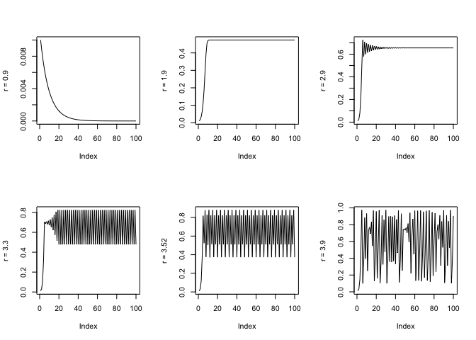

# **Modelling (nonlinear) growth and Deterministic Chaos**

In this assignment you will examine two (relatively) simple one-dimensional maps based on the models implemented in a spreadsheet. Just copy the linked Google Sheet to a new on-line Google Sheet, or, save it to your computer and use your favourite spreadsheet software (e.g., Excel, Numbers) to explore the behaviour of the model.    
    
We will start with the *Linear Map* and then proceed to the slightly more complicated *Logistic Map* (aka *Quadratic map*). You can also use `R` to model the dynamical processes, but for now we will assume you'll use the spreadsheets linked to in the assignments.

</br>

\BeginKnitrBlock{rmdnote}<div class="rmdnote">Check the solutions of the assignments **after** you tried to do them on your own!    
  
Also, have a look at the examples on [plotting time series in `R` in the course book](https://darwin.pwo.ru.nl/skunkworks/courseware/book/1819_CMBS/plotTS.html) on different ways to visualize time series in `R`.</div>\EndKnitrBlock{rmdnote}

</br>

## **The Linear Map**

</br>

Equation \@ref(eq:linmap) is the ordinary difference equation (ODE) discussed in [the course book](https://darwin.pwo.ru.nl/skunkworks/book/courseware/1819_CMBS/introduction-to-the-mathematics-of-change.html) and is called the *Linear Map*:
  
\begin{equation}
Y_{i+1} = Y_{i=0} + r*Y_i
(\#eq:linmap)
\end{equation}
  
In these exercises you will *simulate* time series produced by the change process in equation \@ref(eq:linmap) for different parameter settings of the growth-rate parameter $r$ (the *control parameter*) and the initial conditions $Y_0$. *Simulation* is obviously different from a statistical analysis in which parameters are estimated from a data set. The goal of these assignments is to get a feeling for what a dynamical model is, and in what way it is different from a linear statistical regression model like GLM.

</br>

\BeginKnitrBlock{rmdnote}<div class="rmdnote">It is common practice to use $Y_{i}$ for the current state and $Y_{i+1}$ for the next state of a discrete time model (a map, a difference equation). For a continuous time model (a flow, a differential equation), sometimes $Y_{t}$ and $\hat{Y_t}$ are used. More common is the $\delta$, or *'change in'* notation: $\frac{dY}{dt} = Y_0 + r * Y(t)$, which you can pronounce as *'a change in Y over a change in time is a function of ...'*. However, different authors have different preferences and may use other notations.</div>\EndKnitrBlock{rmdnote}
  
</br>

### Growth in a Spreadsheet
  
</br>

\BeginKnitrBlock{rmdimportant}<div class="rmdimportant">If you want to modify the spreadsheets and use them as a template for other assignments, be sure to check the following settings: 
  
* Open a Microsoft Excel worksheet or a [Google sheet](https://www.google.com/docs/about/)
* Check whether the spreadsheet uses a 'decimal-comma' ($0,05$) or 'decimal-point' ($0.05$) notation. 
    + The numbers given in the assignments of this course all use a 'decimal-point' notation.
* Check if the `$` symbol fixes rows and columns when it used in a formula in your preferred spreadsheet program. 
    + This is the default setting in Microsoft Excel and Google Sheets. If you use one of those programs you are all set.</div>\EndKnitrBlock{rmdimportant}

</br>

First study the behaviour of the **Linear map** in a spreadsheet and if you want to, try to implement it in `R`.
  
* Open the [GoogleSheet](https://docs.google.com/spreadsheets/d/1EEpUFxEmelJDPDT61jyT_xfntLo_MYBTW0MZuRSC770/edit?usp=sharing) and look at the **Linear map** tab.
* The `r` in cell `A5` is the *control parameter*, it currently has the value $1.08$ in cell`B5`.
* The cell labelled $Y_0$ in `A6` is the *initial value* at $i=0$. It has the value $0.1$ in cell `B6`.   
* The `A` column also contains $Y_i$, the output of the linear map. 
    + Click on cell `A10`, in the *formula bar* you can see that this cell simply refers to the initial value given in `B6`. So, this will be the first input value to the iterative process.
    + Click on `A11`, this corresponds to time step $i=1$. In the formula bar you can see the very simple implementation of the linear map which calculates the value at $i=1$ from the initial value at $i=0$ and the value of $r$ in `B5`. The value of cell `A11` is the product of the value in cell `B5` (parameter `r`) and the value of cell `A10` ($Y_{i=0}$).
    
</br>

\BeginKnitrBlock{rmdkennen}<div class="rmdkennen">A reminder of what the model represents:     
      
* We are calculating $Y_{i+1}$ (i.e. 'behaviour' in the future, given the current state)
* This value is *completely determined* by $Y_{t=0}$ (i.e., the first 'input') and the value of the control parameter `r` (the growth rate)
* There are no stochastic components involved in generating the temporal evolution of `Y`</div>\EndKnitrBlock{rmdkennen}
  
</br>

### Change the control parameter, label the order parameter  {.tabset .tabset-fade .tabset-pills}

If you make a copy of the Google Sheet you should be able to edit the cells. If this does not work, [download the spreadsheet from GitHub](https://github.com/complexity-methods/CSA-assignments/blob/master/assignment_data/Iterating1Dmaps/Assignment%20DCS_%20Iterating%201D%20Maps.xlsx)
  
* Change the values in cells `B5` and `B6` and you will see an immediate change in the graph. To study model behaviour, try the following growth parameters:
    + $r =  1.08$
    + $r = -1.08$
    + $r =  1$
    + $r = -1$
    + $r =  0.95$
    + $r = -0.95$

#### Questions {-}
* Are there any *qualitative differences* in the dynamical behaviour of the system that can be attributed parameter values?
* Provide a description for each clearly distinct behaviour displayed by this system (only for the parameter settings you examined). 

#### Answers {-}
* Yes!
    + $r =  1.08$ - Unlimited exponential growth, $Y$ will grow infinitely large
    + $r = -1.08$ - Unstable limit cycle, exponential 2-period oscillation $Y$ will grow infinitely large
    + $r =  1$ - Point attractor, fixed point at $Y = 1$
    + $r = -1$ - Limit cycle, closed period-2 orbit at $Y = [-1,1]$
    + $r =  0.95$ - Exponential decay, $Y$ will approach $0$ in the limit
    + $r = -0.95$ - Point attractor, exponentially decaying 2-period oscillation, $Y$ will approach $0$


\BeginKnitrBlock{rmdkennen}<div class="rmdkennen">The labels assigned to behavioural modes that are clearly qualitatively distinct from one another, are know as the **order parameter**. The **order parameter** will change its value to indicate the system has transitioned to a new behavioural regime. Such changes often occur suddenly with gradual changes in the **control parameter**.     
For example, the (most familiar) phases that describe matter are an **order parameter** (solid, liquid, gas and plasma). We know water will transition from a liquid state to a gas state if we increase the **control parameter** beyond a certain point (e.g. temperature rises above $100^\circ\text{C}$).

Other names you might encounter that refer to the change of the label of an order parameter:
  
* Phase transition/shift
* Order transition
* Critical transition
* Change of behavioural mode/regime
* Change of attractor state/landscape
* Shift between self-organised/stable states/attractors</div>\EndKnitrBlock{rmdkennen}

</br>

### Dependence on initial conditions? {.tabset .tabset-fade .tabset-pills}
  
* Change the initial value $Y_0$ in cell `B6` to $10$ and compare to $0.1$ (if you want to directly compare different settings, just create a new copy of the sheet)
* Subsequently give the growth parameter in cell `B5` the following values:
    + $r =  1.08$
    + $r = -1.08$
    + $r =  1$
    + $r = -1$
    + $r =  0.95$
    + $r = -0.95$ 
  
#### Questions {-}
* Are there any *qualitative differences* in the dynamical behaviour of the system for each parameter setting, that can be attributed to a difference in initial conditions?
  
#### Answers {-}
* No, there are no differences in the overall dynamics due to changes in initial conditions. Of course, the absolute values change, but the temporal pattern of change is the same. 


### **EXTRA:** Using `R` to simulate the Linear Map {.tabset .tabset-fade .tabset-pills}
  
The best (and easiest) way to simulate these simple models in `R` is to create a function, which takes as input arguments the parameters ($Y_0$, $r$) and a variable indicating the length of the time series.

#### Questions {-}

For the Linear Map you could use this template ([also see the notes in the course book](https://darwin.pwo.ru.nl/skunkworks/courseware/1819_CMBS/implementing-iterative-functions.html)):


```r
# TEMPLATE
# Modify this function
linearMap <- function(Y0 = 0, r = 1, N = 100){
                    # Y0, r and N are arguments to this function, they have been given default values
                    # When you call the function you can pass different values to these arguments
    
    # Initialize Y as vector of Y0, followed by N-1 empty slots (NA).
    Y <- c(Y0, rep(NA,N-1))
    
    # Then, you need create the iteration using a for(... in ...){...} loop
    for(i in 1:(N-1)){
        
    Y[i+1] <- # !!Implement the code for the linear or Quadratic map here!!
        
    }
    
    return(Y)
}
```

</br>

* Copy the code to `R` and implement the Linear Map by looking at the formula, or the spreadsheet.
* To test it, you need to initialize the function by selecting the function code and running it. 
    + The environment will now contain a function called `linearMap`
* Generate some data by calling the function using $Y0=0.1$, $r=1.08$ and $N=100$ and store the result in a variable. 

#### Answers {-}


```r
# Linear Map
linearMap <- function(Y0 = 0, r = 1, N = 100){
  
  # Initialize Y as vector of Y0, followed by N-1 empty slots (NA).
  Y <- c(Y0, rep(NA,N-1))
  
  # Then, you need create the iteration
  for(i in 1:(N-1)){
    
    Y[i+1] <- r * Y[i] # The linear difference equation
    
    }
  
  return(Y)
}
```

</br>

### Plot the timeseries {.tabset .tabset-fade .tabset-pills}

#### Questions {-}

Creating a time series plot is easy if the function `linearMap` returns the time series as a numeric vector. You could just use:


```r
plot(linearMap(Y0=0.1,r=1.08,N=100), type = "l")
```

But perhaps better to first save the output of the function and then plot it:


```r
Y <- linearMap(Y0=0.1,r=1.08,N=100)
plot(Y, type = "l")
```

#### Answers {-}


```r
plot(linearMap(Y0=0.1,r=1.08,N=100), type = "l")
```

<!-- -->

`R` and `Matlab` have specialized objects to represent time series, and functions and packages for time series analysis. These are especially convenient for plotting time and date information on the X-axis. See the examples on plotting [time series in `R` in Chapter 2](https://darwin.pwo.ru.nl/skunkworks/courseware/book/1819_CMBS/plotTS.html).
  
</br>
</br>

## **The Logistic Map** 
  
The Logistic Map takes the following functional form: 
  
\begin{equation}
Y_{i+1} = r*Y_i*(1-Y_i)
(\#eq:logmap)
\end{equation}
  
### Chaos in a spreadsheet 
  
* Open the [GoogleSheet](https://docs.google.com/spreadsheets/d/1EEpUFxEmelJDPDT61jyT_xfntLo_MYBTW0MZuRSC770/edit?usp=sharing) and look at the **Logistic map** tab.
* The set-up is the same as for the linear map, except of course the implemented change process.
* The `A` column contains $Y_i$, the output of the Logistic map. With $r=1.3$ the behaviour looks a lot like an S-curve, a logistic function.
* Check the following:
    + Click on `A10`, in the formula bar you can see this refers to the initial value `B6`.
    + Click on `A11`, in the formula bar you can see the very simple implementation of the Logistic map.
    + The value of cell `A11` ($Y_{i=1}$) is calculated by multiplying the value of cell `B5` (parameter `r`) with the value of cell `A10` (the current value $Y_i$, in this case $Y_{i=0}$). The only difference is we are also multiplying by $(1-Y_i)$.

</br>

\BeginKnitrBlock{rmdselfThink}<div class="rmdselfThink">We established that `r` controls growth, what could be the function of $(1-Y_t)$?</div>\EndKnitrBlock{rmdselfThink}

</br>

### Change the control parameter, label the order parameter {.tabset .tabset-fade .tabset-pills}
  
To study the behaviour of the Logistic Map you can start changing the values in `B5`. 
  
* Try the following settings for $r$:
    + $r = 0.9$
    + $r = 1.9$
    + $r = 2.9$
    + $r = 3.3$
    + $r = 3.52$
    + $r = 3.9$

#### Questions {-}
  
* Are there any *qualitative differences* in the dynamical behaviour of the system that can be attributed parameter values?
* Provide a description for each clearly distinct behaviour (the labels of the order parameter) displayed by this system (only for the parameter settings you examined). 
  
#### Answers {-}

* Yes!
* With $Y_0 = 0.01$:
    + $r = 0.9$ - Point attractor, fixed point at $Y = 0$
    + $r = 1.9$ - Point attractor, fixed point at $Y = 0.4737$
    + $r = 2.9$ - Point attractor, fixed point at $Y = 0.6552$
    + $r = 3.3$ - Limit cycle attractor, closed period 2 orbit at $Y =  [0.8236, 0.4794]$
    + $r = 3.52$ - Limit cycle attractor, closed period 4 orbit at $Y =  [0.5121, 0.8795, 0.3731, 0.8233]$
    + $r = 3.9$ - Strange attractor, a-periodic orbit all values between $\approx0.01$ and $\approx0.99$


  
### The return plot {.tabset .tabset-fade .tabset-pills}
  
#### Questions {-}

* Set $r$ at $4.0$:
    + How would you describe the dynamics of the time series? Periodic? Something else?
    + Check the values, is there any value that is recurring, for example like when $r=3.3$? Perhaps if you increase the length of the simulation?
* Select the values in both columns under $Y(i)$ and $Y(i+1)$, (`A10` to `B309`) and create a scatter-plot (no lines, just points).
    + The points should line up to represent a familiar shape...

</br>

\BeginKnitrBlock{rmdkennen}<div class="rmdkennen">The plot you just produced is a so called **return plot**, in which you have plotted $Y_{i+1}$ against $Y_i$. We shifted the time series by 1 time step, which is why this is also called a **lag 1 plot**.    

Can you explain the pattern you see (a 'parabola') by looking closely at the functional form of the Logistic Map? (hint: another name for this equation is the **Quadratic Map**).

If you change the control parameter to a lower value the return plot will seem to display a shape that is no longer a parabola, but this is not the case, all values produced by by the Logistic Map **must** be a point on a parabola. Some parameter settings just do not produce enought different points for the parabola to show itself in the return plot.</div>\EndKnitrBlock{rmdkennen}

</br>

* What do you expect the return plot of the **Linear Map** will look like? Go ahead and try it!

</br>

\BeginKnitrBlock{rmdselfThink}<div class="rmdselfThink">The return plot is an important tool for getting a 'first impression' of the nature of the dynamic process that generated the observed values:
  
* Try to imagine what the lag 1 plot of a cubic difference equation would look like
* What about the return plot for a timeseries of independent random numbers (white noise)?     
* We are of course not limited to a lag of 1, what happens at lag 2, or lag 10 in the return plots of the Linear and Quadratic Map?</div>\EndKnitrBlock{rmdselfThink}

#### Answers {-}

* Set $r$ at $4.0$:
    + The dynamics are called a-periodic, or quasi-periodic, or, chaotic.
    + None of the values will exactly recur!!
* Select the values in both columns under $Y(i)$ and $Y(i+1)$, (`A10` to `B309`) and create a scatter-plot (no lines, just points).
    + The points form a parabola
    + The return plot for both maps can be seen [here](https://docs.google.com/spreadsheets/d/17PBTvGa1Hu9spqEQGuhpwWXGeY7Nujkm09pxcppKPn4/edit?usp=sharing) 


</br>

### Sensitive dependence on initial conditions?  {.tabset .tabset-fade .tabset-pills}
  
Go to the following [GoogleSheet](https://docs.google.com/spreadsheets/d/1xaZJLYfZzkxg_PXCAa7QT7p4R_JTnUIxzs_Qs1-RAOQ/edit?usp=sharing) and download or copy it.
  
#### Questions {-}
  
* Imagine these are observed time series from two subjects in a response time experiment. These subjects are perfect 'twins':
    + The formula describing their behaviour is exactly the same (it's the Quadratic Map, check it!)
    + The control parameter, controlling the behavioural mode is exactly the same ($r=4$).
    + The only difference is that they have a tiny discrepancy in initial conditions in cell `D6` of $0.01$.
* Not tiny enough? Change it to become even smaller:
    + $0.001$
    + $0.0001$
    + $0.00001$
    + etc.
* What happens as you make the discrepancy smaller and smaller?

</br>


#### Answers {-}

By making the discrepancy smaller the two time series will become more similar.

\BeginKnitrBlock{rmdkennen}<div class="rmdkennen">This sheet displays the extreme sensitivity to changes in initial conditions displayed by the Logistic Map for specific parameter settings. This specific phenomenon is more commonly referred to as **The Butterfly Effect**. It is a characteristic of a very interesting and rather mysterious behaviour displayed by deterministic dynamical equations known as **deterministic chaos**.

However, perhaps even more important to notice here, is the fact that a wide range of qualitatively different behaviourial modes can be understood as originating from one and the same, rather simple, dynamical system. The different behavioural modes were observed for different values of a control parameter, which, in real-world models, often represents an observable (physical) quantity (e.g. temperature, available resources, chemical gradient, etc.) 

The Logistic Map is the simplest nontrivial model that can display deterministic chaos.</div>\EndKnitrBlock{rmdkennen}

</br>

### Use `R` to simulate the Logistic Map {.tabset .tabset-fade .tabset-pills}

The best (and easiest) way to simulate the discrete time models is to create a function which takes as input the parameters ($Y_0$, $r$) and a variable indicating the length of the time series.

#### Questions {-}

To model the Logistic Map, use this template:


```r
# TEMPLATE
# Modify this function
logisticMap <- function(Y0 = 0.01, r = 1, N = 100){
    
    # Initialize Y as vector of Y0, followed by N-1 empty slots (NA).
    Y <- c(Y0, rep(NA,N-1))
    
    # Then, you need create the iteratation
    for(i in 1:(N-1)){
        
    Y[i+1] <- # !!Implement the linear or logistic map here!!
        
    }
    
    return(Y)
}
```

</br>

* Copy the code above and implement the Logistic Map.
* When you are done, you need to initialize the function, select the code and run it. 
    + The environment will now contain a function called `logisticMap`
    + Generate some data by calling the function using $Y0=0.1$, $r=4$ and $N=100$ (or any other values you want to explore) and store the result in a variable. 
    

#### Answers {-}


```r
# Logistic Map
logisticMap <- function(Y0 = 0.01, r = 1, N = 100){
    
    # Initialize Y as vector of Y0, followed by N-1 empty slots (NA).
    Y <- c(Y0, rep(NA,N-1))
    
    # Then, you need create the iteratation
    for(i in 1:(N-1)){
        
    Y[i+1] <- r * Y[i] * (1 - Y[i]) # The quadratic difference equation
       
    }
    
    return(Y)
}
```


### Plot the timeseries {.tabset .tabset-fade .tabset-pills}

#### Questions {-}

Creating a time series plot is easy if the function `linearMap` returns the time series as a numeric vector. You could just use:


```r
plot(logisticMap(Y0=0.01,r=1.9,N=100), type = "l")
```

* Also try to create a graph that demonstrates the sensitive dependence on initial conditions
* Create the lag 1 return plot.
      + Also try to create a lag 2, lag 3 and lag 4 return plot.
      + Can you explain the patterns?


#### Answers {-}


```r
library(plyr)
rs <- c(0.9,1.9,2.9,3.3,3.52,3.9)
op<-par(mfrow=c(2,3))
l_ply(rs,function(r) plot(logisticMap(r=r),ylab = paste("r =",r) ,type = "l"))
```

<!-- -->

```r
par(op)
```

* Also try to create a graph that demonstrates the sensitive dependence on initial conditions
* Create the lag 1 return plot.
      + Also try to create a lag 2, lag 3 and lag 4 return plot (increase N to 500 or 1000).
      + Can you explain the patterns?


```r
lags <- c(1,2,3,4)
N <- 1000
op <- par(mfrow = c(2,2), pty = "s")
l_ply(lags, function(l) {plot(dplyr::lag(logisticMap(r=4,N=N),l), logisticMap(r=4,N=N), pch = ".", xlim = c(0,1), ylim = c(0,1), xlab = "Y(t)", ylab = "Y(t+1)",  main = paste("lag =",l))})
```

<!-- -->

```r
par(op)
```

</br>

