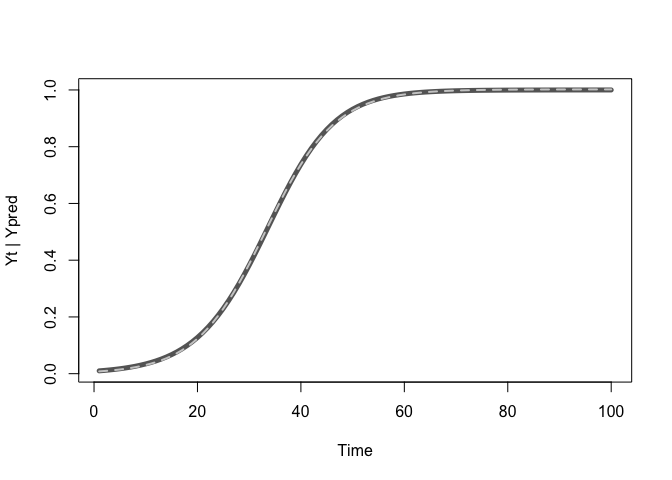
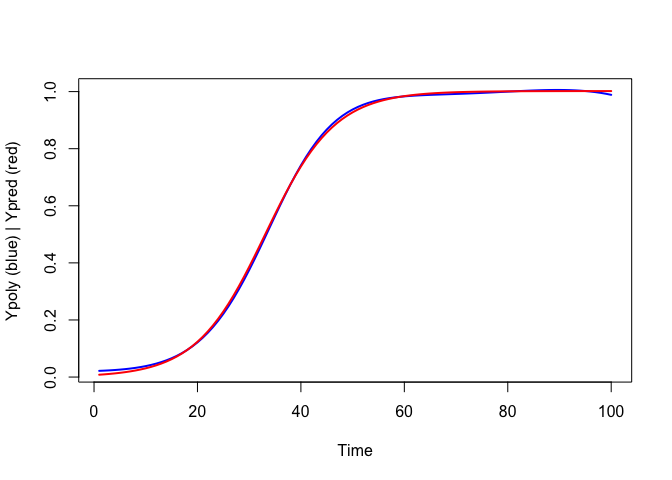

<!-- </br> -->
<!-- </br> -->


# **Fitting Parameters of Analytic Solutions [EXTRA]**


## **Non-linear Growth curves**


### Fitting the Logistic Growth model in SPSS {.tabset .tabset-fade .tabset-pills}

#### Questions {-}

Open the file [Growthregression.sav](https://github.com/FredHasselman/The-Complex-Systems-Approach-Book/blob/master/assignments/assignment_data/BasicTSA_nonlinreg/GrowthRegression.sav), it contains two variables: `Time` and `Y(t)`. 

This is data from an iteration of the logistic growth differential equation you are familiar with by now, but let’s pretend it’s data from one subject measured on 100 occasions.

* Plot Y(t) against Time Recognize the shape?
* To get the growth parameter we’ll try to fit the solution of the logistic flow with SPSS non-linear regression
     + Select non-linear… from the `Analysis` >> `Regression` menu.
     + Here we can build the solution equation. We need three parameters:
            a. **Yzero**, the initial condition.
            b. *K*, the carrying capacity.
            c. *r*, the growth rate.
     + Fill these in where it says `parameters` give all parameters a starting value of  $0.01$

Take a good look at the analytic solution of the (stylized) logistic flow:

$$
Y(t)  =  \frac{K * Y_0}{Y_0 + \left(K-Y_{0}\right) * e^{-r*t} }
$$

Try to build this equation, the function for $e$ is called `EXP` in `SPSS` (`Function Group` >> `Arithmetic`)
Group terms by using parentheses as shown in the equation.

* If you think you have built the model correctly, click on `Save` choose `predicted values`. Then paste your syntax and run it!
    + Check the estimated parameter values.
    + Check $R^2$!!!

* Plot a line graph of both the original data and the predicted values. (Smile)

You can try do the same using a polynomial approach.

* A polynomial fishing expedition:
    + Create time-varying 'covariates' of $Y(t)$:
```
COMPUTE T1=Yt * Time.
COMPUTE T2=Yt * (Time ** 2). 
COMPUTE T3=Yt * (Time ** 3). 
COMPUTE T4=Yt * (Time ** 4). 
EXECUTE.
```
    + Use these variables as predictors of $Y(t)$ in a regular linear regression analysis. This is called a *polynomial regression*: Fitting combinations of curves of different shapes on the data.
    + Before you run the analysis: Click `Save` Choose `Predicted Values: Unstandardized`

\BeginKnitrBlock{rmdselfthink}<div class="rmdselfthink">Look at $R^2$. This is also almost 1!

Which model is better? 

Think about this: Based on the results of the linear regression what can you tell about the *growth rate*, the *carrying capacity* or the *initial condition*?</div>\EndKnitrBlock{rmdselfthink}

*	Create a line graph of $Y(t)$, plot the predicted values of the non-linear regression and the unstandardised predicted values of the linear polynomial regression against `time` in one figure.
    + Now you can see that the shape is approximated by the polynomials, but it is not quite the same. Is this really a model of a growth process as we could encounter it in nature?


#### Answers {-}

The solutions are also provided as an `SPSS` [syntax file](https://github.com/FredHasselman/The-Complex-Systems-Approach-Book/blob/master/assignments/assignment_data/BasicTSA_nonlinreg/GrowthRegression_sol.sps) file.

Or copy the block below:
```
GRAPH
  /LINE(SIMPLE)=VALUE(Yt) BY Time.

* NonLinear Regression.
MODEL PROGRAM  Yzero=0.01 r=0.01 K=0.01.
COMPUTE  PRED_=K*Yzero/(Yzero + (K-Yzero) * EXP(-1*(r * Time))).
NLR Yt
  /PRED PRED_
  /SAVE PRED
  /CRITERIA SSCONVERGENCE 1E-8 PCON 1E-8.

GRAPH
  /LINE(MULTIPLE)=VALUE(Yt PRED_) BY Time.

COMPUTE T1=Yt * Time.
COMPUTE T2=Yt * (Time ** 2).
COMPUTE T3=Yt * (Time ** 3).
COMPUTE T4=Yt * (Time ** 4).
EXECUTE.

REGRESSION
  /MISSING LISTWISE
  /STATISTICS COEFF OUTS R ANOVA
  /CRITERIA=PIN(.05) POUT(.10)
  /NOORIGIN 
  /DEPENDENT Yt
  /METHOD=ENTER T1 T2 T3 T4
  /SAVE PRED.


GRAPH
  /LINE(MULTIPLE)=VALUE(Yt PRED_ PRE_1) BY Time.
```

* The point here is that the polynomial regression approach is "just" curve fitting ... adding components until a nice fit is found ... but what does component $Y_t^4$ represent? A quartic sub-process?
* Fitting the solution of the the logistic function will give us parameters we can interpret unambiguously: Carrying capacity, growth rate, starting value.


### Fitting the Logistic Growth model in R {.tabset .tabset-fade .tabset-pills}

There are several packages that can perform non-linear regression analysis, the function most resembling the approach used by `SPSS` is `nls` in the default `stats` package.  

The easiest way to do this is to first define your function (i.e., the solution) and then fit it using starting values for the parameters.


```r
library(rio)
df <- import("https://github.com/FredHasselman/The-Complex-Systems-Approach-Book/raw/master/assignments/assignment_data/BasicTSA_nonlinreg/GrowthRegression.sav", setclass = "tbl_df")

# Create the function for the analytic solution
# Same as SPSS syntax: PRED_=K*Yzero/(Yzero + (K-Yzero) * EXP(-1*(r * Time))).
log.eq <- function(Yzero, r, K, Time) {
    K*Yzero/(Yzero + (K-Yzero) * exp(-1*(r * Time)))
}
```

There is one drawback and you can read about in the help pages:

> Warning. Do not use nls on artificial "zero-residual" data.

This means, "do not use it on data generated by a deterministic model which has no residual error", which is exactly what the time series in this assignment is, it is the output of the logistic flow.

So, this will give an error:

```r
# Fit this function ... gives an error
# The list after 'start' provides the initial values
m.log <- nls(Yt ~ log.eq(Yzero, r, K, Time), data = df, start = list(Yzero=.01, r=.01, K=1), trace = TRUE)
```


We'll provide you the answers right away, but be sure to figure out what is going on.


#### Answers{-}

It is possible to fit these ideal data using package `minpack.lm`, which contains function `nlsM`.


```r
library(minpack.lm)

m.log <- nlsLM(Yt ~ log.eq(Yzero, r, K, Time), data = df, start = list(Yzero = .01, r=.01, K=0.1))

summary(m.log)
```

```
## 
## Formula: Yt ~ log.eq(Yzero, r, K, Time)
## 
## Parameters:
##        Estimate Std. Error t value Pr(>|t|)    
## Yzero 7.055e-03  8.983e-05   78.53   <2e-16 ***
## r     1.494e-01  3.878e-04  385.18   <2e-16 ***
## K     1.002e+00  4.376e-04 2289.42   <2e-16 ***
## ---
## Signif. codes:  0 '***' 0.001 '**' 0.01 '*' 0.05 '.' 0.1 ' ' 1
## 
## Residual standard error: 0.002865 on 97 degrees of freedom
## 
## Number of iterations to convergence: 21 
## Achieved convergence tolerance: 1.49e-08
```

In order to look at the model prediction, we use `predict()` which is defined for almost all model fitting functions in `R`

```r
Ypred <- predict(m.log)

plot(ts(df$Yt), col="gray40", lwd=5, ylab = ("Yt | Ypred"))
lines(Ypred, col="gray80", lwd=2, lty=2)
```

<!-- -->

Then we do a polynomial regression using `lm`:

```r
# Mimic the SPSS syntax
attach(df)
  df$T1 <- Yt * Time
  df$T2 <- Yt * (Time^2) 
  df$T3 <- Yt * (Time^3) 
  df$T4 <- Yt * (Time^4)
detach(df)

m.poly <- lm(Yt ~ T1 + T2 + T3 + T4, data=df)
summary(m.poly)
```

```
## 
## Call:
## lm(formula = Yt ~ T1 + T2 + T3 + T4, data = df)
## 
## Residuals:
##        Min         1Q     Median         3Q        Max 
## -0.0117491 -0.0046800 -0.0000683  0.0045719  0.0112732 
## 
## Coefficients:
##               Estimate Std. Error t value Pr(>|t|)    
## (Intercept)  2.113e-02  1.258e-03   16.80   <2e-16 ***
## T1           6.366e-02  7.169e-04   88.80   <2e-16 ***
## T2          -1.497e-03  3.100e-05  -48.28   <2e-16 ***
## T3           1.510e-05  4.425e-07   34.12   <2e-16 ***
## T4          -5.529e-08  2.055e-09  -26.90   <2e-16 ***
## ---
## Signif. codes:  0 '***' 0.001 '**' 0.01 '*' 0.05 '.' 0.1 ' ' 1
## 
## Residual standard error: 0.005506 on 95 degrees of freedom
## Multiple R-squared:  0.9998,	Adjusted R-squared:  0.9998 
## F-statistic: 1.264e+05 on 4 and 95 DF,  p-value: < 2.2e-16
```

Then, predict and plot!

```r
Ypoly <- predict(m.poly)

plot(ts(Ypoly), col="blue1", lwd=2, ylab = ("Ypoly (blue) | Ypred (red)"))
lines(Ypred, col="red1", lwd=2)
```

<!-- -->

SPSS computes an $r^2$ value for non-linear regression models, which doesn't make a lot of sense if you think about it. Here we van just compare the residual errors:

* Polynomial regression: $0.005506$
* Analytic solution: $0.002865$

Slightly less residual error for the analytic solution, using less parameters to fit the model (3 vs. 5). **More important:**, the parameters of the analytic solution have a direct interpretation in terms of growth processes.


