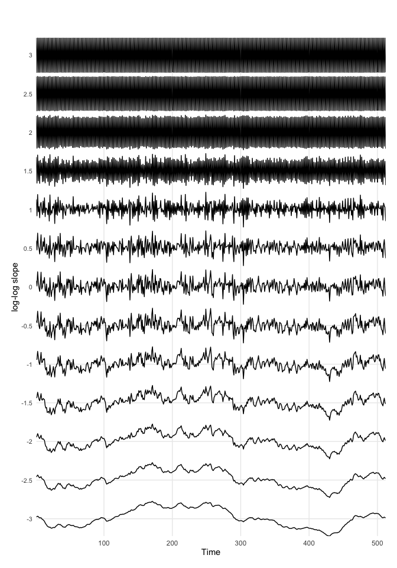
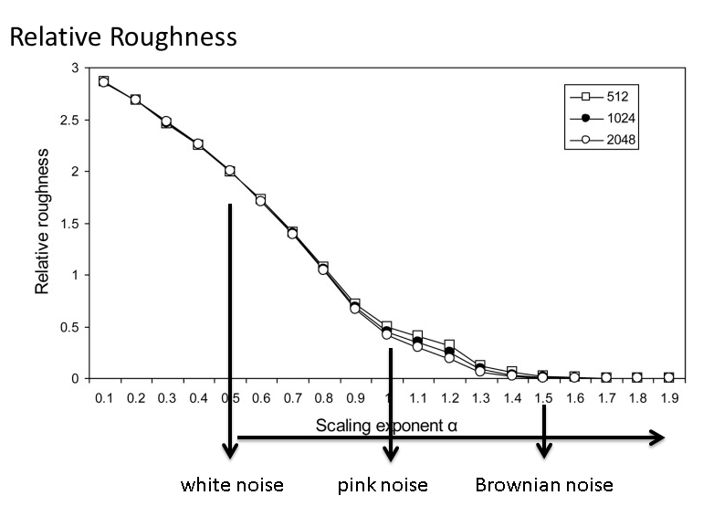

# **Basic Nonlinear Timeseries Analysis** 

Many nonlinear analyses can be considered "descriptive" techniques, that is, the aim is not to fit the parameters of a model, but to describe, quantitatively, some aspects of how one value changes into another value over time.


### Intuitive notion of Fractal Dimension {-}

A qualitative description of the fractal dimension of a time series (or 1D curve) can be given by deciding whether the curve looks/behaves like a line, or, like a plane. 

As can be seen in the figure below, if slow processes (low frequencies) dominate the signal, they are more *line-like* and will have a fractal dimension closer to `1`. If fast processes (high frequencies) dominate the signal, they are more *plane-like* and will have a fractal dimension closer to `2`. 


```r
library(casnet)
library(plyr)

N    <- 512
noises <- round(seq(-3,3,by=.5),1)

yy <- llply(noises, function(a){cbind(noise_powerlaw(alpha = a, N = 512, seed = 1234))})
names(yy) <- noises
tmp<- data.frame(yy,check.names = FALSE)

plotTS_multi(tmp, ylabel = "Scaling exponent alpha")
```

<!-- -->


## Three time series

We are going to analyse 3 different time series using different techniques. The goal is to describe the dynamics, temporal patterns (if any) and perhaps other interesting characteristics of these time series.


**Importing data**

Two ways:

A. By downloading:

  1. Follow the link, e.g. for [`series.sav`](https://github.com/complexity-methods/CSA-assignments/blob/master/assignment_data/BasicTSA_arma/series.xlsx).
  2. On the Github page, find a button marked **Download** (or **Raw** for textfiles).
  3. Download the file
  4. Load it into `R` using the code below       


```r
library(rio)
series <- rio::import("series.xlsx")
```
     
      
B. By importing from Github:

   1. Copy the `url` associated with the **Download**  button [on Github](https://github.com/complexity-methods/CSA-assignments/blob/master/assignment_data/BasicTSA_arma/series.csv) (right-clik).
   2. The copied path should contain the word 'raw' somewhere in the url.
   3. Call `rio::import(url)`
        

```r
library(rio)
series <- rio::import("https://github.com/complexity-methods/CSA-assignments/raw/master/assignment_data/BasicTSA_arma/series.xlsx")
```


### Relative Roughness   {.tabset .tabset-fade .tabset-pills}


#### Questions {-}

*	Construct a graphical representation of the time series, and inspect their dynamics visually (plot the time series).
* Write down your first guesses (i.e., which one looks more like a line than a plane, which one looks more 'smooth' than 'rough'?).
*	Next, explore some measures of central tendency and dispersion (calculate the mean, variance standard deviation)
*	Compute the Relative Roughness for each time series.
   - You can try to figure it out for yourself by using Equation \@ref(eq:RR)
   - There is also a function in `casnet` that will do everything for you: `fd_RR()`


\begin{equation}
RR = 2\left[1 + \frac{\gamma_1(x_i)}{Var(x_i)}\right]
(\#eq:RR)
\end{equation}

The numerator in the formula stands for the `lag 1` autocovariance of the HBI time series $x_i$. The denominator stands for the (global) variance of $x_i$. Most statistics packages can calculate these variances, `R` and `Matlab` have built in functions. Alternatively, you can create the formula yourself.


* Calculate the Relative Roughness of the 2 time series using function `fd_RR`

Use Figure \@ref(fig:RRf3) to lookup which value of $RR$ corresponds to which type of dynamics:


<div class="figure" style="text-align: center">

<p class="caption">(\#fig:RRf3)Coloured Noise versus Relative Roughness</p>
</div>


### Sample Entropy  {.tabset .tabset-fade .tabset-pills}

Use the `sample_entropy()` function in package `pracma`.

#### Questions {-}

* Calculate the Sample Entropy of the two sets of three time series you now have.
    + Use your favourite function to estimate the sample entropy of the three time series. Use for instance a segment length `edim` of 3 data points, and a tolerance range `r` of 1 * the standard deviation of the series. What values do you observe?
    + Can you change the absolute SampEn outcomes by 'playing' with the m parameter? If so, how does the outcome change, and why?
    + Can you change the absolute SampEn outcomes by 'playing' with the r parameter If so, how does the outcome change, and why?
    + Do changes in the relative SampEn outcome change the outcomes for the three time series relative to each other?

*	Extra: Go back to the assignment where you generated simulated time series from the logistic map.


#### Answers {-}

Change some of the parameters.


```r
library(rio)
library(pracma)
## 
## Attaching package: 'pracma'
## The following object is masked from 'package:casnet':
## 
##     repmat

# ACF assignment data `series`
cat(paste0("\nseries.TS1 m=3\n",sample_entropy(series$TS_1, edim = 3, r = sd(series$TS_1))))
## 
## series.TS1 m=3
## 0.652582760511648
cat(paste0("\nseries.TS2 m=3\n",sample_entropy(series$TS_2, edim = 3, r = sd(series$TS_2))))
## 
## series.TS2 m=3
## 0.195888185092471
cat(paste0("\nseries.TS3 m=3\n",sample_entropy(series$TS_3, edim = 3, r = sd(series$TS_3))))
## 
## series.TS3 m=3
## 0.528115883767288


# ACF assignment data `series`
cat(paste0("\nseries.TS1 m=6\n",sample_entropy(series$TS_1, edim = 6, r = sd(series$TS_1))))
## 
## series.TS1 m=6
## 0.676004479826967
cat(paste0("\nseries.TS2 m=6\n",sample_entropy(series$TS_2, edim = 6, r = sd(series$TS_2))))
## 
## series.TS2 m=6
## 0.167801266934409
cat(paste0("\nseries.TS3 m=6\n",sample_entropy(series$TS_3, edim = 6, r = sd(series$TS_3))))
## 
## series.TS3 m=6
## 0.527677852462416


# ACF assignment data `series`
cat(paste0("\nseries.TS1 m=6, r=.5\n",sample_entropy(series$TS_1, edim = 3, r = .5*sd(series$TS_1))))
## 
## series.TS1 m=6, r=.5
## 1.26945692316692
cat(paste0("\nseries.TS2 m=6, r=.5\n",sample_entropy(series$TS_2, edim = 3, r = .5*sd(series$TS_2))))
## 
## series.TS2 m=6, r=.5
## 0.641584864066123
cat(paste0("\nseries.TS3 m=6, r=.5\n",sample_entropy(series$TS_3, edim = 3, r = .5*sd(series$TS_3))))
## 
## series.TS3 m=6, r=.5
## 0.5894301000077
```

The change of `m` keeps the relative order, change of `r` for the same `m` does not.

**Values of other time series**


```r

# Logistic map
library(casnet)
cat("\nLogistic map\nr=2.9\n")
## 
## Logistic map
## r=2.9
y1<-growth_ac(r = 2.9,type="logistic")
sample_entropy(y1, edim = 3, r = sd(y1))
## [1] 0.0002390343
cat("\nLogistic map\nr=4\n")
## 
## Logistic map
## r=4
y2<-growth_ac(r = 4,type="logistic")
sample_entropy(y2, edim = 3, r = sd(y2))
## [1] 0.5293149
```


