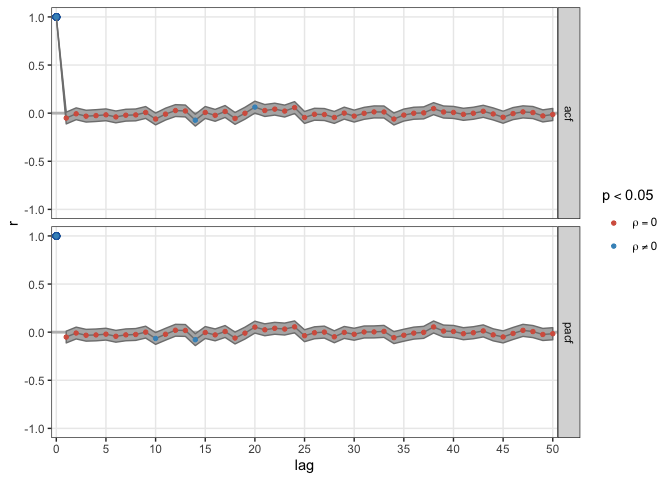
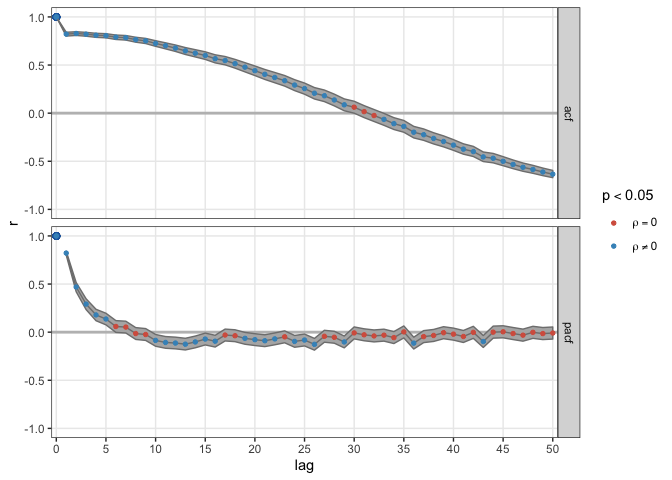
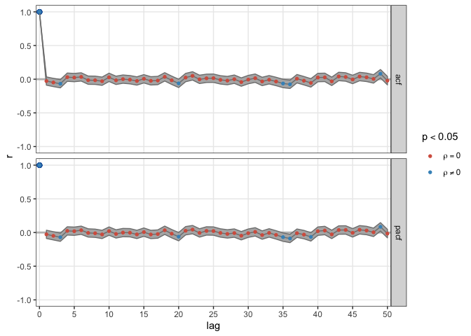

# **Basic Timeseries Analysis** 

In this course we will not discuss the type of linear time series models known as Autoregressive Models (e.g. AR, ARMA, ARiMA, ARfiMA) summarised on [this Wikipedia page on timeseries](https://en.wikipedia.org/wiki/Time_series#Models). We will in fact be discussing a lot of methods in a book the Wiki page refers to for *'Further references on nonlinear time series analysis'*: [**Nonlinear Time Series Analysis** by Kantz & Schreiber](https://www.cambridge.org/core/books/nonlinear-time-series-analysis/519783E4E8A2C3DCD4641E42765309C7). You do not need to buy the book, but it can be a helpful reference if you want to go beyond the formal level (= mathematics) used in this course. Some of the packages we use are based on the companying software [**TiSEAN**](https://www.pks.mpg.de/~tisean/Tisean_3.0.1/index.html) which is written in `C` and `Fortran` and can be called from the command line (Windows / Linux).


## **Correlation functions**  

Correlation functions are intuitive tools for quantifying the temporal structure in a time series. As you know, correlation can only quantify linear regularities between variables, which is why we discuss them here as `basic` tools for time series analysis. So what are the variables? In the simplest case, the variables between which we calculate a correlation are between a data point at time *t* and a data point that is separated in time by some *lag*, for example, if you would calculate the correlation in a lag-1 return plot, you would have calculated the 1st value of the correlation function (actually, it is 2nd value, the 1st value is the correlation of time series with itself, the lag-0 correlation, which is of course $r = 1$)  

### ACF and PCF {.tabset .tabset-fade .tabset-pills}


You can do the analyses in SPSS, `R` or JAMOVI. This analysis is very common, so you'll find functions called `acf`, `pacf`and `ccf` in many other statistical software packages, In package `casnet` you can use the function `plotRED_acf()` (plot REDundancies).

First, download the file [`series.sav`](https://github.com/FredHasselman/The-Complex-Systems-Approach-Book/blob/master/assignments/assignment_data/BasicTSA_arma/series.sav) from Github. 

#### Questions {-}

`series.sav` contains three time series `TS_1`, `TS_2` and `TS_3` . As a first step look at the mean and the standard deviation (SPSS: `Analyze` >> `Descriptives`; R: summary(series)).  Suppose these were time series from three different subjects in an experiment, what would you conclude based on the means and SD’s?  

* Let’s visualize these data (in SPSS fo to `Forecasting` >> `Time Series` >> `Sequence Charts`. Check the box One chart per variable and move all the variables to `Variables`. Are they really the same?  

* Let’s look at the `ACF` and `PCF`
    + Go to `Analyze` >> `Forecasting` >> `Autocorrelations`. 
    + Enter all the variables and make sure both *Autocorrelations* (ACF) and *Partial autocorrelations* (PACF) boxes are checked. Click `Options`, and change the `Maximum Number of Lags` to `30`. 
    + Use the table to characterize the time series:  


|                    SHAPE                | INDICATED MODEL |
|-----------------------------------------|-------------------------------------------------------------------------------------------------|
|       Exponential, decaying to zero     | Autoregressive model. Use the partial autocorrelation plot to identify the order of the autoregressive model|
| Alternating positive and negative, decaying to zero  | Autoregressive model. Use the partial autocorrelation plot to help identify the order.|
| One or more spikes, rest are essentially zero | Moving average model, order identified by where plot becomes zero. |
| Decay, starting after a few lags | Mixed autoregressive and moving average model.|
All zero or close to zero  | Data is essentially random.|
| High values at fixed intervals | Include seasonal autoregressive term. |
| No decay to zero  | Series is not stationary. |


* In the simulation part of this course we have learned a very simple way to explore the dynamics of a system: The return plot. The time series is plotted against itself shifted by 1 step in time. 

* Create return plots (use a Scatterplot) for the three time series. Tip: You can easily create a `t+1` version of the time series by using the LAG function in a `COMPUTE` statement. For instance:

```
COMPUTE TS_1_lag1 = LAG(TS_1)
```
    
* Are your conclusions about the time series based on interpreting these return plots the same as based on the `acf` and `pacf`?
     
     
#### Answers (SPSS) {-}

If you run this syntax in `SPSS` you'll get the correct output.

```
DESCRIPTIVES
  VARIABLES=TS_1 TS_2 TS_3
  /STATISTICS=MEAN STDDEV MIN MAX .

*Sequence Charts .
TSPLOT VARIABLES= TS_1
  /NOLOG
  /FORMAT NOFILL REFERENCE.
TSPLOT VARIABLES= TS_2
  /NOLOG
  /FORMAT NOFILL REFERENCE.
TSPLOT VARIABLES= TS_3
  /NOLOG
  /FORMAT NOFILL REFERENCE.

*ACF and PCF.

ACF
  VARIABLES= TS_1 TS_2 TS_3
  /NOLOG
  /MXAUTO 30
  /SERROR=IND
  /PACF.


*Return plots.

COMPUTE TS_1_lag1 = LAG(TS_1) .
COMPUTE TS_2_lag1 = LAG(TS_2) .
COMPUTE TS_3_lag1 = LAG(TS_3) .
EXECUTE .


IGRAPH /VIEWNAME='Scatterplot' /X1 = VAR(TS_1_lag1) TYPE = SCALE /Y =
  VAR(TS_1) TYPE = SCALE /COORDINATE = VERTICAL  /X1LENGTH=3.0 /YLENGTH=3.0
  /X2LENGTH=3.0 /CHARTLOOK='NONE' /SCATTER COINCIDENT = NONE.
EXE.

IGRAPH /VIEWNAME='Scatterplot' /X1 = VAR(TS_2_lag1) TYPE = SCALE /Y =
  VAR(TS_2) TYPE = SCALE /COORDINATE = VERTICAL  /X1LENGTH=3.0 /YLENGTH=3.0
  /X2LENGTH=3.0 /CHARTLOOK='NONE' /SCATTER COINCIDENT = NONE.
EXE.

IGRAPH /VIEWNAME='Scatterplot' /X1 = VAR(TS_3_lag1) TYPE = SCALE /Y =
  VAR(TS_3) TYPE = SCALE /COORDINATE = VERTICAL  /X1LENGTH=3.0 /YLENGTH=3.0
  /X2LENGTH=3.0 /CHARTLOOK='NONE' /SCATTER COINCIDENT = NONE.
EXE.

```


#### Notes for `R` {-}

If you want to use `R`, just go through the questions and ignore the `SPSS` specific comments. Here are some tips:

**Importing data in `R`**

By downloading:

1. Follow the link, e.g. for [`series.sav`](https://github.com/FredHasselman/The-Complex-Systems-Approach-Book/blob/master/assignments/assignment_data/BasicTSA_arma/series.sav).
2. On the Github page, find a button marked **Download** (or **Raw** for textfiles).
3. Download the file
4. Load it into `R`


```r
library(rio)
series <- import("series.sav", setclass = "tbl_df")
```


By importing from Github:

1. Copy the `url` associated with the **Download**  button on Github (right-clink).
2. The copied path should contain the word 'raw' somewhere in the url.
3. Call `rio::import(url)`

```r
library(rio)
series <- import("https://github.com/FredHasselman/The-Complex-Systems-Approach-Book/raw/master/assignments/assignment_data/BasicTSA_arma/series.sav", setclass = "tbl_df")
```

You can use the functions in the `stats` package: `arima()`, `acf()` and `pacf()`. In package `casnet` you can use the function `plotRED_acf()` (plot REDundancies).

There are many extensions to these linear models, check the [`CRAN Task View` on `Time Series Analysis`](https://cran.r-project.org/web/views/TimeSeries.html) to learn more (e.g. about package `zoo` and `forecast`).


```r
library(casnet)
library(ggplot2)

plotRED_acf(y = series$TS_1,Lmax = 50, returnCorFun = FALSE)
```

```
## Registered S3 method overwritten by 'xts':
##   method     from
##   as.zoo.xts zoo
```

<!-- -->

```r
plotRED_acf(y = series$TS_2,Lmax = 50, returnCorFun = FALSE)
```

<!-- -->

```r
plotRED_acf(y = series$TS_3,Lmax = 50, returnCorFun = FALSE)
```

<!-- -->


<!-- Use Figure \@ref(fig:RRf3) to lookup which value of $RR$ corresponds to which type of dynamics: -->

<!-- **TS1**: Pink noise -->
<!-- **TS2**: Brownian noise -->
<!-- **TS3**: White noise -->


<!-- **Randomize** -->

<!-- To randomize the data you may use the function `sample` (which is easier than `randperm`) -->

<!-- ```{r} -->
<!-- library(pracma) -->
<!-- # randperm() -->
<!-- TS1Random <- TS1$TS1[randperm(length(TS1$TS1))] -->

<!-- # sample() -->
<!-- TS1Random <- sample(TS1$TS1, length(TS1$TS1)) -->
<!-- TS2Random <- sample(TS2$TS2, length(TS2$TS2)) -->
<!-- TS3Random <- sample(TS3$TS3, length(TS3$TS3)) -->


<!-- plot.ts(TS1Random) -->
<!-- lines(ts(TS1$TS1),col="red3") -->
<!-- ``` -->

<!-- If you repeat this for TS2 and TS3 and compute the Relative Roughness of each randomized time series, the outcomes should be around 2, white noise! This makes sense, you destroyed all the correlations in the data by removing the temporal order with which values were observed. -->

<!-- ```{r} -->
<!-- library(casnet) -->
<!-- cat("TS1random\n") -->
<!-- cat(fd_RR(TS1Random)) -->
<!-- cat("\nTS2random\n") -->
<!-- cat(fd_RR(TS2Random)) -->
<!-- cat("\nTS3random\n") -->
<!-- cat(fd_RR(TS3Random)) -->
<!-- ``` -->

<!-- **Integrate** -->

<!-- Normalize the white noise time series -->
<!-- ```{r} -->
<!-- TS3Norm <- scale(TS3$TS3) -->
<!-- ``` -->

<!-- Now integrate it, which just means, 'take the cumulative sum'. -->
<!-- ```{r} -->
<!-- TS3Int <- cumsum(TS3Norm) -->
<!-- plot.ts(TS3Int) -->
<!-- lines(ts(TS3Norm),col="red3") -->
<!-- ``` -->

<!-- If you compute the Relative Roughness of the integrated time series, the outcome should be close to 0, Brownian noise. -->
<!-- ```{r} -->
<!-- cat("\nTS3Int\n") -->
<!-- cat(RR(TS3Int)) -->
<!-- ``` -->


<!-- ### Sample Entropy  {.tabset .tabset-fade .tabset-pills} -->

<!-- Use the `sample_entropy()` function in package `pracma`. -->

<!-- #### Questions {-} -->

<!-- * Calculate the Sample Entropy of the two sets of three time series you now have. -->
<!--     + Use your favourite function to estimate the sample entropy of the three time series. Use for instance a segment length `edim` of 3 data points, and a tolerance range `r` of 1 * the standard deviation of the series. What values do you observe? -->
<!--     + Can you change the absolute SampEn outcomes by 'playing' with the m parameter? If so, how does the outcome change, and why? -->
<!--     + Can you change the absolute SampEn outcomes by 'playing' with the r parameter If so, how does the outcome change, and why? -->
<!--     + Do changes in the relative SampEn outcome change the outcomes for the three time series relative to each other? -->

<!-- *	Extra: Go back to the assignment where you generated simulated time series from the logistic map. -->


<!-- #### Answers {-} -->

<!-- Change some of the parameters. -->

<!-- ```{r,collapse=TRUE} -->
<!-- library(rio) -->
<!-- library(pracma) -->

<!-- # ACF assignment data `series` -->
<!-- cat(paste0("\nseries.TS1 m=3\n",sample_entropy(series$TS_1, edim = 3, r = sd(series$TS_1)))) -->
<!-- cat(paste0("\nseries.TS2 m=3\n",sample_entropy(series$TS_2, edim = 3, r = sd(series$TS_2)))) -->
<!-- cat(paste0("\nseries.TS3 m=3\n",sample_entropy(series$TS_3, edim = 3, r = sd(series$TS_3)))) -->


<!-- # ACF assignment data `series` -->
<!-- cat(paste0("\nseries.TS1 m=6\n",sample_entropy(series$TS_1, edim = 6, r = sd(series$TS_1)))) -->
<!-- cat(paste0("\nseries.TS2 m=6\n",sample_entropy(series$TS_2, edim = 6, r = sd(series$TS_2)))) -->
<!-- cat(paste0("\nseries.TS3 m=6\n",sample_entropy(series$TS_3, edim = 6, r = sd(series$TS_3)))) -->


<!-- # ACF assignment data `series` -->
<!-- cat(paste0("\nseries.TS1 m=6, r=.5\n",sample_entropy(series$TS_1, edim = 3, r = .5*sd(series$TS_1)))) -->
<!-- cat(paste0("\nseries.TS2 m=6, r=.5\n",sample_entropy(series$TS_2, edim = 3, r = .5*sd(series$TS_2)))) -->
<!-- cat(paste0("\nseries.TS3 m=6, r=.5\n",sample_entropy(series$TS_3, edim = 3, r = .5*sd(series$TS_3)))) -->

<!-- ``` -->

<!-- The change of `m` keeps the relative order, change of `r` for the same `m` does not. -->

<!-- **Values of other time series** -->

<!-- ```{r message=FALSE, warning=FALSE, collapse=TRUE} -->

<!-- # RR assignment data `TS1,TS2,TS3` -->
<!-- cat(paste0("\nTS1\n",sample_entropy(TS1$TS1, edim = 3, r = sd(TS1$TS1)))) -->
<!-- cat(paste0("TS1Random\n",sample_entropy(TS1Random, edim = 3, r = sd(TS1Random)))) -->

<!-- cat(paste0("\nTS2\n",sample_entropy(TS2$TS2, edim = 3, r = sd(TS2$TS2)))) -->
<!-- cat(paste0("TS2Random\n",sample_entropy(TS2Random, edim = 3, r = sd(TS2Random)))) -->

<!-- cat(paste0("\nTS3\n",sample_entropy(TS3$TS3, edim = 3, r = sd(TS3$TS3)))) -->
<!-- cat(paste0("TS3Int\n",sample_entropy(TS3Norm, edim = 3, r = sd(TS3Norm)))) -->


<!-- # Logistic map -->
<!-- library(casnet) -->
<!-- cat("\nLogistic map\nr=2.9\n") -->
<!-- y1<-growth_ac(r = 2.9,type="logistic") -->
<!-- sample_entropy(y1, edim = 3, r = sd(y1)) -->
<!-- cat("\nLogistic map\nr=4\n") -->
<!-- y2<-growth_ac(r = 4,type="logistic") -->
<!-- sample_entropy(y2, edim = 3, r = sd(y2)) -->


<!-- ``` -->


