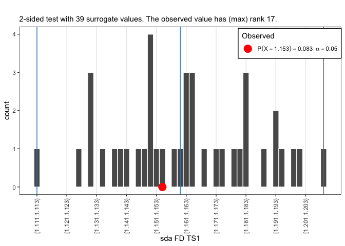
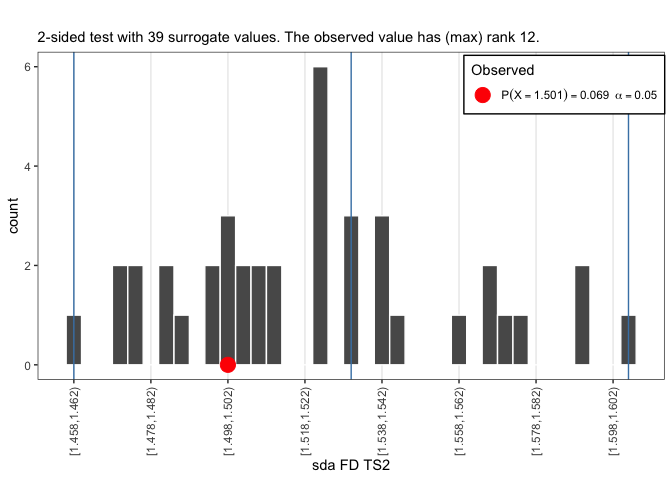
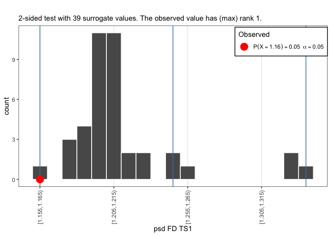
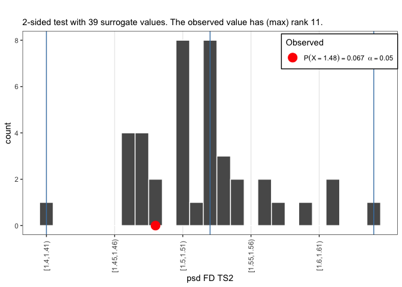
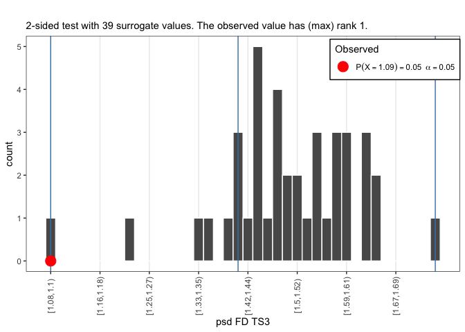

# **Fluctuation and Disperion analyses** {-}

    
### Three time series {-}

We are going to analyse the same 3 time series as last session, now using fluctuation and dispersion analysis. 

**Importing data**

Two ways:

A. By downloading:

  1. Follow the link, e.g. for [`series.xlsx`](https://github.com/complexity-methods/CSA-assignments/blob/master/assignment_data/BasicTSA_arma/series.xlsx).
  2. On the Github page, find a button marked **Download** (or **Raw** for text files).
  3. Download the file
  4. Load it into `R` using the code below       


```r
library(rio)
series <- rio::import("series.xlsx")
```
     
      
B. By directly importing the file in R from Github:

   1. Copy the `url` associated with the **Download**  button [on Github](https://github.com/complexity-methods/CSA-assignments/blob/master/assignment_data/BasicTSA_arma/series.csv) (right-click).
   2. The copied path should contain the word 'raw' somewhere in the url.
   3. Call `rio::import(url)`
        

```r
library(rio)
series <- rio::import("https://github.com/complexity-methods/CSA-assignments/raw/master/assignment_data/BasicTSA_arma/series.xlsx")
```


        
        
      
###  Standardised Dispersion Analysis {.tabset .tabset-fade .tabset-pills}


#### Questions {-}

* Common data preparation before running fluctuation analyses like `SDA`:
    + Normalize the time series (using `sd` based on `N`, not `N-1`, e.g. by using `ts_standardise()`, or use function arguments)
    + Check whether time series length is a power of `2`. If you use `N <- log2(length(y))`, the number you get is `2^N`. You need an integer power for the length in order to create equal bin sizes. You can pad the series with 0s, or make it shorter before analysis.
* Perform `sda` on the 3 time series, or any of the other series you already analysed.
* Compare to what you find for `fd_sda` to the other techniques (`fd_RR`,`SampEn`, `acf`, `pacf`)


#### Answers {-}


```r
library(casnet)

fdS1 <- fd_sda(series$TS_1, returnPLAW = TRUE)
## 
## 
## fd_sda:	Sample rate was set to 1.
## 
## 
## ~~~o~~o~~casnet~~o~~o~~~
## 
##  Standardised Dispersion Analysis 
## 
##  Full range (n = 10)
## Slope = -0.64 | FD = 1.64 
## 
##  Fit range (n = 9)
## Slope = -0.61 | FD = 1.61
## 
## ~~~o~~o~~casnet~~o~~o~~~
fdS2 <- fd_sda(series$TS_2, returnPLAW = TRUE)
## 
## 
## fd_sda:	Sample rate was set to 1.
## 
## 
## ~~~o~~o~~casnet~~o~~o~~~
## 
##  Standardised Dispersion Analysis 
## 
##  Full range (n = 10)
## Slope = -0.58 | FD = 1.58 
## 
##  Fit range (n = 9)
## Slope = -0.55 | FD = 1.55
## 
## ~~~o~~o~~casnet~~o~~o~~~
fdS3 <- fd_sda(series$TS_3, returnPLAW = TRUE)
## 
## 
## fd_sda:	Sample rate was set to 1.
## 
## 
## ~~~o~~o~~casnet~~o~~o~~~
## 
##  Standardised Dispersion Analysis 
## 
##  Full range (n = 10)
## Slope = -0.64 | FD = 1.64 
## 
##  Fit range (n = 9)
## Slope = -0.58 | FD = 1.58
## 
## ~~~o~~o~~casnet~~o~~o~~~

# If you asked to return the powerlaw (returnPLAW = TRUE) the function plotFD_loglog() can make a plot
plotFD_loglog(fdS1,title = "SDA", subtitle = "Series 1")
```

<!-- -->

```r
plotFD_loglog(fdS2,title = "SDA", subtitle = "Series 2")
```

<!-- -->

```r
plotFD_loglog(fdS3,title = "SDA", subtitle = "Series 3")
```

<!-- -->


<!-- **Values of other time series** -->

<!-- ```{r message=FALSE, warning=FALSE, collapse=TRUE, cache=TRUE} -->

<!-- # RR assignment data TS1, TS2, TS3 and shuffled versions -->
<!-- # This is just a check so you can see which bin sizes to expect -->
<!-- # It is also possible to force calclulation of specific bin sizes, see the manual pages for more info ?fd_sda -->
<!-- L1 <- floor(log2(length(TS1$TS1))) -->
<!-- L2 <- floor(log2(length(TS2$TS2))) -->
<!-- L3 <- floor(log2(length(TS3$TS3))) -->

<!-- # You can also ask for a plot directly by passing doPlot = TRUE -->
<!-- fdTS1  <- fd_sda(TS1$TS1[1:2^L1], doPlot = TRUE, tsName = "TS1") -->

<!-- fdTS1r <- fd_sda(TS1Random[1:2^L1], doPlot = TRUE, tsName = "TS1 shuffled") -->


<!-- fdTS2 <- fd_sda(TS2$TS2[1:2^L2], returnPLAW = TRUE) -->
<!-- plotFD_loglog(fdTS2,subtitle = "TS2") -->

<!-- fdTS2r <- fd_sda(TS2Random[1:2^L2], returnPLAW = TRUE) -->
<!-- plotFD_loglog(fdTS2r,subtitle = "TS2 shuffled") -->

<!-- fdTS3 <- fd_sda(TS3$TS3[1:2^L3], returnPLAW = TRUE) -->
<!-- plotFD_loglog(fdTS3,subtitle = "TS3") -->

<!-- fdTS3r <- fd_sda(TS3Random[1:2^L3], returnPLAW = TRUE) -->
<!-- plotFD_loglog(fdTS3r,subtitle = "TS3 shuffled") -->

<!-- fdTS3n <- fd_sda(TS3Norm[1:2^L3], returnPLAW = TRUE) -->
<!-- plotFD_loglog(fdTS3n,subtitle = "TS3 standardised") -->


<!-- # Logistic map -->
<!-- y1 <- growth_ac(r = 2.9, type="logistic",N = 1024) -->
<!-- fdL29 <- fd_sda(y1, returnPLAW = TRUE) -->
<!-- plotFD_loglog(fdL29, subtitle = "Logistic Map: r =  2.9") -->

<!-- y2 <- growth_ac(r = 4, type="logistic", N = 1024) -->
<!-- fdL4 <- fd_sda(y2, returnPLAW = TRUE) -->
<!-- plotFD_loglog(fdL4, subtitle = "Logistic Map: r =  4") -->

<!-- ``` -->


###  Spectral Slope {.tabset .tabset-fade .tabset-pills}


#### Questions {-}

* Common data preparation before running spectral analyses:
    + Normalize the time series (using `sd` based on `N`, not `N-1`)
    + Check whether time series length is a power of `2`. If you use `N <- log2(length(y))`, the number you get is `2^N`. You need an integer power for the length in order to create equal bin sizes. You can pad the series with 0s, or make it shorter before analysis.
* Perform `fd_psd()` on the 3 time series, or any of the other series you already analysed.
* Compare to what you find for `fd_psd` to the other measures (`fd_RR`,`SampEn`, `acf`, `pacf`)


#### Answers {-}


```r

fdS1 <- fd_psd(series$TS_1, doPlot = TRUE)
## 
## 
## fd_psd:	Sample rate was set to 1.
```

<!-- -->

```
## 
## ~~~o~~o~~casnet~~o~~o~~~
## 
##  Power Spectral Density Slope 
## 
##  All frequencies (n = 512)
## Slope = 0.18 | FD = 1.57 
## 
##  Hurvich-Deo (n = 36)
## Slope = 0.29 | FD = 1.61
## 
## ~~~o~~o~~casnet~~o~~o~~~
fdS2 <- fd_psd(series$TS_2, returnPLAW = TRUE)
## 
## 
## fd_psd:	Sample rate was set to 1.
## 
## 
## ~~~o~~o~~casnet~~o~~o~~~
## 
##  Power Spectral Density Slope 
## 
##  All frequencies (n = 512)
## Slope = -0.27 | FD = 1.4 
## 
##  Hurvich-Deo (n = 79)
## Slope = -0.98 | FD = 1.2
## 
## ~~~o~~o~~casnet~~o~~o~~~
plotFD_loglog(fdS2,subtitle = "Series 2")
```

<!-- -->

```r
fdS3 <- fd_psd(series$TS_3, returnPLAW = TRUE)
## 
## 
## fd_psd:	Sample rate was set to 1.
## 
## 
## ~~~o~~o~~casnet~~o~~o~~~
## 
##  Power Spectral Density Slope 
## 
##  All frequencies (n = 512)
## Slope = 0.12 | FD = 1.54 
## 
##  Hurvich-Deo (n = 32)
## Slope = 0.02 | FD = 1.51
## 
## ~~~o~~o~~casnet~~o~~o~~~
plotFD_loglog(fdS3,subtitle = "Series 3")
```

<!-- -->


<!-- **Values of other time series** -->

<!-- ```{r message=FALSE, warning=FALSE, collapse=TRUE, cache=TRUE} -->

<!-- # This is just a check so you can see which frequency range to expect -->
<!-- # It is also possible to force calclulation of specific bin sizes, see the manual pages for more info ?fd_psd -->
<!-- L1 <- floor(log2(length(TS1$TS1))) -->
<!-- L2 <- floor(log2(length(TS2$TS2))) -->
<!-- L3 <- floor(log2(length(TS3$TS3))) -->

<!-- # RR assignment data TS1, TS2, TS3 and shuffled versions -->

<!-- fdTS1 <- fd_psd(TS1$TS1[1:2^L1], doPlot = TRUE, tsName = "TS1") -->

<!-- fdTS1r <- fd_psd(TS1Random[1:2^L1], returnPLAW = TRUE) -->
<!-- plotFD_loglog(fdTS1r,subtitle = "TS1 shuffled") -->

<!-- fdTS2 <- fd_psd(TS2$TS2[1:2^L2], returnPLAW = TRUE) -->
<!-- plotFD_loglog(fdTS2,subtitle = "TS2") -->

<!-- fdTS2r <- fd_psd(TS2Random[1:2^L2], returnPLAW = TRUE) -->
<!-- plotFD_loglog(fdTS2r,subtitle = "TS2 shuffled") -->

<!-- fdTS3 <- fd_psd(TS3$TS3[1:2^L3], returnPLAW = TRUE) -->
<!-- plotFD_loglog(fdTS3,subtitle = "TS3") -->

<!-- fdTS3r <- fd_psd(TS3Random[1:2^L3], returnPLAW = TRUE) -->
<!-- plotFD_loglog(fdTS3r,subtitle = "TS3 shuffled") -->

<!-- fdTS3n <- fd_psd(TS3Norm[1:2^L3], returnPLAW = TRUE) -->
<!-- plotFD_loglog(fdTS3n,subtitle = "TS3 standardised") -->


<!-- # Logistic map -->
<!-- y1 <- growth_ac(r = 2.9, type="logistic",N = 1024) -->
<!-- fdL29 <- fd_psd(as.numeric(y1), returnPLAW = TRUE) -->
<!-- plotFD_loglog(fdL29, subtitle = "Logistic Map: r =  2.9") -->

<!-- y2 <- growth_ac(r = 4, type="logistic", N = 1024) -->
<!-- fdL4 <- fd_psd(as.numeric(y2), returnPLAW = TRUE) -->
<!-- plotFD_loglog(fdL4, subtitle = "Logistic Map: r =  4") -->

<!-- ``` -->


###  Detrended Fluctuation Analysis {.tabset .tabset-fade .tabset-pills}


#### Questions {-}

* Data preparation before running `DFA` analyses are not really necessary, except perhaps:
    + Check whether time series length is a power of `2`. If you use `N <- log2(length(y))`, the number you get is `2^N`. You need an integer power for the length in order to create equal bin sizes. You can pad the series with 0s, or make it shorter before analysis.
* Perform `fd_dfa()` on the 3 time series, or any of the other series you already analysed.
* Compare to what you find for `fd_dfa` to the other measures (`fd_RR`,`SampEn`, `acf`, `pacf`)


#### Answers {-}


```r

fdS1 <- fd_dfa(series$TS_1, doPlot = TRUE)
## 
## 
## fd_dfa:	Sample rate was set to 1.
```

<!-- -->

```
## 
## ~~~o~~o~~casnet~~o~~o~~~
## 
##  Detrended FLuctuation Analysis 
## 
##  Full range (n = 8)
## Slope = 0.44 | FD = 1.55 
## 
##  Exclude large bin sizes (n = 7)
## Slope = 0.45 | FD = 1.54
## 
## ~~~o~~o~~casnet~~o~~o~~~
fdS2 <- fd_dfa(series$TS_2, returnPLAW = TRUE)
## 
## 
## fd_dfa:	Sample rate was set to 1.
## 
## 
## ~~~o~~o~~casnet~~o~~o~~~
## 
##  Detrended FLuctuation Analysis 
## 
##  Full range (n = 8)
## Slope = 1.1 | FD = 1.16 
## 
##  Exclude large bin sizes (n = 7)
## Slope = 1.23 | FD = 1.12
## 
## ~~~o~~o~~casnet~~o~~o~~~
plotFD_loglog(fdS2,subtitle = "Series 2")
```

<!-- -->

```r
fdS3 <- fd_dfa(series$TS_3, returnPLAW = TRUE)
## 
## 
## fd_dfa:	Sample rate was set to 1.
## 
## 
## ~~~o~~o~~casnet~~o~~o~~~
## 
##  Detrended FLuctuation Analysis 
## 
##  Full range (n = 8)
## Slope = 0.47 | FD = 1.52 
## 
##  Exclude large bin sizes (n = 7)
## Slope = 0.47 | FD = 1.53
## 
## ~~~o~~o~~casnet~~o~~o~~~
plotFD_loglog(fdS3,subtitle = "Series 3")
```

<!-- -->


<!-- **Values of other time series** -->

<!-- ```{r message=FALSE, warning=FALSE, collapse=TRUE,cache=TRUE} -->

<!-- # This is just a check so you can see which bin sizes to expect -->
<!-- # It is also possible to force calclulation of specific bin sizes, see the manual pages for more info ?fd_dfa -->
<!-- L1 <- floor(log2(length(TS1$TS1))) -->
<!-- L2 <- floor(log2(length(TS2$TS2))) -->
<!-- L3 <- floor(log2(length(TS3$TS3))) -->

<!-- # RR assignment data TS1, TS2, TS3 and shuffled versions -->

<!-- fdTS1 <- fd_dfa(TS1$TS1[1:2^L1], doPlot = TRUE, tsName = "TS1") -->

<!-- fdTS1r <- fd_dfa(TS1Random[1:2^L1], returnPLAW = TRUE) -->
<!-- plotFD_loglog(fdTS1r,subtitle = "TS1 shuffled") -->

<!-- fdTS2 <- fd_dfa(TS2$TS2[1:2^L2], returnPLAW = TRUE) -->
<!-- plotFD_loglog(fdTS2,subtitle = "TS2") -->

<!-- fdTS2r <- fd_dfa(TS2Random[1:2^L2], returnPLAW = TRUE) -->
<!-- plotFD_loglog(fdTS2r,subtitle = "TS2 shuffled") -->

<!-- fdTS3 <- fd_dfa(TS3$TS3[1:2^L3], returnPLAW = TRUE) -->
<!-- plotFD_loglog(fdTS3,subtitle = "TS3") -->

<!-- fdTS3r <- fd_dfa(TS3Random[1:2^L3], returnPLAW = TRUE) -->
<!-- plotFD_loglog(fdTS3r,subtitle = "TS3 shuffled") -->

<!-- fdTS3n <- fd_dfa(TS3Norm[1:2^L3], returnPLAW = TRUE) -->
<!-- plotFD_loglog(fdTS3n,subtitle = "TS3 standardised") -->


<!-- # Logistic map -->
<!-- y1 <- growth_ac(r = 2.9, type="logistic",N = 1024) -->
<!-- fdL29 <- fd_dfa(y1, returnPLAW = TRUE) -->
<!-- plotFD_loglog(fdL29, subtitle = "Logistic Map: r =  2.9") -->

<!-- y2 <- growth_ac(r = 4, type="logistic", N = 1024) -->
<!-- fdL4 <- fd_dfa(y2, returnPLAW = TRUE) -->
<!-- plotFD_loglog(fdL4, subtitle = "Logistic Map: r =  4") -->

<!-- ``` -->


## **Surrogate testing: Beyond the straw-man null-hypothesis** 

Look at the explanation of surrogate analysis on the [TiSEAN website](https://www.pks.mpg.de/~tisean/Tisean_3.0.1/)
(Here is [direct link](https://www.pks.mpg.de/~tisean/Tisean_3.0.1/docs/surropaper/node5.html) to the relevant sections)


### Constrained realisations of complex signals {.tabset .tabset-fade .tabset-pills}

We'll look mostly at three different kinds of surrogates:

* *Randomly shuffled*: $H_0:$ The time series data are independent random numbers drawn from some probability distribution.
* *Phase Randomised*: $H_0:$ The time series data were generated by a stationary linear stochastic process
* *Amplitude Adjusted ,Phase Randomised*: $H_0:$ The time series data were generated by a rescaled linear stochastic process.


#### Questions {-}

* Figure out how many surrogates you minimally need for a 2-sided test.
* Package `nonlinearTseries` has a function `FFTsurrogate` and package `fractal` `surrogate`. Look them up and try to create a surrogate test for some of the time series of the previous assignments.
    + If you use `fractal::surrogate()`, choose either `aaft` (amplitude adjusted Fourier transform) or `phase` (phase randomisation)
    + `nonlinearTseries::FFTsurrogates` will calculate phase randomised surrogates.
* In package `casnet` there's a function that will calculate and display a point-probability based on a distribution of surrogate measures and one observed measure: `plotSUR_hist`


#### Answers {-}


Create a number of surrogates, calulate the slopes and plot the results.

* First let's get the values we found earlier (we'll use the FD from `sda`, then we do the same for `psd`,but you can take any of the measures as well)


```r
library(fractal)

# RR assignment data `TS1,TS2,TS3`
# Now we'll trim the time series length to a power of 2 to get the cleanest results, this is not strictly necessary 
L1 <- floor(log2(length(series$TS_1)))
L2 <- floor(log2(length(series$TS_2)))
L3 <- floor(log2(length(series$TS_3)))

TS1_FDsda <- fd_sda(series$TS_1[1:2^L1])$fitRange$FD
```

```
## 
## 
## fd_sda:	Sample rate was set to 1.
## 
## 
## ~~~o~~o~~casnet~~o~~o~~~
## 
##  Standardised Dispersion Analysis 
## 
##  Full range (n = 10)
## Slope = -0.64 | FD = 1.64 
## 
##  Fit range (n = 9)
## Slope = -0.61 | FD = 1.61
## 
## ~~~o~~o~~casnet~~o~~o~~~
```

```r
TS2_FDsda <- fd_sda(series$TS_2[1:2^L2])$fitRange$FD
```

```
## 
## 
## fd_sda:	Sample rate was set to 1.
## 
## 
## ~~~o~~o~~casnet~~o~~o~~~
## 
##  Standardised Dispersion Analysis 
## 
##  Full range (n = 10)
## Slope = -0.58 | FD = 1.58 
## 
##  Fit range (n = 9)
## Slope = -0.55 | FD = 1.55
## 
## ~~~o~~o~~casnet~~o~~o~~~
```

```r
TS3_FDsda <- fd_sda(series$TS_3[1:2^L3])$fitRange$FD
```

```
## 
## 
## fd_sda:	Sample rate was set to 1.
## 
## 
## ~~~o~~o~~casnet~~o~~o~~~
## 
##  Standardised Dispersion Analysis 
## 
##  Full range (n = 10)
## Slope = -0.64 | FD = 1.64 
## 
##  Fit range (n = 9)
## Slope = -0.58 | FD = 1.58
## 
## ~~~o~~o~~casnet~~o~~o~~~
```

```r
# y1<-growth_ac(r = 2.9,type="logistic",N = 2^L1)
# TSlogMapr29 <- fd_sda(y1)$fitRange$FD
# 
# y2<-growth_ac(r = 4,type="logistic", N = 2^L1)
# TSlogMapr4 <- fd_sda(y2)$fitRange$FD
# 
# # These were rendomised
# TS1R_FDsda <- fd_sda(TS1Random[1:2^L1])$fitRange$FD
# TS2R_FDsda <- fd_sda(TS1Random[1:2^L2])$fitRange$FD
# TS3R_FDsda <- fd_sda(TS1Random[1:2^L3])$fitRange$FD
```


* To create the surrogates using `fractal::surrogate()`
    + You'll need to repeatedly call the function and store the result
    + To get into a dataframe we have to use `unclass()` otherwise `R` doesn't recognise the object
    + Function `t()` trnasposes the data from 39 rows to 39 columns
* Once you have the surrogates in a datafram, repeatedly calculate the measure you want to compare, in this case `fd_sda()`.


```r
# NOW CREATE SURROGATES
library(plyr)
library(tidyverse)
library(fractal)

# For a two-sided test at alpha = .05 we need N=39
Nsurrogates <- 39

TS1surrogates <- as.data.frame(t(ldply(1:Nsurrogates, function(s) unclass(surrogate(x=series$TS_1[1:2^L1] ,method="aaft")))))
colnames(TS1surrogates) <- paste0("S",1:NCOL(TS1surrogates))

# Add the observed data
TS1surrogates$Obs <- series$TS_1[1:2^L1]
plotTS_multi(TS1surrogates)
```

<!-- -->


```r
library(fractal)
# Now we calculate FD for each series
TS1surrogates_FD <- plyr::laply(1:Nsurrogates,function(s) fd_sda(y=TS1surrogates[,s], silent = TRUE)$fitRange$FD)

TS2surrogates <- t(plyr::ldply(1:Nsurrogates, function(s) unclass(surrogate(x=series$TS_2[1:2^L2] ,method="aaft"))))
colnames(TS2surrogates) <- paste0("aaftSurr",1:NCOL(TS2surrogates))

TS2surrogates_FD <- plyr::laply(1:Nsurrogates,function(s) fd_sda(y=TS2surrogates[,s], silent = TRUE)$fitRange$FD)


TS3surrogates <- t(plyr::ldply(1:Nsurrogates, function(s) unclass(surrogate(x=series$TS_3[1:2^L3] ,method="aaft"))))
colnames(TS3surrogates) <- paste0("aaftSurr",1:NCOL(TS3surrogates))

TS3surrogates_FD <- plyr::laply(1:Nsurrogates,function(s) fd_sda(y=TS3surrogates[,s], silent = TRUE)$fitRange$FD)

# 
# TSr29surrogates <- t(ldply(1:Nsurrogates, function(s) unclass(surrogate(x=y1, method="aaft"))))
# colnames(TSr29surrogates) <- paste0("aaftSurr",1:NCOL(TSr29surrogates))
# 
# TSr29surrogates_FD <- laply(1:Nsurrogates,function(s) fd_sda(y=TSr29surrogates[,s], silent = TRUE)$fitRange$FD)
# 
# 
# TSr4surrogates <- t(ldply(1:Nsurrogates, function(s) unclass(surrogate(x=y2, method="aaft"))))
# colnames(TSr4surrogates) <- paste0("aaftSurr",1:NCOL(TSr4surrogates))
# 
# TSr4surrogates_FD <- laply(1:Nsurrogates,function(s) fd_sda(y=TSr4surrogates[,s], silent = TRUE)$fitRange$FD)
```

* Collect the results in a dataframe, so we can compare.


```r
x <- data.frame(Source = c("TS1", "TS2", "TS3"), # "TSlogMapr29", "TSlogMapr4"), 
                FDsda = c(TS1_FDsda, TS2_FDsda, TS3_FDsda), # TSlogMapr29, TSlogMapr4), 
                #FDsdaRandom =  c(TS1R_FDsda, TS2R_FDsda, TS3R_FDsda,NA,NA), 
                FDsdaAAFT.median= c(median(TS1surrogates_FD),median(TS2surrogates_FD),median(TS3surrogates_FD))) #,median(TSr29surrogates_FD),median(TSr4surrogates_FD)))
```


* Call function `plotSUR_hist()` to see the results of the test.


```r
plotSUR_hist(surrogateValues = TS1surrogates_FD, observedValue = TS1_FDsda, sides = "two.sided", doPlot = TRUE, measureName = "sda FD TS1")
```

<!-- -->

```r
plotSUR_hist(surrogateValues = TS2surrogates_FD, observedValue = TS2_FDsda, sides = "two.sided", doPlot = TRUE, measureName = "sda FD TS2")
```

<!-- -->

```r
plotSUR_hist(surrogateValues = TS3surrogates_FD, observedValue = TS3_FDsda,sides = "two.sided", doPlot = TRUE, measureName = "sda FD TS3")
```

<!-- -->

```r
# 
# plotSUR_hist(surrogateValues = TSr29surrogates_FD, observedValue = TSlogMapr29,sides = "two.sided", doPlot = TRUE, measureName = "sda FD logMap r=2.9")
# 
# plotSUR_hist(surrogateValues = TSr4surrogates_FD, observedValue = TSlogMapr4, sides = "two.sided", doPlot = TRUE, measureName = "sda FD logMap r=4")
```

**FD: SPECTRAL SLOPE**


```r
# RR assignment data `TS1,TS2,TS3`
L1 <- floor(log2(length(series$TS_1)))
L2 <- floor(log2(length(series$TS_2)))
L3 <- floor(log2(length(series$TS_2)))

TS1_FDpsd <- fd_psd(series$TS_1[1:2^L1])$fitRange$FD
```

```
## 
## 
## fd_psd:	Sample rate was set to 1.
## 
## 
## ~~~o~~o~~casnet~~o~~o~~~
## 
##  Power Spectral Density Slope 
## 
##  All frequencies (n = 512)
## Slope = 0.18 | FD = 1.57 
## 
##  Hurvich-Deo (n = 36)
## Slope = 0.29 | FD = 1.61
## 
## ~~~o~~o~~casnet~~o~~o~~~
```

```r
TS2_FDpsd <- fd_psd(series$TS_2[1:2^L2])$fitRange$FD
```

```
## 
## 
## fd_psd:	Sample rate was set to 1.
## 
## 
## ~~~o~~o~~casnet~~o~~o~~~
## 
##  Power Spectral Density Slope 
## 
##  All frequencies (n = 512)
## Slope = -0.27 | FD = 1.4 
## 
##  Hurvich-Deo (n = 79)
## Slope = -0.98 | FD = 1.2
## 
## ~~~o~~o~~casnet~~o~~o~~~
```

```r
TS3_FDpsd <- fd_psd(series$TS_3[1:2^L3])$fitRange$FD
```

```
## 
## 
## fd_psd:	Sample rate was set to 1.
## 
## 
## ~~~o~~o~~casnet~~o~~o~~~
## 
##  Power Spectral Density Slope 
## 
##  All frequencies (n = 512)
## Slope = 0.12 | FD = 1.54 
## 
##  Hurvich-Deo (n = 32)
## Slope = 0.02 | FD = 1.51
## 
## ~~~o~~o~~casnet~~o~~o~~~
```

```r
# # Logistic map - make it the length of L1
# y1<-growth_ac(r = 2.9,type="logistic",N = 2^L1)
# # Turn standardisation and detrending off!
# TSlogMapr29 <- fd_psd(y1, standardise = FALSE, detrend = FALSE)$fitRange$FD
# y2<-growth_ac(r = 4,type="logistic", N = 2^L1)
# TSlogMapr4 <- fd_psd(y2, standardise = FALSE, detrend = FALSE)$fitRange$FD
# 
# TS1R_FDpsd <- fd_psd(TS1Random[1:2^L1])$fitRange$FD
# TS2R_FDpsd <- fd_psd(TS1Random[1:2^L2])$fitRange$FD
# TS3R_FDpsd <- fd_psd(TS1Random[1:2^L3])$fitRange$FD
```


* To create the surrogates using `fractal::surrogate()`
    + You'll need to repeatedly call the function and store the result
    + To get into a dataframe we have to use `unclass()` otherwise `R` doesn't recognise the object
    + Function `t()` trnasposes the data from 39 rows to 39 columns
* Once you have the surrogates in a dataframe, repeatedly calculate the measure you want to compare, in this case `fd_sda()`.


```r
# NOW CREATE SURROGATES
library(dplyr)

# For a two-sided test at alpha = .05 we need N=39
Nsurrogates <- 39

TS1surrogates <- t(ldply(1:Nsurrogates, function(s) unclass(fractal::surrogate(x=series$TS_1[1:2^L1] ,method="aaft"))))
colnames(TS1surrogates) <- paste0("aaftSurr",1:NCOL(TS1surrogates))

TS1surrogates_FD <- laply(1:Nsurrogates,function(s){fd_psd(y=TS1surrogates[,s], silent = TRUE)$fitRange$FD})


TS2surrogates <- t(ldply(1:Nsurrogates, function(s) unclass(surrogate(x=series$TS_2[1:2^L2] ,method="aaft"))))
colnames(TS2surrogates) <- paste0("aaftSurr",1:NCOL(TS2surrogates))

TS2surrogates_FD <- laply(1:Nsurrogates,function(s) fd_psd(y=TS2surrogates[,s], silent = TRUE)$fitRange$FD)


TS3surrogates <- t(ldply(1:Nsurrogates, function(s) unclass(surrogate(x=series$TS_3[1:2^L3] ,method="aaft"))))
colnames(TS3surrogates) <- paste0("aaftSurr",1:NCOL(TS3surrogates))

TS3surrogates_FD <- laply(1:Nsurrogates,function(s) fd_psd(y=TS3surrogates[,s], silent = TRUE)$fitRange$FD)


# TSr29surrogates <- t(ldply(1:Nsurrogates, function(s) unclass(surrogate(x=y1, method="aaft"))))
# colnames(TSr29surrogates) <- paste0("aaftSurr",1:NCOL(TSr29surrogates))
# 
# TSr29surrogates_FD <- laply(1:Nsurrogates,function(s) fd_psd(y=TSr29surrogates[,s], silent = TRUE)$fitRange$FD)
# 
# 
# TSr4surrogates <- t(ldply(1:Nsurrogates, function(s) unclass(surrogate(x=y2, method="aaft"))))
# colnames(TSr4surrogates) <- paste0("aaftSurr",1:NCOL(TSr4surrogates))
# 
# TSr4surrogates_FD <- laply(1:Nsurrogates,function(s) fd_psd(y=TSr4surrogates[,s], silent = TRUE)$fitRange$FD)
```


* Call function `plotSUR_hist()` to get the results of the test.


```r
plotSUR_hist(surrogateValues = TS1surrogates_FD, observedValue = TS1_FDpsd, sides = "two.sided", doPlot = TRUE, measureName = "psd FD TS1")
```

<!-- -->

```r
plotSUR_hist(surrogateValues = TS2surrogates_FD, observedValue = TS2_FDpsd,sides = "two.sided", doPlot = TRUE, measureName = "psd FD TS2")
```

<!-- -->

```r
plotSUR_hist(surrogateValues = TS3surrogates_FD, observedValue = TS3_FDpsd,sides = "two.sided", doPlot = TRUE, measureName = "psd FD TS3")
```

<!-- -->

```r
# plotSUR_hist(surrogateValues = TSr29surrogates_FD, observedValue = TSlogMapr29,sides = "two.sided", doPlot = TRUE, measureName = "psd FD logMap r=2.9")
# 
# plotSUR_hist(surrogateValues = TSr4surrogates_FD, observedValue = TSlogMapr4, sides = "two.sided", doPlot = TRUE, measureName = "psd FD logMap r=4")
```


 * Let's print the results into a table
 


```r
x$FDpsd <- c(TS1_FDpsd,TS2_FDpsd,TS3_FDpsd) #TSlogMapr29,TSlogMapr4)
#x$FDpsdRandom <- c(TS1R_FDpsd, TS2R_FDpsd, TS3R_FDpsd,NA,NA)
x$FDpsdAAFT.median <- c(median(TS1surrogates_FD),median(TS2surrogates_FD),median(TS3surrogates_FD)) #,median(TSr29surrogates_FD),median(TSr4surrogates_FD))
knitr::kable(x, digits = 2, booktabs=TRUE,formt="html")
```


Source    FDsda   FDsdaAAFT.median   FDpsd   FDpsdAAFT.median
-------  ------  -----------------  ------  -----------------
TS1        1.15               1.16    1.16               1.21
TS2        1.50               1.52    1.48               1.52
TS3        2.46               1.64    1.09               1.50


<!-- ## The Spectral Slope {#psd} -->

<!-- We can use the power spectrum to estimate a **self-affinity parameter**, or scaling exponent. -->

<!-- * Download `ts1.txt`, `ts2.txt`, `ts3.txt` [here](https://github.com/FredHasselman/DCS/tree/master/assignmentData/Fluctuation_PSDslope). If you use `R` and have package `rio` installed you can run this code. It loads the data into a `data.frame` object directly from `Github`.     -->


<!-- ```{r, echo=TRUE, eval=FALSE, include=TRUE} -->
<!-- library(rio) -->
<!-- TS1 <- rio::import("https://raw.githubusercontent.com/FredHasselman/DCS/master/assignmentData/Fluctuation_PSDslope/ts1.txt") -->
<!-- TS2 <- rio::import("https://raw.githubusercontent.com/FredHasselman/DCS/master/assignmentData/Fluctuation_PSDslope/ts2.txt") -->
<!-- TS3 <- rio::import("https://raw.githubusercontent.com/FredHasselman/DCS/master/assignmentData/Fluctuation_PSDslope/ts3.txt") -->

<!-- # These objects are now data.frames with one column named V1. -->
<!-- # If you want to change the column names -->
<!-- colnames(TS1) <- "TS1" -->
<!-- colnames(TS2) <- "TS2" -->
<!-- colnames(TS3) <- "TS3" -->
<!-- ``` -->

<!-- * Plot the three 'raw' time series. -->

<!-- ### Basic data checks and preparations -->

<!-- For spectral analysis we need to check some data assumptions (see [notes on data preparation, Lecture 4](#data-considerations)). -->

<!-- #### Normalize {-}   -->

<!-- 1. Are the lengths of the time series a power of 2? (Use `log2(length of var)` ) -->
<!--   + Computation of the frequency domain is greatly enhanced if data length is a power (of 2). -->
<!-- 2. Are the data normalized? (we will *not* remove datapoints outside 3SD) -->
<!--     + To normalize we have to subtract the mean from each value in the time series and divide it by the standard deviation, the function `scale()` can do this for you, but you could also use `mean()` and `sd()` to construct your own function. -->
<!-- 3. Plot the normalized time series. -->

<!-- #### Detrend {-}    -->

<!-- Before a spectral analysis you should remove any linear trends (it cannot deal with nonstationary signals!) -->

<!-- 1. Detrend the normalized data (just the linear trend). -->
<!--     + This can be done using the function `pracma::detrend()`. -->
<!--     + Extra: Try to figure out how to detrend the data using `stats::lm()` or `stats::poly()` -->
<!-- 2. Plot the detrended data. -->

<!-- #### Get the log-log slope in Power Spectral Density {-} -->
<!-- The function `fd.psd()` will perform the spectral slope fitting procedure. -->

<!-- 1. Look at the manual pages to figure out how to call the function. The manual is on blackboard and [Github](https://github.com/FredHasselman/DCS/blob/master/functionLib/) -->
<!--     + Remember, we have already normalized and detrended the data. -->
<!--     + You can also look at the code itself by selecting the function name in`R` and pressing `F2` -->
<!-- 2. Calculate the spectral slopes for the three normalized and detrended time series. -->
<!--     + Call with `plot = TRUE` -->
<!--     + Compare the results... What is your conclusion? -->


<!-- ## DFA and SDA {#dfa} -->

<!-- * Use the functions `fd.dfa()` and `fd.sda()` to estimate the self-affinity parameter and Dimension of the series. -->
<!--     + Check what kind of data preparation is required for SDA and DFA in [notes on data preparation, Lecture 4](#data-considerations). -->
<!--     + Compare the results between the three different methods. -->

<!-- [| jump to solution |](#dfasol) -->


<!-- ## Analysis of Deterministic Chaos {#chaos} -->

<!-- * Generate a chaotic timeseries (e.g. $r = 4$ ) of equal length as the time series used above (use the function `growth.ac( ..., type = "logistic")` in `nlRtsa_SOURCE`, see the [solutions of Lecture 1 and 2](#linear-and-logistic-growth)) -->
<!--     + This is in fact one of the series you analysed in a [previous assignment](#pacf). If you still have the results use them for the next part. -->
<!-- * Get all the scaling quantities for this series as well as the ACF and PACF and [some return plots](#the-return-plot) just like in the previous assignments. -->
<!--     + Compare the results to e.g. the heartbeat series. -->
