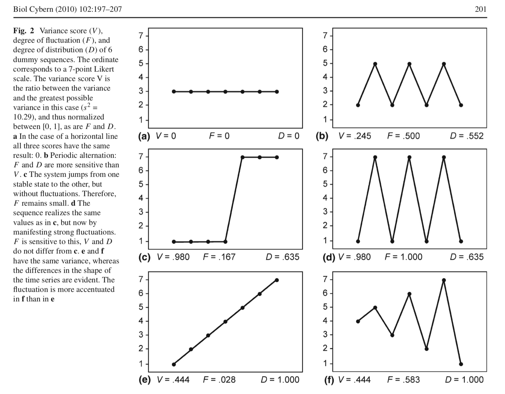

# **Quick Links** {-}

* [Main Assignments Page](https://darwin.pwo.ru.nl/skunkworks/courseware/1718_DCS/assignments/)
* [Assignments Part 1A: Introduction to the mathematics of change](https://darwin.pwo.ru.nl/skunkworks/courseware/1718_DCS/assignments/ASSIGNMENTS_P1A.html)
* [Assignments Part 1B: Fitting Parameters and Potential Functions](https://darwin.pwo.ru.nl/skunkworks/courseware/1718_DCS/assignments/ASSIGNMENTS_P1B.html)
* [Assignments Part 2: Time Series Analysis: Temporal Correlations and Fractal Scaling](https://darwin.pwo.ru.nl/skunkworks/courseware/1718_DCS/assignments/ASSIGNMENTS_P2.html)
* [Assignments Part 3: Quantifying Recurrences in State Space](https://darwin.pwo.ru.nl/skunkworks/courseware/1718_DCS/assignments/ASSIGNMENTS_P3.html)
  
</br>
</br>


# **Early Warning Signals and Complex Networks**


## **Early Warning Signals in a Clinical Case Study**

Dynamic assessment (e.g. ecological momentary assesment) is increasingly used in the mental health field. Process monitoring with dynamic assessment can empower patients and benefit self-insight (van Os et al., 2017). Additionally, ecological momentary assesment (EMA) time series can be analysed and the results can be used to inform the treatment process. 
In this assignment, we will use complex systems theory and methodology to perform a quantitative case study for a real patient. 

### First Steps {.tabset .tabset-fade .tabset-pills}

You will analyse EMA data from a patient who received impatient psychotherapy for mood disorders. The patient answered questions from the therapy process questionnaire on a daily basis for the full 101 days of his treatment. 
The learning objectives of the assignments are as follows:
1) You can interpret plots of raw EMA time series, as well as complexity resonance diagrams and critical instability diagrams of EMA time series.
2) You can describe what possible change processes in complex systems could explain the quantitative results from the case study. 


#### Questions {-}

* Open R and load the data 'clinical.case.study.csv' to a data frame called df.  The data file is on [Github](https://github.com/FredHasselman/The-Complex-Systems-Approach-Book/blob/master/assignments/assignment_data/EarlyWarningSignals/clinical.case.study.csv)
* Look at the data frame. Where is time in this data? In the rows or the columns?
* Add a time variable called 'days' to the data frame. 
* Factor 7 yields the scores on *Impairment by Symptoms and Problems* for this patient on each day. 
    + Plot the time series.
    + What pattern do you see?


#### Answers {-}


* Open R and load the data 'clinical.case.study.csv' to a data frame called df.  The data file is on [Github](https://github.com/FredHasselman/The-Complex-Systems-Approach-Book/blob/master/assignments/assignment_data/EarlyWarningSignals/clinical.case.study.csv)


```r
library(rio)
df <- import("https://raw.githubusercontent.com/FredHasselman/The-Complex-Systems-Approach-Book/master/assignments/assignment_data/EarlyWarningSignals/clinical.case.study.csv")
```

* Look at the data frame. Where is time in this data? In the rows or the columns?

> In the rows.

* Add a time variable called 'days' to the data frame. 


```r
df$days <- (1:nrow(df))
```

* Factor 7 yields the scores on *Impairment by Symptoms and Problems* for this patient on each day. 
    + Plot the time series.
    + What pattern do you see?


```r
plot(df$days, df$factor7, type='l')
```

<!-- -->


### Phase Transitions and Early-Warning Signals {.tabset .tabset-fade .tabset-pills}

Before we continue, read this short summary of what you (should) know about phase transitions and early-warning signals: 

\BeginKnitrBlock{rmdkennen}<div class="rmdkennen">Change from one attractor to another is called a phase transition. Phase transitions are preceded by a destabilization period in which the stability of the existing state decreases (as a consequence of increasing control parameters). During destabilization, the system loses its resilience to external influences leading to increased fluctuations and disorder in the systems behaviour (critical fluctuations) and an increased return time to the existing state after perturbation (critical slowing down). Destabilization ends abruptly when the system makes a phase transition towards a new stable state. Critical fluctuations and critical slowing down can therefore serve as early-warning signals (EWS) for phase transitions. </div>\EndKnitrBlock{rmdkennen}

#### Questions {-}

Answer the following questions, please think and discuss with your neighbours before turning to the answers. You can use the literature and what you've learned in the lecture:

* Can you think of possible phase transitions in psychopathology?
   + Give examples. 
* What is the role of destabilization in the treatment of psychopathology?
* Look at the plot of factor 7 for our patient. 
   + Can you visualize a possible phase transition?
   + Do you expect to find early-warning signals in the data of our patient? 
   + Where?

#### Answers {-}


* Can you think of possible phase transitions in psychopathology?
   + Give examples. 

> Onset of pathology (e.g. psychosis), relapse in addiction, suicide attempts, sudden gains and losses, etc.
   
* What is the role of destabilization in the treatment of psychopathology?

> Destabilization is most of the time a good thing in treatment: the goal of treatment is to change (destabilize) the existing state. During destabilization, the patient is increasingly sensitive to external influences (including treatment). Destabilization can be a target period for intervention.

* Look at the plot of factor 7 for our patient. 
   + Can you visualize a possible phase transition?
   
> There is a sudden gain (abrupt and persisting decrease in symptoms) somewhere around day 40.
   
   + Do you expect to find early-warning signals in the data of our patient? 
   + Where?

> Before the sudden gain

### Phase transitions in symptom severity {.tabset .tabset-fade .tabset-pills}

In the last question, you might have hypothesized the occurrence of a phase transition in the impairment by symptoms and problems of our patient (sudden gain). Let's try a method to quantify level shifts, including sudden gains, in time series data.  

#### Questions {-}

* Analyse the time series of factor 7 using the function `ts_levels()` in package `casnet`. 
    + Look at the manual pages to get an idea what is going. 
    + Use this code: 
    

```r
library(casnet)
library(ggplot2)
library(tidyr)

ts_levels(df$factor7, minDataSplit = 12, minLevelDuration = 7, changeSensitivity = 0.01, maxLevels=30, method="anova")
```

```
## $tree
## n= 101 
## 
## node), split, n, deviance, yval
##       * denotes terminal node
## 
##  1) root 101 48.6567000  6.930683e-11  
##    2) x>=39.5 62 13.5817900 -3.651189e-01  
##      4) x>=81.5 20  1.0810820 -6.040324e-01 *
##      5) x< 81.5 42 10.8155000 -2.513506e-01  
##       10) x< 66.5 27  3.5018850 -3.722225e-01  
##         20) x>=46.5 20  1.4570330 -4.898476e-01 *
##         21) x< 46.5 7  0.9775286 -3.615077e-02 *
##       11) x>=66.5 15  6.2090960 -3.378125e-02 *
##    3) x< 39.5 39 13.6698100  5.804455e-01  
##      6) x< 30.5 30  8.0609400  5.050166e-01  
##       12) x>=23.5 7  1.8913370  2.148010e-01 *
##       13) x< 23.5 23  5.4005920  5.933431e-01 *
##      7) x>=30.5 9  4.8692330  8.318752e-01 *
## 
## $pred
##       x           y           p
## 1     1  1.15790404  0.59334309
## 2     2  0.93805793  0.59334309
## 3     3  0.19514048  0.59334309
## 4     4  0.65672201  0.59334309
## 5     5  0.00005500  0.59334309
## 6     6  0.52578923  0.59334309
## 7     7  0.60172052  0.59334309
## 8     8  0.57222817  0.59334309
## 9     9 -0.36800553  0.59334309
## 10   10  1.04101001  0.59334309
## 11   11  0.88737872  0.59334309
## 12   12  0.28774806  0.59334309
## 13   13  0.94245058  0.59334309
## 14   14  0.25815999  0.59334309
## 15   15  0.16636161  0.59334309
## 16   16  0.46910151  0.59334309
## 17   17 -0.28216750  0.59334309
## 18   18  0.36459278  0.59334309
## 19   19  1.22596198  0.59334309
## 20   20  0.49044223  0.59334309
## 21   21  0.61916961  0.59334309
## 22   22  1.53206108  0.59334309
## 23   23  1.36500850  0.59334309
## 24   24  1.40136613  0.21480101
## 25   25  0.15895032  0.21480101
## 26   26  0.19629173  0.21480101
## 27   27 -0.17988253  0.21480101
## 28   28  0.06468336  0.21480101
## 29   29 -0.33409369  0.21480101
## 30   30  0.19629173  0.21480101
## 31   31  1.20157980  0.83187520
## 32   32  0.52231000  0.83187520
## 33   33  1.30432397  0.83187520
## 34   34  1.20681562  0.83187520
## 35   35 -0.48168916  0.83187520
## 36   36  0.44712467  0.83187520
## 37   37  2.30176297  0.83187520
## 38   38  0.42794583  0.83187520
## 39   39  0.55670313  0.83187520
## 40   40 -0.11201277 -0.03615077
## 41   41  0.17493741 -0.03615077
## 42   42 -0.42185577 -0.03615077
## 43   43 -0.39384971 -0.03615077
## 44   44  0.42151832 -0.03615077
## 45   45 -0.42442157 -0.03615077
## 46   46  0.50262866 -0.03615077
## 47   47 -0.64964816 -0.48984762
## 48   48 -0.52363124 -0.48984762
## 49   49 -0.51173008 -0.48984762
## 50   50 -1.08051720 -0.48984762
## 51   51 -0.29116082 -0.48984762
## 52   52 -0.38360093 -0.48984762
## 53   53 -0.77127243 -0.48984762
## 54   54 -0.25007550 -0.48984762
## 55   55 -0.28998272 -0.48984762
## 56   56 -0.84595526 -0.48984762
## 57   57 -0.67417500 -0.48984762
## 58   58 -0.72459566 -0.48984762
## 59   59 -0.47786789 -0.48984762
## 60   60 -0.49003372 -0.48984762
## 61   61 -0.15928776 -0.48984762
## 62   62 -0.72459566 -0.48984762
## 63   63  0.15036092 -0.48984762
## 64   64 -0.44335695 -0.48984762
## 65   65 -0.39384971 -0.48984762
## 66   66 -0.26197666 -0.48984762
## 67   67  0.78511583 -0.03378125
## 68   68  0.37933141 -0.03378125
## 69   69 -0.33692416 -0.03378125
## 70   70 -0.46478864 -0.03378125
## 71   71 -0.87396132 -0.03378125
## 72   72 -0.37517900 -0.03378125
## 73   73 -0.12871590 -0.03378125
## 74   74  1.02399868 -0.03378125
## 75   75  1.54430428 -0.03378125
## 76   76 -0.45111029 -0.03378125
## 77   77 -0.31825346 -0.03378125
## 78   78 -0.40791275 -0.03378125
## 79   79 -0.47786789 -0.03378125
## 80   80 -0.21529989 -0.03378125
## 81   81 -0.18945571 -0.03378125
## 82   82 -0.53671049 -0.60403241
## 83   83 -0.57148610 -0.60403241
## 84   84 -0.80861385 -0.60403241
## 85   85 -0.66740544 -0.60403241
## 86   86 -0.16862312 -0.60403241
## 87   87 -0.40227164 -0.60403241
## 88   88 -1.31507915 -0.60403241
## 89   89 -0.63006403 -0.60403241
## 90   90 -0.59272261 -0.60403241
## 91   91 -0.62072867 -0.60403241
## 92   92 -0.66740544 -0.60403241
## 93   93 -0.65807009 -0.60403241
## 94   94 -0.53671049 -0.60403241
## 95   95 -0.74326637 -0.60403241
## 96   96 -0.51803978 -0.60403241
## 97   97 -0.10452411 -0.60403241
## 98   98 -0.65807009 -0.60403241
## 99   99 -0.63006403 -0.60403241
## 100 100 -0.61139332 -0.60403241
## 101 101 -0.63939938 -0.60403241
```

* Look at the `summary()` of the `tree` field in the output object
    + Look for `primary splits`

*  Plot the results in the `pred` field of the output object (`x` is `time`, `y` is the original series, `p` is the predicted level of the original series.
*  Describe verbally the change trajectory in the symptom severity of our patient. 

#### Answers {-}

* Analyse the time series of factor 7 using the function `ts_levels()` in package `casnet`. 
    + Look at the manual pages to get an idea what is going. 

> This method uses regression trees to quantify segments of the time series. This is OK for descriptive purposes. Ideally, we would classify a phase transition in a qualitative manner (remember, it is a qualitative shift) but the ts_levels function is very useful to identify discontinous shifts in time series data. 

    + Use this code: 


```r
library(casnet)
library(ggplot2)
library(tidyr)

(lvl <- ts_levels(df$factor7, minDataSplit = 12, minLevelDuration = 7, changeSensitivity = 0.05, maxLevels=30, method="anova"))
```

```
## $tree
## n= 101 
## 
## node), split, n, deviance, yval
##       * denotes terminal node
## 
## 1) root 101 48.65670  6.930683e-11  
##   2) x>=39.5 62 13.58179 -3.651189e-01 *
##   3) x< 39.5 39 13.66981  5.804455e-01 *
## 
## $pred
##       x           y          p
## 1     1  1.15790404  0.5804455
## 2     2  0.93805793  0.5804455
## 3     3  0.19514048  0.5804455
## 4     4  0.65672201  0.5804455
## 5     5  0.00005500  0.5804455
## 6     6  0.52578923  0.5804455
## 7     7  0.60172052  0.5804455
## 8     8  0.57222817  0.5804455
## 9     9 -0.36800553  0.5804455
## 10   10  1.04101001  0.5804455
## 11   11  0.88737872  0.5804455
## 12   12  0.28774806  0.5804455
## 13   13  0.94245058  0.5804455
## 14   14  0.25815999  0.5804455
## 15   15  0.16636161  0.5804455
## 16   16  0.46910151  0.5804455
## 17   17 -0.28216750  0.5804455
## 18   18  0.36459278  0.5804455
## 19   19  1.22596198  0.5804455
## 20   20  0.49044223  0.5804455
## 21   21  0.61916961  0.5804455
## 22   22  1.53206108  0.5804455
## 23   23  1.36500850  0.5804455
## 24   24  1.40136613  0.5804455
## 25   25  0.15895032  0.5804455
## 26   26  0.19629173  0.5804455
## 27   27 -0.17988253  0.5804455
## 28   28  0.06468336  0.5804455
## 29   29 -0.33409369  0.5804455
## 30   30  0.19629173  0.5804455
## 31   31  1.20157980  0.5804455
## 32   32  0.52231000  0.5804455
## 33   33  1.30432397  0.5804455
## 34   34  1.20681562  0.5804455
## 35   35 -0.48168916  0.5804455
## 36   36  0.44712467  0.5804455
## 37   37  2.30176297  0.5804455
## 38   38  0.42794583  0.5804455
## 39   39  0.55670313  0.5804455
## 40   40 -0.11201277 -0.3651189
## 41   41  0.17493741 -0.3651189
## 42   42 -0.42185577 -0.3651189
## 43   43 -0.39384971 -0.3651189
## 44   44  0.42151832 -0.3651189
## 45   45 -0.42442157 -0.3651189
## 46   46  0.50262866 -0.3651189
## 47   47 -0.64964816 -0.3651189
## 48   48 -0.52363124 -0.3651189
## 49   49 -0.51173008 -0.3651189
## 50   50 -1.08051720 -0.3651189
## 51   51 -0.29116082 -0.3651189
## 52   52 -0.38360093 -0.3651189
## 53   53 -0.77127243 -0.3651189
## 54   54 -0.25007550 -0.3651189
## 55   55 -0.28998272 -0.3651189
## 56   56 -0.84595526 -0.3651189
## 57   57 -0.67417500 -0.3651189
## 58   58 -0.72459566 -0.3651189
## 59   59 -0.47786789 -0.3651189
## 60   60 -0.49003372 -0.3651189
## 61   61 -0.15928776 -0.3651189
## 62   62 -0.72459566 -0.3651189
## 63   63  0.15036092 -0.3651189
## 64   64 -0.44335695 -0.3651189
## 65   65 -0.39384971 -0.3651189
## 66   66 -0.26197666 -0.3651189
## 67   67  0.78511583 -0.3651189
## 68   68  0.37933141 -0.3651189
## 69   69 -0.33692416 -0.3651189
## 70   70 -0.46478864 -0.3651189
## 71   71 -0.87396132 -0.3651189
## 72   72 -0.37517900 -0.3651189
## 73   73 -0.12871590 -0.3651189
## 74   74  1.02399868 -0.3651189
## 75   75  1.54430428 -0.3651189
## 76   76 -0.45111029 -0.3651189
## 77   77 -0.31825346 -0.3651189
## 78   78 -0.40791275 -0.3651189
## 79   79 -0.47786789 -0.3651189
## 80   80 -0.21529989 -0.3651189
## 81   81 -0.18945571 -0.3651189
## 82   82 -0.53671049 -0.3651189
## 83   83 -0.57148610 -0.3651189
## 84   84 -0.80861385 -0.3651189
## 85   85 -0.66740544 -0.3651189
## 86   86 -0.16862312 -0.3651189
## 87   87 -0.40227164 -0.3651189
## 88   88 -1.31507915 -0.3651189
## 89   89 -0.63006403 -0.3651189
## 90   90 -0.59272261 -0.3651189
## 91   91 -0.62072867 -0.3651189
## 92   92 -0.66740544 -0.3651189
## 93   93 -0.65807009 -0.3651189
## 94   94 -0.53671049 -0.3651189
## 95   95 -0.74326637 -0.3651189
## 96   96 -0.51803978 -0.3651189
## 97   97 -0.10452411 -0.3651189
## 98   98 -0.65807009 -0.3651189
## 99   99 -0.63006403 -0.3651189
## 100 100 -0.61139332 -0.3651189
## 101 101 -0.63939938 -0.3651189
```

* Look at the `summary()` of the `tree` field in the output object


```r
summary(lvl$tree)
```

```
## Call:
## rpart::rpart(formula = y ~ x, data = dfs, method = method, control = list(minsplit = minDataSplit, 
##     minbucket = minLevelDuration, maxdepth = maxLevels, cp = changeSensitivity))
##   n= 101 
## 
##          CP nsplit rel error    xerror      xstd
## 1 0.4399209      0 1.0000000 1.0231643 0.1497573
## 2 0.0500000      1 0.5600791 0.6064802 0.1168192
## 
## Variable importance
##   x 
## 100 
## 
## Node number 1: 101 observations,    complexity param=0.4399209
##   mean=6.930683e-11, MSE=0.4817495 
##   left son=2 (62 obs) right son=3 (39 obs)
##   Primary splits:
##       x < 39.5 to the right, improve=0.4399209, (0 missing)
## 
## Node number 2: 62 observations
##   mean=-0.3651189, MSE=0.2190611 
## 
## Node number 3: 39 observations
##   mean=0.5804455, MSE=0.350508
```

    + Look for `primary splits`

> 39.5 = 40 days

*  Plot the results in the `pred` field of the output object (`x` is `time`, `y` is the original series, `p` is the predicted level of the original series.


```r
# ggplot likes the long data format
lvl_long <- lvl$pred %>% 
  gather(key=variable, value=value, -x)

ggplot(lvl_long, aes(x=x, y=value, colour=variable)) + geom_line() + theme_bw()
```

<!-- -->

*  Describe verbally the change trajectory in the symptom severity of our patient. 

> Fluctuations around some level then a shift and then fluctuations again, around another level

### Early Warning Signals {.tabset .tabset-fade .tabset-pills}

Now it is time to analyse the dynamic complexity of the ES time series and see if we can find early-warning signals. 

Dynamic complexity can be calculated from short time series of ordered categorical data (see [Schiepek & Strunk, 2010](https://link.springer.com/content/pdf/10.1007%2Fs00422-009-0362-1.pdf)). We can distinguish between different types of fluctuation (see Figure \@ref(fig:dyncomp))

<div class="figure">

<p class="caption">(\#fig:dyncomp)Calculation of Dynamic Complexity (F * D) from a Likert scale time series (figure from Schiepek & Strunk (2010)</p>
</div>


#### Questions {-}

* Some questions in the data were answered on a scale from 0 to 100, others from 0 to 6. We must rescale all questions that are 0-100 to the scale 0-6 before we can analyse EWS. 
    + If you like, you can try to write a for loop for this. You can also look at the answers.
* Analyse the dynamic complexity of the ES time series using the function `dyn_comp()`, ask for a plot.
    + The function returns a list, what is in the list?
* Look at the complexity resonance diagram, do you see early-warning signals for the sudden gain?
* Analyse the presence of critical instabilities using the function `crit_in()`, set `doPlot=TRUE`
    + Look at the critical instability diagram, do you see early-warning signals for the sudden gain?
* Plot the time series of the average dynamic complexity of all items 
* Plot the time series of factor 7 and the time series of the average dynamic complexity in one plot
    + You get a warning that there are NA values. Why are there NA's?

#### Answers {-}


* Some questions in the data were answered on a scale from 0 to 100, others from 0 to 6. We must rescale all questions that are 0-100 to the scale 0-6 before we can analyse EWS. 
    + If you like, you can try to write a for loop for this. You can also look at the answers.


```r
#  rescale predictors to max=6
for(j in (9:50)){
  if(max(df[,j])>6){
    df[,j] <- elascer(df[,j],mn = 0, mx = 100, lo = 0, hi = 6)
  }
}
```
    
* Analyse the dynamic complexity of the ES time series using the function `dyn_comp()`, ask for a plot.
    + The function returns a list, what is in the list?


```r
dc.case <- dyn_comp(df, win=7, col_first=9, col_last=50, scale_min=0, scale_max=6, doPlot = TRUE)
```

<!-- --><!-- -->

```r
summary(dc.case)
```

```
##         Length Class  Mode   
## df.comp 4242   -none- numeric
## plot.dc    9   gg     list
```

> dataframe + plot object

* Look at the complexity resonance diagram, do you see early-warning signals for the sudden gain?

> Yes

* Analyse the presence of critical instabilities using the function `crit_in()`, set `doPlot=TRUE`
    + Look at the critical instability diagram, do you see early-warning signals for the sudden gain?
    

```r
ci.case <- crit_in(dc.case$df.comp, 7)
```

<!-- --><!-- -->

* Plot the time series of the average dynamic complexity of all items 


```r
dc.mean <- rowMeans(as.matrix(dc.case$df.comp))
plot(dc.mean, type='l')
```

<!-- -->

* Plot the time series of factor 7 and the time series of the average dynamic complexity in one plot


```r
library(dplyr)

# Create a long dataset for ggplot
# Here we use the syntax from the `tidyverse` set of packages to create a 
df %>% 
  mutate(MeanDC=ts_standardise(dc.mean)) %>% 
  select(days,factor7,MeanDC) %>% 
  gather(key=variable,value=value,-days) %>%
  ggplot(aes(x=days, y=value, colour=variable)) + geom_line() + theme_bw()
```

<!-- -->

    + You get a warning that there are NA values. Why are there NA's?

> Because dynamic complexity is analyzed over a backwards window. The first value is at day 7.


# **Complex Networks**


To complete the network assignments you need to load:

```r
library(igraph)
library(qgraph)
library(devtools)
library(casnet)
```

## **Basic graphs**


\BeginKnitrBlock{rmdnote}<div class="rmdnote">The following set of assignments serve as a demonstration to get you aquainted with graph models, just follow the instructions.</div>\EndKnitrBlock{rmdnote}


### Plot basic graph types {.tabset .tabset-fade .tabset-pills}

#### Demos {-}

* Create a small ring graph in `igraph` and plot it.


```r
g <- graph.ring(20)
plot(g)
```

<!-- -->

    + Look in the manual of the `igraph`package for a function that will get you the `degree` of each node (vertex).
    + Also, find a function to get the average path length (mean distcance).


* Create a "Small world" graph and plot it:


```r
g_ws <- watts.strogatz.game(1, 20, 5, 0.05)
plot(g_ws)
```

<!-- -->

    + Run `degree(g_ws)`, also look at average path length and `transitivity`


*Get a directed scale-free  graph:


```r
g_bara <- barabasi.game(20)
plot(g_bara)
```

<!-- -->

    - Get the `degree`, `average path length` and `transitivity`
    - There should be a power law relation between nodes number and degree ... (but this is a very small network)


```r
# We can add properties to nodes:
V(g_bara)$degree <- degree(g_bara)
get.vertex.attribute(g_bara)
```

```
## $degree
##  [1] 7 6 1 2 4 2 1 1 1 1 1 2 2 1 1 1 1 1 1 1
```

```r
V(g_bara)$name <- 1:20

df.deg <- data.frame(Node=V(g_bara)$name, Degree = V(g_bara)$degree)
df.deg <- df.deg %>% arrange(Degree)

ggplot(df.deg,aes(x=Node,y=Degree)) + geom_point() + stat_smooth(method = "lm") + theme_bw()
```

<!-- -->

### Social Networks {.tabset .tabset-fade .tabset-pills}

The package igraph contains data on a Social network of friendships between 34 members of a karate club at a US university in the 1970s.

> See W. W. Zachary, An information flow model for conflict and fission in small groups, *Journal of Anthropological Research 33*, 452-473 (1977).

#### Demos {-}

* Get a graph of the communities within the social network. 


```r
# Community membership
karate <- graph.famous("Zachary")
wc <- walktrap.community(karate)
plot(wc, karate)
```

<!-- -->

```r
modularity(wc)
```

```
## [1] 0.3532216
```

```r
membership(wc)
```

```
##  [1] 1 1 2 1 5 5 5 1 2 2 5 1 1 2 3 3 5 1 3 1 3 1 3 4 4 4 3 4 2 3 2 2 3 3
```

    + Check the `igraph` manual, or any on-line source to figure out what the `modularity` and `membership` measures might mean and how they are calculated.


* It is also possible to get the adjacency matrix of the graph


```r
get.adjacency(karate)
```

```
## 34 x 34 sparse Matrix of class "dgCMatrix"
##                                                                          
##  [1,] . 1 1 1 1 1 1 1 1 . 1 1 1 1 . . . 1 . 1 . 1 . . . . . . . . . 1 . .
##  [2,] 1 . 1 1 . . . 1 . . . . . 1 . . . 1 . 1 . 1 . . . . . . . . 1 . . .
##  [3,] 1 1 . 1 . . . 1 1 1 . . . 1 . . . . . . . . . . . . . 1 1 . . . 1 .
##  [4,] 1 1 1 . . . . 1 . . . . 1 1 . . . . . . . . . . . . . . . . . . . .
##  [5,] 1 . . . . . 1 . . . 1 . . . . . . . . . . . . . . . . . . . . . . .
##  [6,] 1 . . . . . 1 . . . 1 . . . . . 1 . . . . . . . . . . . . . . . . .
##  [7,] 1 . . . 1 1 . . . . . . . . . . 1 . . . . . . . . . . . . . . . . .
##  [8,] 1 1 1 1 . . . . . . . . . . . . . . . . . . . . . . . . . . . . . .
##  [9,] 1 . 1 . . . . . . . . . . . . . . . . . . . . . . . . . . . 1 . 1 1
## [10,] . . 1 . . . . . . . . . . . . . . . . . . . . . . . . . . . . . . 1
## [11,] 1 . . . 1 1 . . . . . . . . . . . . . . . . . . . . . . . . . . . .
## [12,] 1 . . . . . . . . . . . . . . . . . . . . . . . . . . . . . . . . .
## [13,] 1 . . 1 . . . . . . . . . . . . . . . . . . . . . . . . . . . . . .
## [14,] 1 1 1 1 . . . . . . . . . . . . . . . . . . . . . . . . . . . . . 1
## [15,] . . . . . . . . . . . . . . . . . . . . . . . . . . . . . . . . 1 1
## [16,] . . . . . . . . . . . . . . . . . . . . . . . . . . . . . . . . 1 1
## [17,] . . . . . 1 1 . . . . . . . . . . . . . . . . . . . . . . . . . . .
## [18,] 1 1 . . . . . . . . . . . . . . . . . . . . . . . . . . . . . . . .
## [19,] . . . . . . . . . . . . . . . . . . . . . . . . . . . . . . . . 1 1
## [20,] 1 1 . . . . . . . . . . . . . . . . . . . . . . . . . . . . . . . 1
## [21,] . . . . . . . . . . . . . . . . . . . . . . . . . . . . . . . . 1 1
## [22,] 1 1 . . . . . . . . . . . . . . . . . . . . . . . . . . . . . . . .
## [23,] . . . . . . . . . . . . . . . . . . . . . . . . . . . . . . . . 1 1
## [24,] . . . . . . . . . . . . . . . . . . . . . . . . . 1 . 1 . 1 . . 1 1
## [25,] . . . . . . . . . . . . . . . . . . . . . . . . . 1 . 1 . . . 1 . .
## [26,] . . . . . . . . . . . . . . . . . . . . . . . 1 1 . . . . . . 1 . .
## [27,] . . . . . . . . . . . . . . . . . . . . . . . . . . . . . 1 . . . 1
## [28,] . . 1 . . . . . . . . . . . . . . . . . . . . 1 1 . . . . . . . . 1
## [29,] . . 1 . . . . . . . . . . . . . . . . . . . . . . . . . . . . 1 . 1
## [30,] . . . . . . . . . . . . . . . . . . . . . . . 1 . . 1 . . . . . 1 1
## [31,] . 1 . . . . . . 1 . . . . . . . . . . . . . . . . . . . . . . . 1 1
## [32,] 1 . . . . . . . . . . . . . . . . . . . . . . . 1 1 . . 1 . . . 1 1
## [33,] . . 1 . . . . . 1 . . . . . 1 1 . . 1 . 1 . 1 1 . . . . . 1 1 1 . 1
## [34,] . . . . . . . . 1 1 . . . 1 1 1 . . 1 1 1 . 1 1 . . 1 1 1 1 1 1 1 .
```

    + What do the columns, rows and 0s and 1s stand for?


### Package `qgraph`

Learn about the functionality of the `qgraph` from its author Sacha Epskamp.

Try running the examples, e.g. of the `Big 5`: 

[http://sachaepskamp.com/qgraph/examples](http://sachaepskamp.com/qgraph/examples)


#### `qgraph` tutorials / blog

Great site by Eiko Fried:
[http://psych-networks.com ](http://psych-networks.com )


### Early warning signals

Have a look at the site [Early Warning Systems](http://www.early-warning-signals.org/home/)

There is an accompanying [`R` package `earlywarnings`](https://cran.r-project.org/web/packages/earlywarnings/index.html)
