# **Fluctuation and Disperion analyses** {-}

    
### Three plus two time series {-}

We are going to analyse the same 3 time series as during the last session, now using fluctuation and dispersion analyses. 

**Importing data**

Two ways:

A. By downloading:

  1. Follow the link, e.g. for [`series.xlsx`](https://github.com/complexity-methods/CSA-assignments/blob/master/assignment_data/BasicTSA_arma/series.xlsx).
  2. On the Github page, find a button marked **Download** (or **Raw** for text files).
  3. Download the file
  4. Load it into `R` using the code below       


```r
library(rio)
series <- rio::import("series.xlsx")
```
     
      
B. By directly importing the file in R from Github:

   1. Copy the `url` associated with the **Download**  button [on Github](https://github.com/complexity-methods/CSA-assignments/blob/master/assignment_data/BasicTSA_arma/series.csv) (right-click).
   2. The copied path should contain the word 'raw' somewhere in the url.
   3. Call `rio::import(url)`
        

```r
library(rio)
series <- rio::import("https://github.com/complexity-methods/CSA-assignments/raw/master/assignment_data/BasicTSA_arma/series.xlsx")
```


Remember this is what the time series and retun plots looked like.

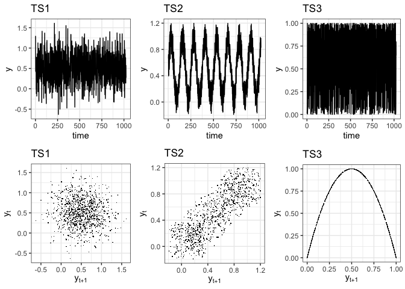<!-- -->


Now we'll add two additional time series using the function `noise_powerlaw()`, run the code below:

```r
library(casnet)
series$TS_4 <- noise_powerlaw(alpha = -1, N = 1024, standardise = TRUE)
series$TS_5 <- noise_powerlaw(alpha = -2, N = 1024, standardise = TRUE)
```


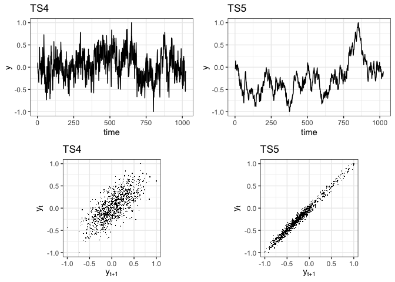<!-- -->


###  Standardised Dispersion Analysis {.tabset .tabset-fade .tabset-pills}


#### Questions {-}

* Common data preparation before running fluctuation analyses like `SDA`:
    + Normalize the time series (using `sd` based on `N`, not `N-1`, e.g. by using `ts_standardise()`, or use the arguments of the function `fd_sda()`)
    + Check whether time series length is a power of `2`. If you use `nextn(length(TS),factors=2)`, the number you get is the length your time series should be to create equal bin sizes. You can pad the series with 0s before analysis, look at package `invctr` at the infix function `%+]%`.
* Perform `sda` on the 5 time series, use `minData = 6` to exclude the larger bin sizes from estimating  the scaling relation.
* Compare what you find for `fd_sda()` to the other techniques (`fd_RR`,`SampEn`, `acf`, `pacf`)


#### Answers {-}


```r
library(casnet)

# All N are already a power of 2
N1 <- nextn(length(series$TS_1), factors = 2)
N2 <- nextn(length(series$TS_2), factors = 2)
N3 <- nextn(length(series$TS_3), factors = 2)
N4 <- nextn(length(series$TS_4), factors = 2)
N5 <- nextn(length(series$TS_5), factors = 2)

#Suppose the time series Y had length 10, you could have used:
library(invctr)
Y <- 1:10
Y %+]% 6
##  [1]  1  2  3  4  5  6  7  8  9 10  0  0  0  0  0  0

# The default of fd_sda() is to standardise in the mean and sd
fdSDA1 <- fd_sda(series$TS_1, minData = 6, doPlot = TRUE, tsName = "TS1")
## 
## 
## fd_sda:	Sample rate was set to 1.
```

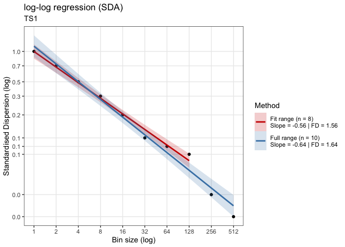<!-- -->

```
## 
## ~~~o~~o~~casnet~~o~~o~~~
## 
##  Standardised Dispersion Analysis 
## 
##  Full range (n = 10)
## Slope = -0.64 | FD = 1.64 
## 
##  Fit range (n = 8)
## Slope = -0.56 | FD = 1.56
## 
## ~~~o~~o~~casnet~~o~~o~~~
fdSDA2 <- fd_sda(series$TS_2, minData = 6, doPlot = TRUE, tsName = "TS2")
## 
## 
## fd_sda:	Sample rate was set to 1.
```

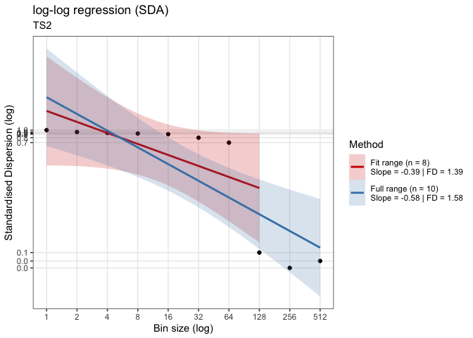<!-- -->

```
## 
## ~~~o~~o~~casnet~~o~~o~~~
## 
##  Standardised Dispersion Analysis 
## 
##  Full range (n = 10)
## Slope = -0.58 | FD = 1.58 
## 
##  Fit range (n = 8)
## Slope = -0.39 | FD = 1.39
## 
## ~~~o~~o~~casnet~~o~~o~~~
fdSDA3 <- fd_sda(series$TS_3, minData = 6, doPlot = TRUE, tsName = "TS3")
## 
## 
## fd_sda:	Sample rate was set to 1.
```

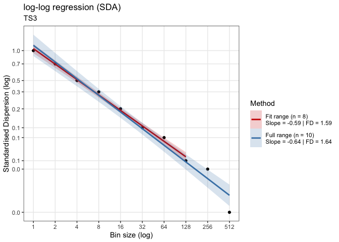<!-- -->

```
## 
## ~~~o~~o~~casnet~~o~~o~~~
## 
##  Standardised Dispersion Analysis 
## 
##  Full range (n = 10)
## Slope = -0.64 | FD = 1.64 
## 
##  Fit range (n = 8)
## Slope = -0.59 | FD = 1.59
## 
## ~~~o~~o~~casnet~~o~~o~~~
fdSDA4 <- fd_sda(series$TS_4, minData = 6, doPlot = TRUE, tsName = "TS4")
## 
## 
## fd_sda:	Sample rate was set to 1.
```

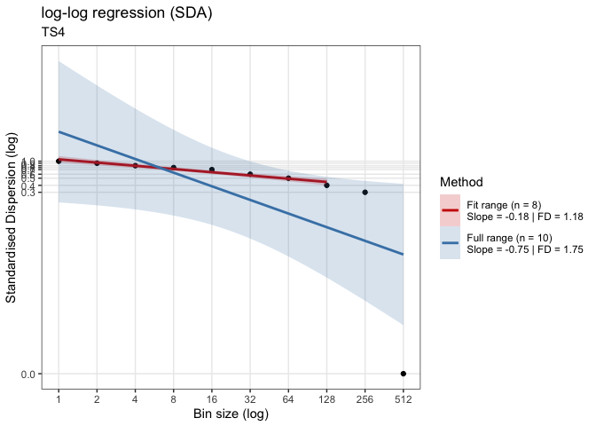<!-- -->

```
## 
## ~~~o~~o~~casnet~~o~~o~~~
## 
##  Standardised Dispersion Analysis 
## 
##  Full range (n = 10)
## Slope = -0.75 | FD = 1.75 
## 
##  Fit range (n = 8)
## Slope = -0.18 | FD = 1.18
## 
## ~~~o~~o~~casnet~~o~~o~~~
fdSDA5 <- fd_sda(series$TS_5, minData = 6, doPlot = TRUE, tsName = "TS5")
## 
## 
## fd_sda:	Sample rate was set to 1.
```

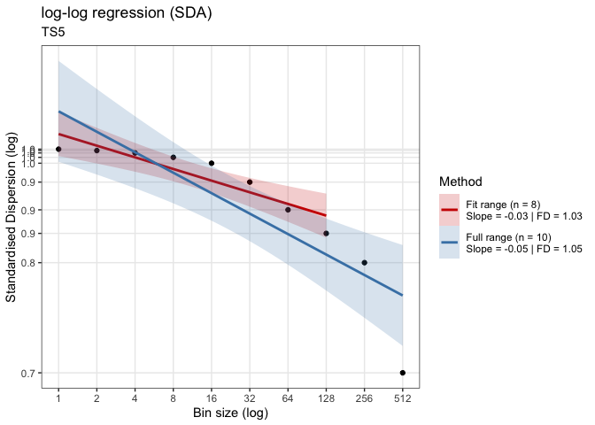<!-- -->

```
## 
## ~~~o~~o~~casnet~~o~~o~~~
## 
##  Standardised Dispersion Analysis 
## 
##  Full range (n = 10)
## Slope = -0.05 | FD = 1.05 
## 
##  Fit range (n = 8)
## Slope = -0.03 | FD = 1.03
## 
## ~~~o~~o~~casnet~~o~~o~~~

# If you ask to return the powerlaw (returnPLAW = TRUE) the function plotFD_loglog() can make the plot as well
fdS5 <- fd_sda(series$TS_5, returnPLAW = TRUE, minData = 6, doPlot = TRUE, tsName = "TS5")
## 
## 
## fd_sda:	Sample rate was set to 1.
```

<!-- -->

```
## 
## ~~~o~~o~~casnet~~o~~o~~~
## 
##  Standardised Dispersion Analysis 
## 
##  Full range (n = 10)
## Slope = -0.05 | FD = 1.05 
## 
##  Fit range (n = 8)
## Slope = -0.03 | FD = 1.03
## 
## ~~~o~~o~~casnet~~o~~o~~~
plotFD_loglog(fdS5, title = "SDA", subtitle = "TS5")
```

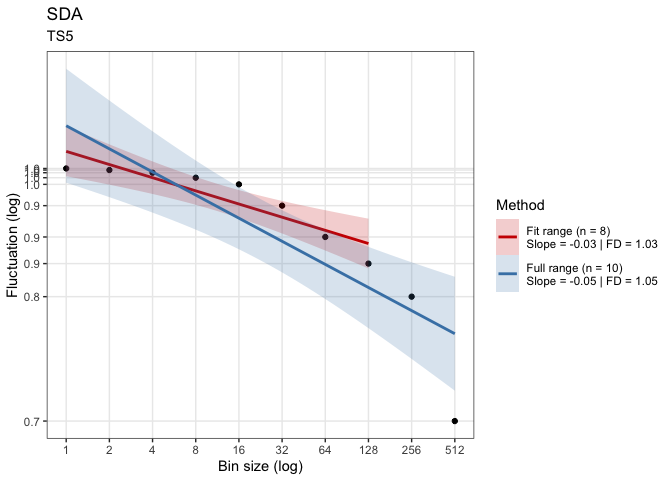<!-- -->


###  Spectral Slope {.tabset .tabset-fade .tabset-pills}


#### Questions {-}

* Common data preparation before running spectral analyses:
    + Normalize the time series (using `sd` based on `N`, not `N-1`, e.g. by using `ts_standardise()`, or use the arguments of the function `fd_psd()`)
    + Check whether time series length is a power of `2`. If you use `nextn(length(TS),factors=2)`, the number you get is the length your time series should be to create equal bin sizes. You can pad the series with 0s before analysis, look at package `invctr` at the infix function `%+]%`.
* Perform `fd_psd()` on the 3 time series.
* Compare to what you find for `fd_psd` to the other measures (`fd_RR`,`SampEn`, `acf`, `pacf`)


#### Answers {-}


```r
library(casnet)

# All N are already a power of 2
N1 <- nextn(length(series$TS_1), factors = 2)
N2 <- nextn(length(series$TS_2), factors = 2)
N3 <- nextn(length(series$TS_3), factors = 2)
N4 <- nextn(length(series$TS_4), factors = 2)
N5 <- nextn(length(series$TS_5), factors = 2)

#Suppose the time series Y had length 10, you could have used:
library(invctr)
Y <- 1:10
Y %+]% 6
##  [1]  1  2  3  4  5  6  7  8  9 10  0  0  0  0  0  0

# The default of fd_psd() is to standardises on the mean and sd, and detrended
fdPSD1 <- fd_psd(series$TS_1, doPlot = TRUE, tsName = "TS1")
## 
## 
## fd_psd:	Sample rate was set to 1.
```

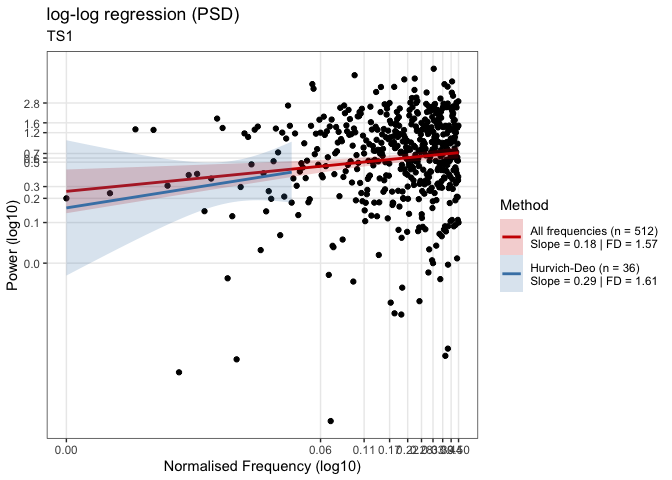<!-- -->

```
## 
## ~~~o~~o~~casnet~~o~~o~~~
## 
##  Power Spectral Density Slope 
## 
##  All frequencies (n = 512)
## Slope = 0.18 | FD = 1.57 
## 
##  Hurvich-Deo (n = 36)
## Slope = 0.29 | FD = 1.61
## 
## ~~~o~~o~~casnet~~o~~o~~~
fdPSD2 <- fd_psd(series$TS_2, doPlot = TRUE, tsName = "TS2")
## 
## 
## fd_psd:	Sample rate was set to 1.
```

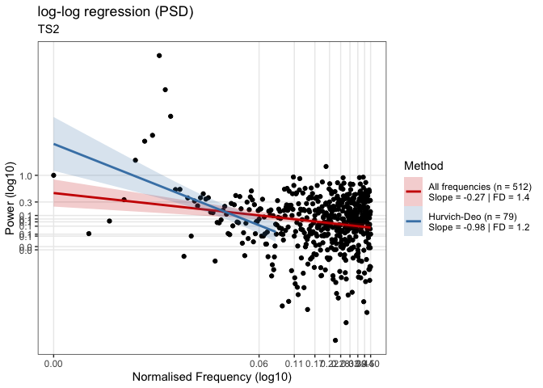<!-- -->

```
## 
## ~~~o~~o~~casnet~~o~~o~~~
## 
##  Power Spectral Density Slope 
## 
##  All frequencies (n = 512)
## Slope = -0.27 | FD = 1.4 
## 
##  Hurvich-Deo (n = 79)
## Slope = -0.98 | FD = 1.2
## 
## ~~~o~~o~~casnet~~o~~o~~~
fdPSD3 <- fd_psd(series$TS_3, doPlot = TRUE, tsName = "TS3")
## 
## 
## fd_psd:	Sample rate was set to 1.
```

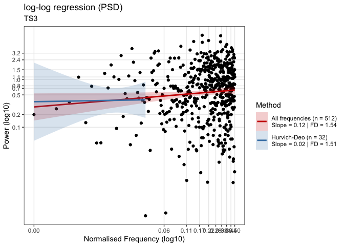<!-- -->

```
## 
## ~~~o~~o~~casnet~~o~~o~~~
## 
##  Power Spectral Density Slope 
## 
##  All frequencies (n = 512)
## Slope = 0.12 | FD = 1.54 
## 
##  Hurvich-Deo (n = 32)
## Slope = 0.02 | FD = 1.51
## 
## ~~~o~~o~~casnet~~o~~o~~~
fdPSD4 <- fd_psd(series$TS_4, doPlot = TRUE, tsName = "TS4")
## 
## 
## fd_psd:	Sample rate was set to 1.
```

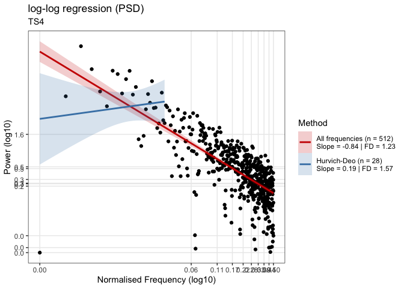<!-- -->

```
## 
## ~~~o~~o~~casnet~~o~~o~~~
## 
##  Power Spectral Density Slope 
## 
##  All frequencies (n = 512)
## Slope = -0.84 | FD = 1.23 
## 
##  Hurvich-Deo (n = 28)
## Slope = 0.19 | FD = 1.57
## 
## ~~~o~~o~~casnet~~o~~o~~~
fdPSD5 <- fd_psd(series$TS_5, doPlot = TRUE, tsName = "TS5")
## 
## 
## fd_psd:	Sample rate was set to 1.
```

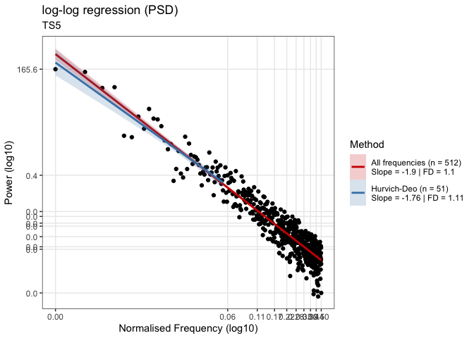<!-- -->

```
## 
## ~~~o~~o~~casnet~~o~~o~~~
## 
##  Power Spectral Density Slope 
## 
##  All frequencies (n = 512)
## Slope = -1.9 | FD = 1.1 
## 
##  Hurvich-Deo (n = 51)
## Slope = -1.76 | FD = 1.11
## 
## ~~~o~~o~~casnet~~o~~o~~~
```


###  Detrended Fluctuation Analysis {.tabset .tabset-fade .tabset-pills}


#### Questions {-}

* Data preparation before running `DFA` analyses are not really necessary, except perhaps:
    + Check whether time series length is a power of `2`. If you use `nextn(length(TS),factors=2)`, the number you get is the length your time series should be to create equal bin sizes. You can pad the series with 0s before analysis, look at package `invctr` at the infix function `%+]%`.
* Perform `fd_dfa()` on the 5 time series.
* Compare to what you find for `fd_dfa` to the other measures (`fd_RR`,`SampEn`, `acf`, `pacf`)


#### Answers {-}


```r
library(casnet)

# All N are already a power of 2
N1 <- nextn(length(series$TS_1), factors = 2)
N2 <- nextn(length(series$TS_2), factors = 2)
N3 <- nextn(length(series$TS_3), factors = 2)
N4 <- nextn(length(series$TS_4), factors = 2)
N5 <- nextn(length(series$TS_5), factors = 2)

#Suppose the time series Y had length 10, you could have used:
library(invctr)
Y <- 1:10
Y %+]% 6
##  [1]  1  2  3  4  5  6  7  8  9 10  0  0  0  0  0  0

# The default of fd_psd() is to standardises on the mean and sd, and detrended
fdDFA1 <- fd_dfa(series$TS_1, doPlot = TRUE, tsName = "TS1")
## 
## 
## fd_dfa:	Sample rate was set to 1.
```

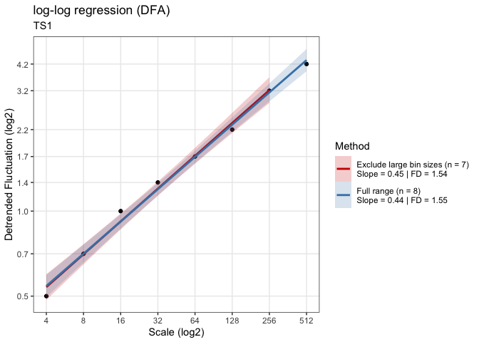<!-- -->

```
## 
## ~~~o~~o~~casnet~~o~~o~~~
## 
##  Detrended FLuctuation Analysis 
## 
##  Full range (n = 8)
## Slope = 0.44 | FD = 1.55 
## 
##  Exclude large bin sizes (n = 7)
## Slope = 0.45 | FD = 1.54
## 
## ~~~o~~o~~casnet~~o~~o~~~
fdDFA2 <- fd_dfa(series$TS_2, doPlot = TRUE, tsName = "TS2")
## 
## 
## fd_dfa:	Sample rate was set to 1.
```

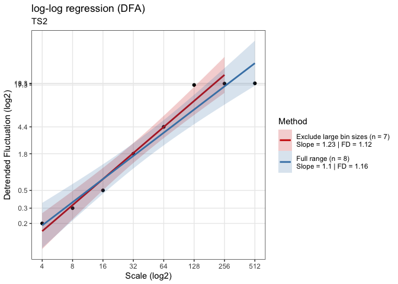<!-- -->

```
## 
## ~~~o~~o~~casnet~~o~~o~~~
## 
##  Detrended FLuctuation Analysis 
## 
##  Full range (n = 8)
## Slope = 1.1 | FD = 1.16 
## 
##  Exclude large bin sizes (n = 7)
## Slope = 1.23 | FD = 1.12
## 
## ~~~o~~o~~casnet~~o~~o~~~
fdDFA3 <- fd_dfa(series$TS_3, doPlot = TRUE, tsName = "TS3")
## 
## 
## fd_dfa:	Sample rate was set to 1.
```

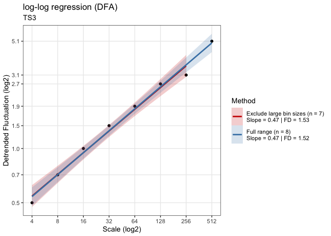<!-- -->

```
## 
## ~~~o~~o~~casnet~~o~~o~~~
## 
##  Detrended FLuctuation Analysis 
## 
##  Full range (n = 8)
## Slope = 0.47 | FD = 1.52 
## 
##  Exclude large bin sizes (n = 7)
## Slope = 0.47 | FD = 1.53
## 
## ~~~o~~o~~casnet~~o~~o~~~
fdDFA4 <- fd_dfa(series$TS_4, doPlot = TRUE, tsName = "TS4")
## 
## 
## fd_dfa:	Sample rate was set to 1.
```

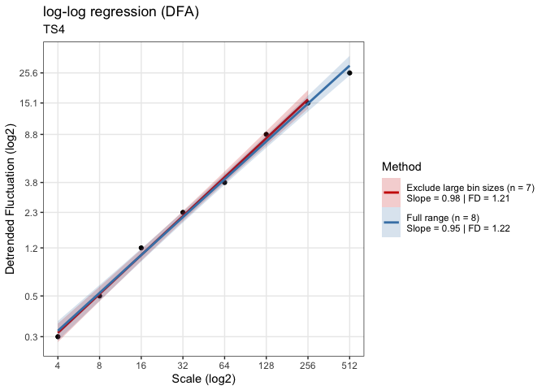<!-- -->

```
## 
## ~~~o~~o~~casnet~~o~~o~~~
## 
##  Detrended FLuctuation Analysis 
## 
##  Full range (n = 8)
## Slope = 0.95 | FD = 1.22 
## 
##  Exclude large bin sizes (n = 7)
## Slope = 0.98 | FD = 1.21
## 
## ~~~o~~o~~casnet~~o~~o~~~
fdDFA5 <- fd_dfa(series$TS_5, doPlot = TRUE, tsName = "TS5")
## 
## 
## fd_dfa:	Sample rate was set to 1.
```

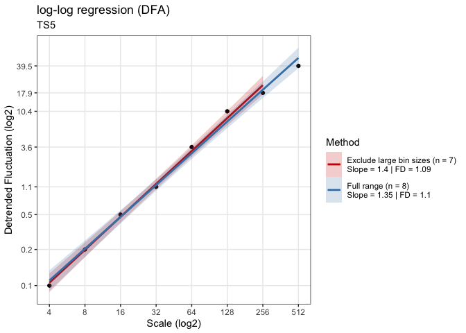<!-- -->

```
## 
## ~~~o~~o~~casnet~~o~~o~~~
## 
##  Detrended FLuctuation Analysis 
## 
##  Full range (n = 8)
## Slope = 1.35 | FD = 1.1 
## 
##  Exclude large bin sizes (n = 7)
## Slope = 1.4 | FD = 1.09
## 
## ~~~o~~o~~casnet~~o~~o~~~
```


### Compare results {.tabset .tabset-fade .tabset-pills}


#### Questions {-}

* Create a table that compares the Fractal Dimension estimates based on the limited fit range for all time series (columns) with for each analysis (rows)
* Create the same for the full fitrange.
* What can you conclude about these series based on these results?


#### Answers {-}


```r
# Fitrange FD
knitr::kable(data.frame(
           TS1 = c(fdSDA1$fitRange$FD,fdPSD1$fitRange$FD,fdDFA1$fitRange$FD),
           TS2 = c(fdSDA2$fitRange$FD,fdPSD2$fitRange$FD,fdDFA2$fitRange$FD),
           TS3 = c(fdSDA3$fitRange$FD,fdPSD3$fitRange$FD,fdDFA3$fitRange$FD),
           TS4 = c(fdSDA4$fitRange$FD,fdPSD4$fitRange$FD,fdDFA4$fitRange$FD),
           TS5 = c(fdSDA5$fitRange$FD,fdPSD5$fitRange$FD,fdDFA5$fitRange$FD),
           row.names = c("SDA","PSD","DFA")
           ),digits = 2,caption = "FD based on limited fit range")
```


Table: (\#tab:unnamed-chunk-9)FD based on limited fit range

        TS1    TS2    TS3    TS4    TS5
----  -----  -----  -----  -----  -----
SDA    1.56   1.39   1.59   1.18   1.03
PSD    1.61   1.20   1.51   1.57   1.11
DFA    1.54   1.12   1.53   1.21   1.09

</br>


```r
# Full range FD
knitr::kable(data.frame(
           TS1 = c(fdSDA1$fullRange$FD,fdPSD1$fullRange$FD,fdDFA1$fullRange$FD),
           TS2 = c(fdSDA2$fullRange$FD,fdPSD2$fullRange$FD,fdDFA2$fullRange$FD),
           TS3 = c(fdSDA3$fullRange$FD,fdPSD3$fullRange$FD,fdDFA3$fullRange$FD),
           TS4 = c(fdSDA4$fullRange$FD,fdPSD4$fullRange$FD,fdDFA4$fullRange$FD),
           TS5 = c(fdSDA5$fullRange$FD,fdPSD5$fullRange$FD,fdDFA5$fullRange$FD),
           row.names = c("SDA","PSD","DFA")
           ),digits = 2,caption = "FD based on full fit range")
```


Table: (\#tab:unnamed-chunk-10)FD based on full fit range

        TS1    TS2    TS3    TS4    TS5
----  -----  -----  -----  -----  -----
SDA    1.64   1.58   1.64   1.75   1.05
PSD    1.57   1.40   1.54   1.23   1.10
DFA    1.55   1.16   1.52   1.22   1.10


## **Surrogate testing: Beyond the straw-man null-hypothesis** 

Look at the explanation of surrogate analysis on the [TiSEAN website](https://www.pks.mpg.de/~tisean/Tisean_3.0.1/)
(Here is [direct link](https://www.pks.mpg.de/~tisean/Tisean_3.0.1/docs/surropaper/node5.html) to the relevant sections)


### Constrained realisations of complex signals {.tabset .tabset-fade .tabset-pills}

We'll look mostly at three different kinds of surrogates:

* *Randomly shuffled*: $H_0:$ The time series data are independent random numbers drawn from some probability distribution.
* *Phase Randomised*: $H_0:$ The time series data were generated by a stationary linear stochastic process
* *Amplitude Adjusted ,Phase Randomised*: $H_0:$ The time series data were generated by a rescaled linear stochastic process.


#### Questions {-}

* Figure out how many surrogates you minimally need for a 2-sided test.
* Package `nonlinearTseries` has a function `FFTsurrogate()` and package `fractal` has `surrogate()`. Look them up and try to create a surrogate test for time series `TS1`, `TS3`, and `TS4` of the previous assignments.
    + If you use `fractal::surrogate()`, choose either `aaft` (amplitude adjusted Fourier transform) or `phase` (phase randomisation)
    + `nonlinearTseries::FFTsurrogates` will calculate phase randomised surrogates.
* In package `casnet` there's a function that will calculate and display a point-probability based on a distribution of surrogate measures and one observed measure: `plotSUR_hist`


#### Answers {-}


Create a number of surrogates, calulate the slopes and plot the results.

* First let's get the values we found earlier (we'll use the FD from `sda`, then we do the same for `psd`,but you can take any of the measures as well)


```r
TS1_FDsda <- fd_sda(series$TS_1)$fitRange$FD
```

```
## 
## 
## fd_sda:	Sample rate was set to 1.
## 
## 
## ~~~o~~o~~casnet~~o~~o~~~
## 
##  Standardised Dispersion Analysis 
## 
##  Full range (n = 10)
## Slope = -0.64 | FD = 1.64 
## 
##  Fit range (n = 9)
## Slope = -0.61 | FD = 1.61
## 
## ~~~o~~o~~casnet~~o~~o~~~
```

```r
TS3_FDsda <- fd_sda(series$TS_3)$fitRange$FD
```

```
## 
## 
## fd_sda:	Sample rate was set to 1.
## 
## 
## ~~~o~~o~~casnet~~o~~o~~~
## 
##  Standardised Dispersion Analysis 
## 
##  Full range (n = 10)
## Slope = -0.64 | FD = 1.64 
## 
##  Fit range (n = 9)
## Slope = -0.58 | FD = 1.58
## 
## ~~~o~~o~~casnet~~o~~o~~~
```

```r
TS5_FDsda <- fd_sda(series$TS_5)$fitRange$FD
```

```
## 
## 
## fd_sda:	Sample rate was set to 1.
## 
## 
## ~~~o~~o~~casnet~~o~~o~~~
## 
##  Standardised Dispersion Analysis 
## 
##  Full range (n = 10)
## Slope = -0.05 | FD = 1.05 
## 
##  Fit range (n = 9)
## Slope = -0.04 | FD = 1.04
## 
## ~~~o~~o~~casnet~~o~~o~~~
```


* To create the surrogates using `fractal::surrogate()`
    + You'll need to repeatedly call the function and store the result
    + To get into a dataframe we have to use `unclass()` otherwise `R` doesn't recognise the object
    + Function `t()` transposes the data from 39 rows to 39 columns
* Once you have the surrogates in a datafram, repeatedly calculate the measure you want to compare, in this case `fd_sda()`.


```r
# NOW CREATE SURROGATES
library(plyr)
library(tidyverse)
library(fractal)

# For a two-sided test at alpha = .05 we need N=39
Nsurrogates <- 39

TS1surrogates <- as.data.frame(t(ldply(1:Nsurrogates, function(s) unclass(surrogate(x=series$TS_1,method="aaft")))))
colnames(TS1surrogates) <- paste0("S",1:NCOL(TS1surrogates))

# Add the observed data
TS1surrogates$Obs <- series$TS_1
plotTS_multi(TS1surrogates)
```

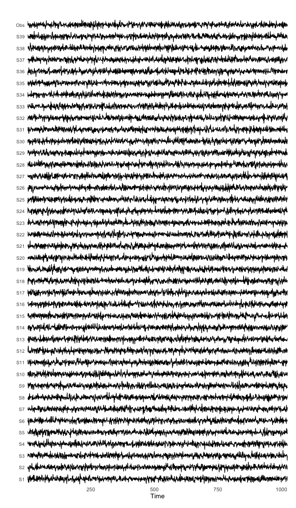<!-- -->


```r
library(fractal)
# Now we calculate FD for each series
TS1surrogates_FD <- plyr::laply(1:Nsurrogates,function(s) fd_sda(y=TS1surrogates[,s], silent = TRUE)$fitRange$FD)

TS3surrogates <- t(plyr::ldply(1:Nsurrogates, function(s) unclass(surrogate(x=series$TS_3 ,method="aaft"))))
colnames(TS3surrogates) <- paste0("aaftSurr",1:NCOL(TS3surrogates))
TS3surrogates_FD <- plyr::laply(1:Nsurrogates,function(s) fd_sda(y=TS3surrogates[,s], silent = TRUE)$fitRange$FD)

TS5surrogates <- t(plyr::ldply(1:Nsurrogates, function(s) unclass(surrogate(x=series$TS_5 ,method="aaft"))))
colnames(TS5surrogates) <- paste0("aaftSurr",1:NCOL(TS5surrogates))
TS5surrogates_FD <- plyr::laply(1:Nsurrogates,function(s) fd_sda(y=TS5surrogates[,s], silent = TRUE)$fitRange$FD)
```

* Collect the results in a dataframe, so we can compare.


```r
x <- data.frame(Source = c("TS1", "TS3", "TS5"),
                FDsda = c(TS1_FDsda, TS3_FDsda, TS5_FDsda),
                FDsdaAAFT.median= c(median(TS1surrogates_FD),median(TS3surrogates_FD),median(TS5surrogates_FD)))
```


* Call function `plotSUR_hist()` to see the results of the test.


```r
plotSUR_hist(surrogateValues = TS1surrogates_FD, observedValue = TS1_FDsda, sides = "two.sided", doPlot = TRUE, measureName = "sda FD TS1")
```

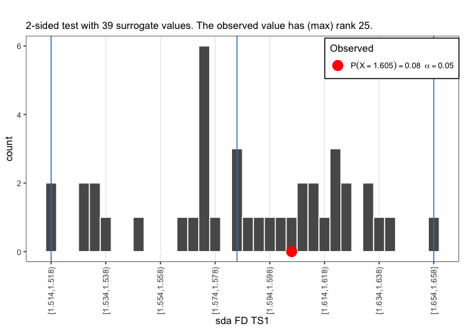<!-- -->

```r
plotSUR_hist(surrogateValues = TS3surrogates_FD, observedValue = TS3_FDsda, sides = "two.sided", doPlot = TRUE, measureName = "sda FD TS3")
```

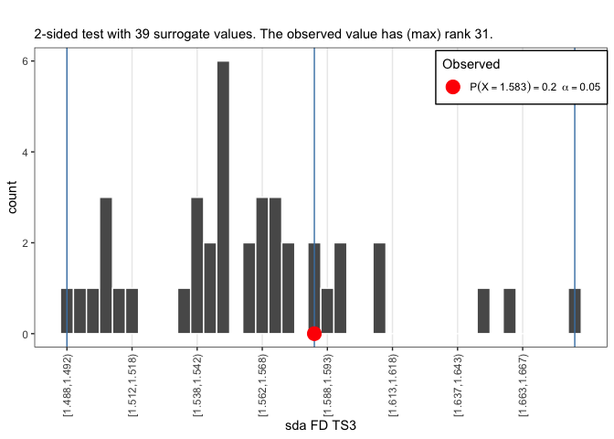<!-- -->

```r
plotSUR_hist(surrogateValues = TS5surrogates_FD, observedValue = TS5_FDsda, sides = "two.sided", doPlot = TRUE, measureName = "sda FD TS5")
```

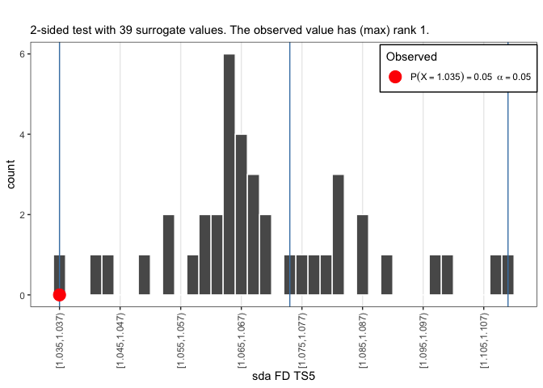<!-- -->


 * Let's print the results into a table
 


```r
x$FDsda <- c(TS1_FDsda,TS3_FDsda,TS5_FDsda)
x$FDsdaAAFT.median <- c(median(TS1surrogates_FD),median(TS3surrogates_FD),median(TS5surrogates_FD)) 
knitr::kable(x, digits = 2, booktabs=TRUE,formt="html")
```


Source    FDsda   FDsdaAAFT.median
-------  ------  -----------------
TS1        1.61               1.59
TS3        1.58               1.55
TS5        1.04               1.07


**FD: SPECTRAL SLOPE**


```r
# TS1,TS3,TS5
TS1_FDpsd <- fd_psd(series$TS_1)$fitRange$FD
```

```
## 
## 
## fd_psd:	Sample rate was set to 1.
## 
## 
## ~~~o~~o~~casnet~~o~~o~~~
## 
##  Power Spectral Density Slope 
## 
##  All frequencies (n = 512)
## Slope = 0.18 | FD = 1.57 
## 
##  Hurvich-Deo (n = 36)
## Slope = 0.29 | FD = 1.61
## 
## ~~~o~~o~~casnet~~o~~o~~~
```

```r
TS3_FDpsd <- fd_psd(series$TS_3)$fitRange$FD
```

```
## 
## 
## fd_psd:	Sample rate was set to 1.
## 
## 
## ~~~o~~o~~casnet~~o~~o~~~
## 
##  Power Spectral Density Slope 
## 
##  All frequencies (n = 512)
## Slope = 0.12 | FD = 1.54 
## 
##  Hurvich-Deo (n = 32)
## Slope = 0.02 | FD = 1.51
## 
## ~~~o~~o~~casnet~~o~~o~~~
```

```r
TS5_FDpsd <- fd_psd(series$TS_5)$fitRange$FD
```

```
## 
## 
## fd_psd:	Sample rate was set to 1.
## 
## 
## ~~~o~~o~~casnet~~o~~o~~~
## 
##  Power Spectral Density Slope 
## 
##  All frequencies (n = 512)
## Slope = -1.91 | FD = 1.1 
## 
##  Hurvich-Deo (n = 73)
## Slope = -1.92 | FD = 1.1
## 
## ~~~o~~o~~casnet~~o~~o~~~
```


* To create the surrogates using `fractal::surrogate()`
    + You'll need to repeatedly call the function and store the result
    + To get into a dataframe we have to use `unclass()` otherwise `R` doesn't recognise the object
    + Function `t()` transposes the data from 39 rows to 39 columns
* Once you have the surrogates in a dataframe, repeatedly calculate the measure you want to compare, in this case `fd_sda()`.


```r
# NOW CREATE SURROGATES
library(dplyr)

# For a two-sided test at alpha = .05 we need N=39
Nsurrogates <- 39

TS1surrogates <- t(ldply(1:Nsurrogates, function(s) unclass(fractal::surrogate(x=series$TS_1 ,method="aaft"))))
colnames(TS1surrogates) <- paste0("aaftSurr",1:NCOL(TS1surrogates))
TS1surrogates_FD <- laply(1:Nsurrogates,function(s){fd_psd(y=TS1surrogates[,s], silent = TRUE)$fitRange$FD})

TS3surrogates <- t(ldply(1:Nsurrogates, function(s) unclass(surrogate(x=series$TS_3 ,method="aaft"))))
colnames(TS3surrogates) <- paste0("aaftSurr",1:NCOL(TS3surrogates))
TS3surrogates_FD <- laply(1:Nsurrogates,function(s) fd_psd(y=TS3surrogates[,s], silent = TRUE)$fitRange$FD)

TS5surrogates <- t(ldply(1:Nsurrogates, function(s) unclass(surrogate(x=series$TS_5 ,method="aaft"))))
colnames(TS5surrogates) <- paste0("aaftSurr",1:NCOL(TS5surrogates))
TS5surrogates_FD <- laply(1:Nsurrogates,function(s) fd_psd(y=TS5surrogates[,s], silent = TRUE)$fitRange$FD)
```


* Call function `plotSUR_hist()` to get the results of the test.


```r
plotSUR_hist(surrogateValues = TS1surrogates_FD, observedValue = TS1_FDpsd, sides = "two.sided", doPlot = TRUE, measureName = "psd FD TS1")
```

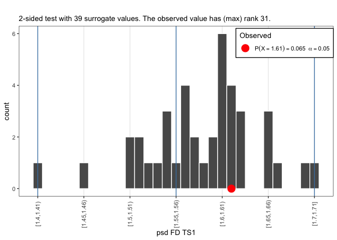<!-- -->

```r
plotSUR_hist(surrogateValues = TS3surrogates_FD, observedValue = TS3_FDpsd,sides = "two.sided", doPlot = TRUE, measureName = "psd FD TS3")
```

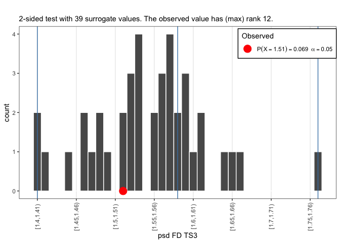<!-- -->

```r
plotSUR_hist(surrogateValues = TS5surrogates_FD, observedValue = TS5_FDpsd,sides = "two.sided", doPlot = TRUE, measureName = "psd FD TS5")
```

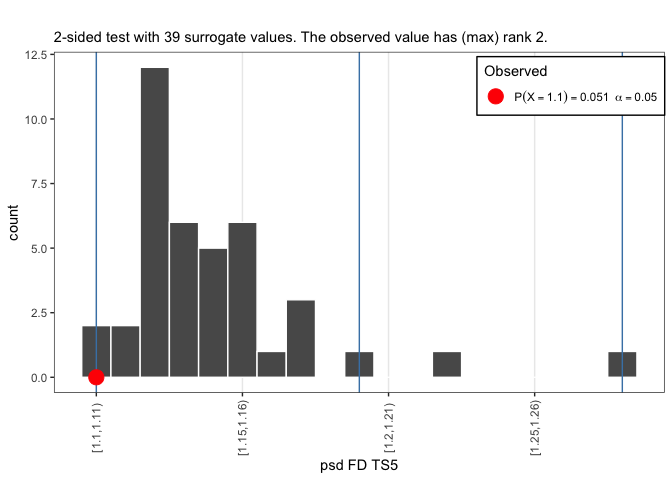<!-- -->


 * Let's print the results into a table
 


```r
xx <-x
xx$FDpsd <- c(TS1_FDpsd,TS3_FDpsd,TS5_FDpsd)
xx$FDpsdAAFT.median <- c(median(TS1surrogates_FD),median(TS3surrogates_FD),median(TS5surrogates_FD)) 
knitr::kable(xx, digits = 2, booktabs=TRUE,formt="html")
```


Source    FDsda   FDsdaAAFT.median   FDpsd   FDpsdAAFT.median
-------  ------  -----------------  ------  -----------------
TS1        1.61               1.59    1.61               1.59
TS3        1.58               1.55    1.51               1.55
TS5        1.04               1.07    1.10               1.13


