# **Basic (Nonlinear) Time Aeries Analysis**

</br>

\BeginKnitrBlock{rmdimportant}<div class="rmdimportant">* Watch [**Assignment Lecture 03**](https://youtu.be/VSR5x0eOUYQ) video before you make these assignments.
* [Chapter 4 + 5](https://complexity-methods.github.io/book/basic-time-series-analysis.html) summarises most of the information in the video lecture. 
* Install R package *casnet*, [follow these instructions](https://fredhasselman.com/casnet/).</div>\EndKnitrBlock{rmdimportant}

</br>

## **Basic TSA** 

> "order is essentially the arrival of redundancy in a system, a reduction of possibilities"
>
> --- Von Föerster (2003)

</br>

In this course we will not discuss the type of linear time series models known as Autoregressive Models (e.g. AR, ARMA, ARiMA, ARfiMA) summarised on [this Wikipedia page on timeseries](https://en.wikipedia.org/wiki/Time_series#Models). There are many extensions to these linear models, check the [`CRAN Task View` on `Time Series Analysis`](https://cran.r-project.org/web/views/TimeSeries.html) to learn more (e.g. about package `zoo` and `forecast`). 

</br>

\BeginKnitrBlock{rmdnote}<div class="rmdnote">We will in fact be discussing a lot of methods in a book the Wiki page refers to for *'Further references on non-linear time series analysis'*: [**Nonlinear Time Series Analysis** by Kantz & Schreiber](https://www.cambridge.org/core/books/nonlinear-time-series-analysis/519783E4E8A2C3DCD4641E42765309C7). You do not need to buy the book, but it can be a helpful reference if you want to go beyond the formal level (= mathematics) used in this course. Some of the packages we use are based on the accompanying software to the book [**TiSEAN**](https://www.pks.mpg.de/~tisean/Tisean_3.0.1/index.html) which is written in `C` and `Fortran` and can be called from the command line (Windows / Linux). On MacOS you can install it from the terminal if you have [homebrew](https://brew.sh) installed: 

`> brew tap brewsci/science`       
`> brew install tisean`
</div>\EndKnitrBlock{rmdnote}


## **Data: Three time series** {-}

We are going to analyse 3 different time series using different techniques. The goal is to describe the dynamics, temporal patterns (if any) and perhaps other interesting characteristics of these time series.


### Importing data {-}

Two ways:

**A.** By downloading:

  1. Follow the link, e.g. for [`series.xlsx`](https://github.com/complexity-methods/CSA-assignments/blob/master/assignment_data/BasicTSA_arma/series.xlsx).
  2. On the Github page, find a button marked **Download** (or **Raw** for text files).
  3. Download the file
  4. Load it into `R` using the code below       


```r
library(rio)
series <- rio::import("series.xlsx")
```
     
      
**B.** By directly importing the file in R from Github:

   1. Copy the `url` associated with the **Download**  button [on Github](https://github.com/complexity-methods/CSA-assignments/blob/master/assignment_data/BasicTSA_arma/series.csv) (right-click).
   2. The copied path should contain the word 'raw' somewhere in the url.
   3. Call `rio::import(url)`
        

```r
library(rio)
series <- rio::import("https://github.com/complexity-methods/CSA-assignments/raw/master/assignment_data/BasicTSA_arma/series.xlsx")
```


</br>
</br>

### Level, Fluctuation, and Visualisation  {.tabset .tabset-fade .tabset-pills}

`series.xlsx` contains three time series as columns `TS_1`, `TS_2` and `TS_3`, the first column is labelled `TIME`. 


#### Questions {-}

* As a first step look at the mean and the standard deviation  of the three series, rounded to 2 decimals (use `mean()`, `sd()`, `round()`).
    + Suppose these were time series from three different subjects in an experiment, what would you conclude based on the means and SD's? 
* Let's visualize these data. See the [appendix on plotting time series](https://complexity-methods.github.io/book/plotTS.html) for all the different options.
    + Does the visual representation of these series correspond to what you expected based on the statistical properties of these series?
    + We'll examine whether there are different levels in the data using function `ts_levels()` in *casnet*. Look at the examples in the manual entry of this function to see how to plot the level data.


#### Answers {-}

* As a first step look at the mean and the standard deviation of the three series (`summary()`, `sd()`).
  + Suppose these were time series from three different subjects in an experiment, what would you conclude based on the means and SD's?

----


```r
library(casnet)

# TS1
round(mean(series$TS_1),2)
## [1] 0.51
round(sd(series$TS_1),2)
## [1] 0.35

# TS2
round(mean(series$TS_2),2)
## [1] 0.51
round(sd(series$TS_2),2)
## [1] 0.35

# TS3
round(mean(series$TS_3),2)
## [1] 0.51
round(sd(series$TS_3),2)
## [1] 0.35

# Similar means and SDs rounded to 2 decimal points
```

----

* Let's visualize these data. See the [chapter on plotting time series](https://complexity-methods.github.io/book/plotTS.html) for all the different options to do this.
    + Does the visual representation of these series correspond to what you expected based on the statistical properties of these series?
    + We'll examine whether there are different levels in the data using function `ts_levels()`. Look at the examples in the manual entry of this function to see how to plot the level data.
    + Time series 2 could also be considered to oscillate around a relatively stable level. Try to modify the arguments of `ts_levels()` so it will return this level.      
      
      

```r
lvl1 <- ts_levels(series$TS_1)
plot(ts(lvl1$pred$y))
lines(lvl1$pred$p, col="red3", lwd=3)
```

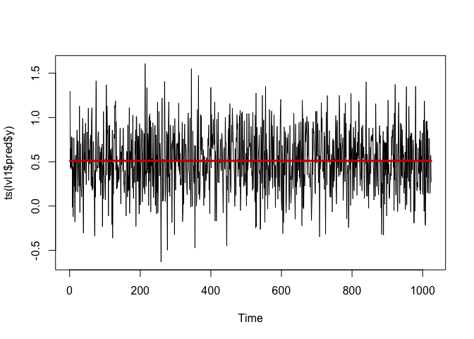<!-- -->

```r
lvl2 <- ts_levels(series$TS_2)
plot(ts(lvl2$pred$y))
lines(lvl2$pred$p, col="red3", lwd=3)
```

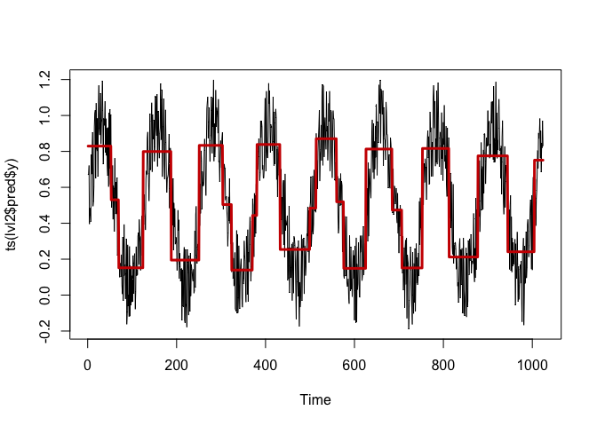<!-- -->

```r
lvl3 <- ts_levels(series$TS_3)
plot(ts(lvl3$pred$y))
lines(lvl3$pred$p, col="red3", lwd=3)
```

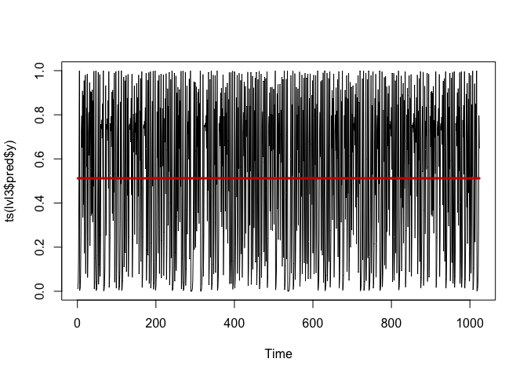<!-- -->

```r
### Time series 2
### You can set 'changeSensitivity' to a stricter value.

lvl2a <- ts_levels(series$TS_2, changeSensitivity = .1)
plot(ts(lvl2a$pred$y))
lines(lvl2a$pred$p, col="red3", lwd=3)
```

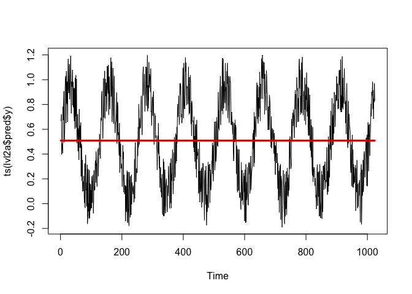<!-- -->


### Correlation functions  {.tabset .tabset-fade .tabset-pills}

Correlation functions are intuitive tools for quantifying the temporal structure in a time series. As you know, the correlation measure can only quantify linear regularities between variables, which is why we discuss them here as `basic` tools for time series analysis. So what are the variables? In the simplest case, the variables between which we calculate a correlation are between a data point at time *t* and a data point that is separated in time by some *lag*, for example, if you would calculate the correlation in a lag-1 return plot, you would have calculated the 1st value of the correlation function (actually, it is 2nd value, the 1st value is the correlation of time series with itself, the lag-0 correlation, which is of course $r = 1$). 

You can do the analyses in SPSS, `R` or JAMOVI. This analysis is very common, so you'll find functions called `acf`, `pacf`and `ccf` in many other statistical software packages, In package `casnet` you can use the function `plotRED_acf()` (plot REDundancies).


#### Questions {-}

* Let's look at the autocorrelation function and partial autocorrelation function (use `acf()`, `pacf()`, and try `plotRED_acf()`)
  + Describe the correlational structure of these time series


#### Answers {-}

* Let's look at the autocorrelation function and partial autocorrelation function (use `acf()`, `pacf()`, and try `plotRED_acf()`)
  + Describe the correlational structure of these time series

----


```r
library(casnet)

acf(series$TS_1, lag.max = 50)
```

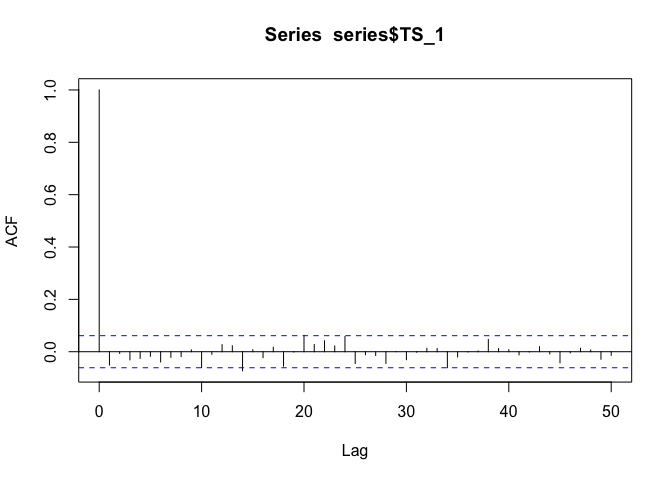<!-- -->

```r
acf(series$TS_1, lag.max = 50, type = "partial")
```

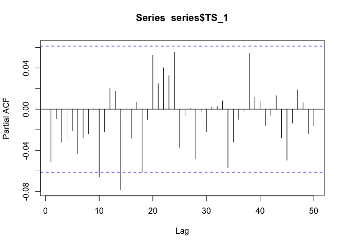<!-- -->

```r
plotRED_acf(y = series$TS_1,Lmax = 50, returnCorFun = FALSE)
```

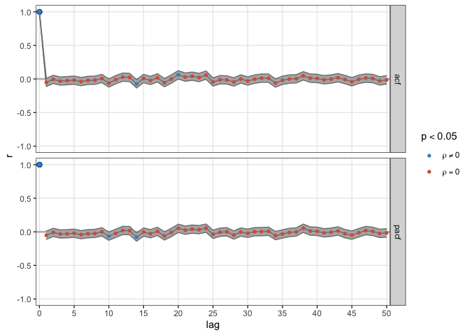<!-- -->

```r
acf(series$TS_2, lag.max = 50)
```

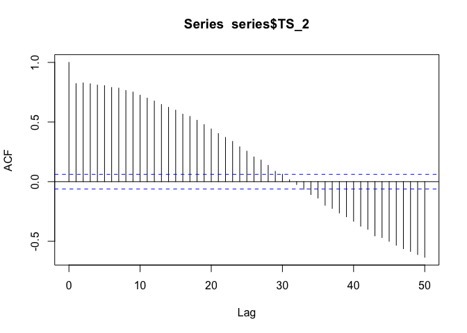<!-- -->

```r
acf(series$TS_2, lag.max = 50, type = "partial")
```

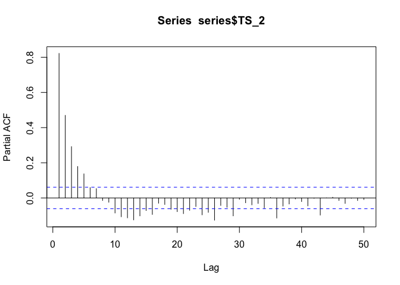<!-- -->

```r
plotRED_acf(y = series$TS_2,Lmax = 50, returnCorFun = FALSE)
```

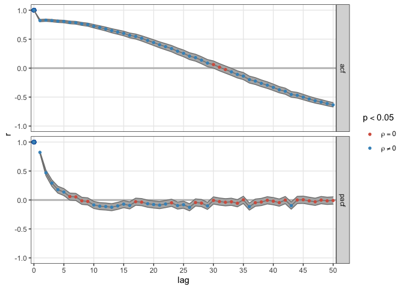<!-- -->

```r
acf(series$TS_3, lag.max = 50)
```

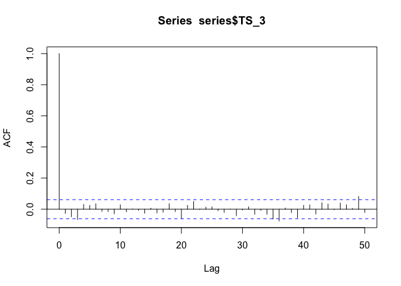<!-- -->

```r
acf(series$TS_3, lag.max = 50, type = "partial")
```

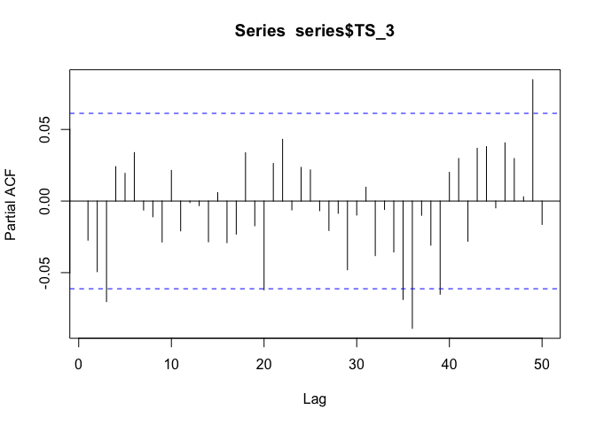<!-- -->

```r
plotRED_acf(y = series$TS_3,Lmax = 50, returnCorFun = FALSE)
```

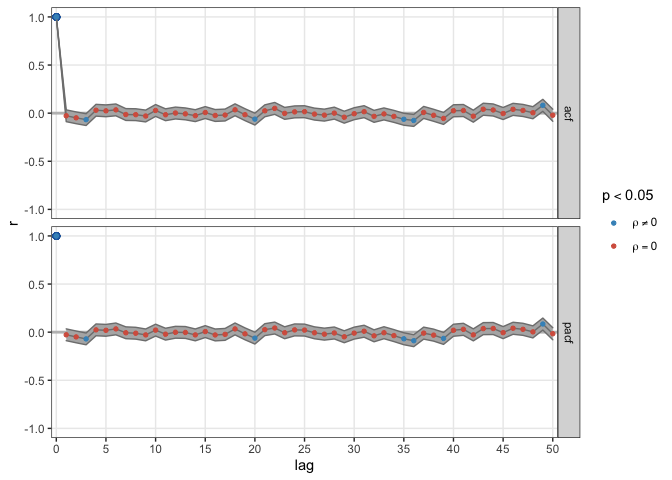<!-- -->


## **Basic Non-linear TSA** 

Many non-linear analyses can be considered "descriptive" techniques, that is, the aim is not to fit the parameters of a model, but to describe, quantitatively, some aspects of how one value changes into another value over time.


### Intuitive notion of Fractal Dimension {-}

A qualitative description of the fractal dimension of a time series (or 1D curve) can be given by deciding whether the curve looks/behaves like a line, or, like a plane. 

As can be seen in the figure below, if slow processes (low frequencies) dominate the signal, they are more *line-like* and will have a fractal dimension closer to `1`. If fast processes (high frequencies) dominate the signal, they are more *plane-like* and will have a fractal dimension closer to `2`.


```r
library(casnet)
library(plyr)

N    <- 512
noises <- round(seq(-3,3,by=.5),1)

yy <- llply(noises, function(a){cbind(noise_powerlaw(alpha = a, N = 512, seed = 1234))})
names(yy) <- noises
tmp<- data.frame(yy,check.names = FALSE)

plotTS_multi(tmp, ylabel = "Scaling exponent alpha")
```

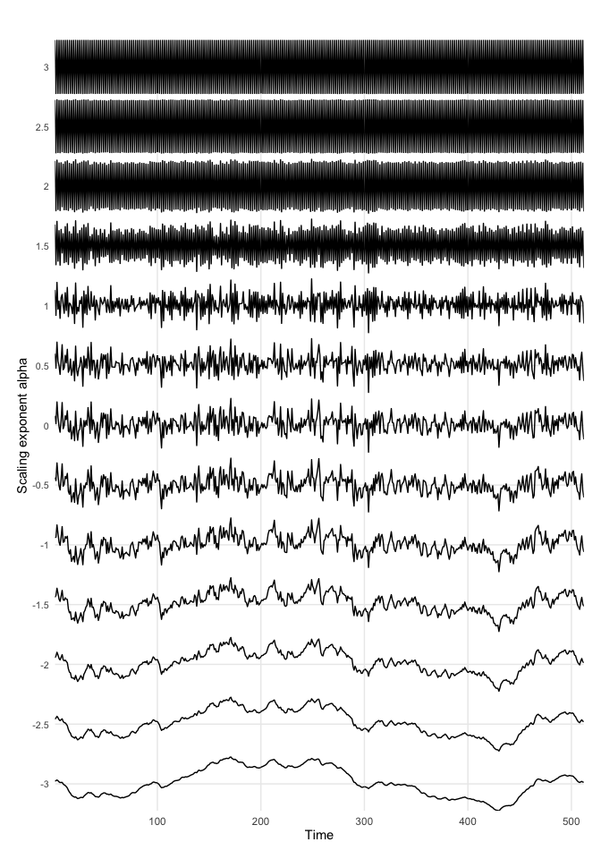<!-- -->


<!-- ## Three time series -->

<!-- We are going to analyse 3 different time series using different techniques. The goal is to describe the dynamics, temporal patterns (if any) and perhaps other interesting characteristics of these time series. -->


<!-- **Importing data** -->

<!-- Two ways: -->

<!-- A. By downloading: -->

<!--   1. Follow the link, e.g. for [`series.xlsx`](https://github.com/complexity-methods/CSA-assignments/blob/master/assignment_data/BasicTSA_arma/series.xlsx). -->
<!--   2. On the Github page, find a button marked **Download** (or **Raw** for text files). -->
<!--   3. Download the file -->
<!--   4. Load it into `R` using the code below        -->

<!-- ```{r, eval=FALSE} -->
<!-- library(rio) -->
<!-- series <- rio::import("series.xlsx") -->
<!-- ``` -->


<!-- B. By importing from Github: -->

<!--    1. Copy the `url` associated with the **Download**  button [on Github](https://github.com/complexity-methods/CSA-assignments/blob/master/assignment_data/BasicTSA_arma/series.csv) (right-click). -->
<!--    2. The copied path should contain the word 'raw' somewhere in the url. -->
<!--    3. Call `rio::import(url)` -->

<!-- ```{r} -->
<!-- library(rio) -->
<!-- series <- rio::import("https://github.com/complexity-methods/CSA-assignments/raw/master/assignment_data/BasicTSA_arma/series.xlsx") -->
<!-- ``` -->


### Relative Roughness   {.tabset .tabset-fade .tabset-pills}

Relative Roughness is calculated using the following formula:    

\begin{equation}
RR = 2\left[1 - \frac{\gamma_1(x_i)}{Var(x_i)}\right]
(\#eq:RR)
\end{equation}

The numerator in the formula stands for the `lag 1` auto-covariance of the time series $x_i$, this is the unstandardised lag1 autocorrelation. Check the function `acf()` to figure out how to get it. The denominator stands for the (global) variance of $x_i$ which all statistics packages can calculate. Another way to describe the variance is: `lag 0` auto-covariance.


#### Questions {-}

* Write down your first guesses for roughness values based on the plots of the time series (i.e., which one looks more like a line than a plane, which one looks more 'smooth' than 'rough'?).
*	Next, explore some measures of central tendency and dispersion (calculate the mean, variance standard deviation)
*	Compute the Relative Roughness for each time series.
    + You can try to figure it out for yourself by using Equation \@ref(eq:RR). Hint: Look at the manual entry for function `acf()`, argument `type`. 
    + There is also a function in `casnet` that will do everything for you: `fd_RR()`


Use Figure \@ref(fig:RRf3) to lookup which value of `RR` corresponds to which type of dynamics.

<div class="figure" style="text-align: center">
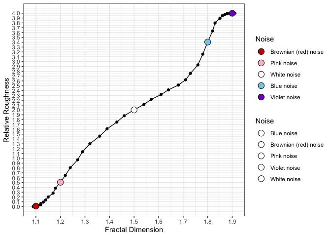
<p class="caption">(\#fig:RRf3)Coloured Noise versus Relative Roughness</p>
</div>


#### Answers {-}


* Write down your first guesses for roughness values based on the plots of the time series (i.e., which one looks more like a line than a plane, which one looks more 'smooth' than 'rough'?).     
*	Next, explore some measures of central tendency and dispersion (calculate the mean, variance standard deviation)
*	Compute the Relative Roughness for each time series.    
   - You can try to figure it out for yourself by using Equation \@ref(eq:RR). Hint: Look at the manual entry for function `acf()`, argument `type`. 
   - There is also a function in `casnet` that will do everything for you: `fd_RR()`

----

To see how to calculate RR 'by hand' you could look at the code of the function `fd_RR()`
If you select the function name in R and press F2, you should be able to see the code, or you can just type `fd_RR` (without parentheses)


```r
fd_RR
```

```
## function (y) 
## {
##     VAR <- stats::acf(y, lag.max = 1, type = "covariance", plot = FALSE)
##     RelR <- 2 * (1 - VAR$acf[2]/VAR$acf[1])
##     attributes(RelR) <- list(localAutoCoVariance = VAR$acf[2], 
##         globalAutoCoVariance = VAR$acf[1])
##     return(RelR)
## }
## <bytecode: 0x7fa4e48750b0>
## <environment: namespace:casnet>
```

----


```r
# TS1
fd_RR(series$TS_1)
```

```
## [1] 2.101952
## attr(,"localAutoCoVariance")
## [1] -0.006144102
## attr(,"globalAutoCoVariance")
## [1] 0.1205297
```

```r
# TS2
fd_RR(series$TS_2)
```

```
## [1] 0.3564002
## attr(,"localAutoCoVariance")
## [1] 0.09851098
## attr(,"globalAutoCoVariance")
## [1] 0.1198722
```

```r
# TS3
fd_RR(series$TS_3)
```

```
## [1] 2.054631
## attr(,"localAutoCoVariance")
## [1] -0.003322233
## attr(,"globalAutoCoVariance")
## [1] 0.1216251
```


### Sample Entropy  {.tabset .tabset-fade .tabset-pills}

Use the `sample_entropy()` function in package `pracma`.

#### Questions {-}

* Calculate the Sample Entropy of the three time series you now have.
    + Use a segment length `edim` of 3 data points, and a tolerance range `r` equal to the `sd()` of the series (`1*sd(ts)`).
    + Can you change the absolute SampEn outcomes by 'playing' with the `edim` parameter? If so, how does the outcome change, and why?
    + Do changes in the `SampEn` value due to different parameter settings change the relative order of the entropy for the three time series?


Use Figure \@ref(fig:sampEnt) to lookup which value of `SampEn` corresponds to which type of dynamics.

<div class="figure" style="text-align: center">
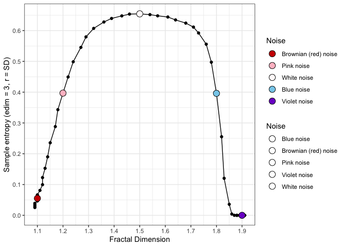
<p class="caption">(\#fig:sampEnt)Coloured Noise versus Sample Entropy</p>
</div>


#### Answers {-}

* Calculate the Sample Entropy of the three time series you now have.
    + Use a segment length `edim` of 3 data points, and a tolerance range `r` equal to the `sd()` of the series (`1*sd(ts)`).
    + Can you change the absolute SampEn outcomes by 'playing' with the `edim` parameter? If so, how does the outcome change, and why?
    + Do changes in the `SampEn` value due to different parameter settings change the relative order of the entropy for the three time series?


```r
library(pracma)

sample_entropy(series$TS_1, edim = 3, r = sd(series$TS_1))
## [1] 0.6525828
sample_entropy(series$TS_2, edim = 3, r = sd(series$TS_2))
## [1] 0.1958882
sample_entropy(series$TS_3, edim = 3, r = sd(series$TS_3))
## [1] 0.5281159

# Change edim parameters.
sample_entropy(series$TS_1, edim = 6, r = sd(series$TS_1))
## [1] 0.6760045
sample_entropy(series$TS_2, edim = 6, r = sd(series$TS_2))
## [1] 0.1678013
sample_entropy(series$TS_3, edim = 6, r = sd(series$TS_3))
## [1] 0.5276779


# Change r parameters.
# Has effect on relative order.
sample_entropy(series$TS_1, edim = 3, r = .2*sd(series$TS_1))
## [1] 2.202697
sample_entropy(series$TS_2, edim = 3, r = .2*sd(series$TS_2))
## [1] 1.519537
sample_entropy(series$TS_3, edim = 3, r = .2*sd(series$TS_3))
## [1] 0.6279321
```

The change of `edim` keeps the relative order, change of `r` for the same `edim` does not.


### The return plot {.tabset .tabset-fade .tabset-pills}

On Day 1 we looked at return plots of simulated time series, we discussed what kind of shapes to expect based on the kind of change processes generated the data.


#### Questions {-}

* Based on the:
  + *correlation functions*, what kind of shape or pattern do you expect to see in a lag-1 return plot of each series?
  + *RR*, what kind of shape or pattern do you expect to see in a lag-1 return plot of each series?
  + *SampEn*, what kind of shape or pattern do you expect to see in a lag-1 return plot of each series?
* Create the return plots!


#### Answers{-}

* Based on the:
  + *correlation functions*, what kind of shape or pattern do you expect to see in a lag-1 return plot of each series?
  + *RR*, what kind of shape or pattern do you expect to see in a lag-1 return plot of each series?
  + *SampEn*, what kind of shape or pattern do you expect to see in a lag-1 return plot of each series?
* Create the return plots!


```r
library(dplyr)

plot(dplyr::lag(series$TS_1), series$TS_1, pch = ".")
```

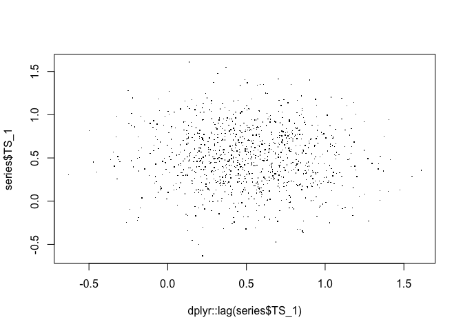<!-- -->

```r
plot(dplyr::lag(series$TS_2), series$TS_2, pch = ".")
```

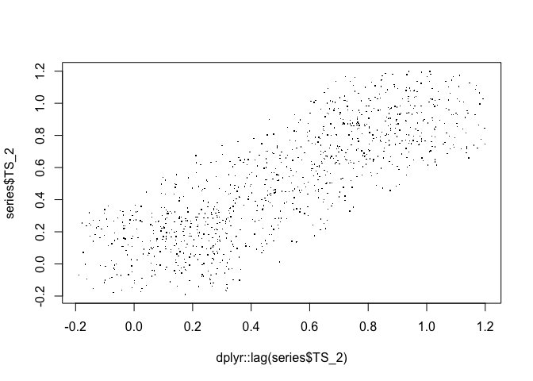<!-- -->

```r
plot(dplyr::lag(series$TS_3), series$TS_3, pch = ".")
```

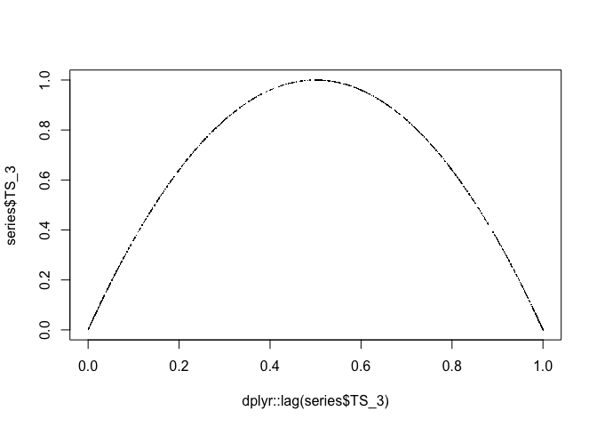<!-- -->

<!-- Use Figure \@ref(fig:RRf3) to lookup which value of $RR$ corresponds to which type of dynamics: -->

<!-- **TS1**: Pink noise -->
<!-- **TS2**: Brownian noise -->
<!-- **TS3**: White noise -->


<!-- **Randomize** -->

<!-- To randomize the data you may use the function `sample` (which is easier than `randperm`) -->

<!-- ```{r} -->
<!-- library(pracma) -->
<!-- # randperm() -->
<!-- TS1Random <- TS1$TS1[randperm(length(TS1$TS1))] -->

<!-- # sample() -->
<!-- TS1Random <- sample(TS1$TS1, length(TS1$TS1)) -->
<!-- TS2Random <- sample(TS2$TS2, length(TS2$TS2)) -->
<!-- TS3Random <- sample(TS3$TS3, length(TS3$TS3)) -->


<!-- plot.ts(TS1Random) -->
<!-- lines(ts(TS1$TS1),col="red3") -->
<!-- ``` -->

<!-- If you repeat this for TS2 and TS3 and compute the Relative Roughness of each randomized time series, the outcomes should be around 2, white noise! This makes sense, you destroyed all the correlations in the data by removing the temporal order with which values were observed. -->

<!-- ```{r} -->
<!-- library(casnet) -->
<!-- cat("TS1random\n") -->
<!-- cat(fd_RR(TS1Random)) -->
<!-- cat("\nTS2random\n") -->
<!-- cat(fd_RR(TS2Random)) -->
<!-- cat("\nTS3random\n") -->
<!-- cat(fd_RR(TS3Random)) -->
<!-- ``` -->

<!-- **Integrate** -->

<!-- Normalize the white noise time series -->
<!-- ```{r} -->
<!-- TS3Norm <- scale(TS3$TS3) -->
<!-- ``` -->

<!-- Now integrate it, which just means, 'take the cumulative sum'. -->
<!-- ```{r} -->
<!-- TS3Int <- cumsum(TS3Norm) -->
<!-- plot.ts(TS3Int) -->
<!-- lines(ts(TS3Norm),col="red3") -->
<!-- ``` -->

<!-- If you compute the Relative Roughness of the integrated time series, the outcome should be close to 0, Brownian noise. -->
<!-- ```{r} -->
<!-- cat("\nTS3Int\n") -->
<!-- cat(RR(TS3Int)) -->
<!-- ``` -->


<!-- ### Sample Entropy  {.tabset .tabset-fade .tabset-pills} -->

<!-- Use the `sample_entropy()` function in package `pracma`. -->

<!-- #### Questions {-} -->

<!-- * Calculate the Sample Entropy of the two sets of three time series you now have. -->
<!--     + Use your favourite function to estimate the sample entropy of the three time series. Use for instance a segment length `edim` of 3 data points, and a tolerance range `r` of 1 * the standard deviation of the series. What values do you observe? -->
<!--     + Can you change the absolute SampEn outcomes by 'playing' with the m parameter? If so, how does the outcome change, and why? -->
<!--     + Can you change the absolute SampEn outcomes by 'playing' with the r parameter If so, how does the outcome change, and why? -->
<!--     + Do changes in the relative SampEn outcome change the outcomes for the three time series relative to each other? -->

<!-- *	Extra: Go back to the assignment where you generated simulated time series from the logistic map. -->


<!-- #### Answers {-} -->

<!-- Change some of the parameters. -->

<!-- ```{r,collapse=TRUE} -->
<!-- library(rio) -->
<!-- library(pracma) -->

<!-- # ACF assignment data `series` -->
<!-- cat(paste0("\nseries.TS1 m=3\n",sample_entropy(series$TS_1, edim = 3, r = sd(series$TS_1)))) -->
<!-- cat(paste0("\nseries.TS2 m=3\n",sample_entropy(series$TS_2, edim = 3, r = sd(series$TS_2)))) -->
<!-- cat(paste0("\nseries.TS3 m=3\n",sample_entropy(series$TS_3, edim = 3, r = sd(series$TS_3)))) -->


<!-- # ACF assignment data `series` -->
<!-- cat(paste0("\nseries.TS1 m=6\n",sample_entropy(series$TS_1, edim = 6, r = sd(series$TS_1)))) -->
<!-- cat(paste0("\nseries.TS2 m=6\n",sample_entropy(series$TS_2, edim = 6, r = sd(series$TS_2)))) -->
<!-- cat(paste0("\nseries.TS3 m=6\n",sample_entropy(series$TS_3, edim = 6, r = sd(series$TS_3)))) -->


<!-- # ACF assignment data `series` -->
<!-- cat(paste0("\nseries.TS1 m=6, r=.5\n",sample_entropy(series$TS_1, edim = 3, r = .5*sd(series$TS_1)))) -->
<!-- cat(paste0("\nseries.TS2 m=6, r=.5\n",sample_entropy(series$TS_2, edim = 3, r = .5*sd(series$TS_2)))) -->
<!-- cat(paste0("\nseries.TS3 m=6, r=.5\n",sample_entropy(series$TS_3, edim = 3, r = .5*sd(series$TS_3)))) -->

<!-- ``` -->

<!-- The change of `m` keeps the relative order, change of `r` for the same `m` does not. -->

<!-- **Values of other time series** -->

<!-- ```{r message=FALSE, warning=FALSE, collapse=TRUE} -->

<!-- # RR assignment data `TS1,TS2,TS3` -->
<!-- cat(paste0("\nTS1\n",sample_entropy(TS1$TS1, edim = 3, r = sd(TS1$TS1)))) -->
<!-- cat(paste0("TS1Random\n",sample_entropy(TS1Random, edim = 3, r = sd(TS1Random)))) -->

<!-- cat(paste0("\nTS2\n",sample_entropy(TS2$TS2, edim = 3, r = sd(TS2$TS2)))) -->
<!-- cat(paste0("TS2Random\n",sample_entropy(TS2Random, edim = 3, r = sd(TS2Random)))) -->

<!-- cat(paste0("\nTS3\n",sample_entropy(TS3$TS3, edim = 3, r = sd(TS3$TS3)))) -->
<!-- cat(paste0("TS3Int\n",sample_entropy(TS3Norm, edim = 3, r = sd(TS3Norm)))) -->


<!-- # Logistic map -->
<!-- library(casnet) -->
<!-- cat("\nLogistic map\nr=2.9\n") -->
<!-- y1<-growth_ac(r = 2.9,type="logistic") -->
<!-- sample_entropy(y1, edim = 3, r = sd(y1)) -->
<!-- cat("\nLogistic map\nr=4\n") -->
<!-- y2<-growth_ac(r = 4,type="logistic") -->
<!-- sample_entropy(y2, edim = 3, r = sd(y2)) -->


<!-- ``` -->


