# **Fluctuation and Disperion analyses** {-}

    
### Three plus two time series {-}

We are going to analyse the same 3 time series as during the last session, now using fluctuation and dispersion analyses. 

**Importing data**

Two ways:

A. By downloading:

  1. Follow the link, e.g. for [`series.xlsx`](https://github.com/complexity-methods/CSA-assignments/blob/master/assignment_data/BasicTSA_arma/series.xlsx).
  2. On the Github page, find a button marked **Download** (or **Raw** for text files).
  3. Download the file
  4. Load it into `R` using the code below       


```r
library(rio)
series <- rio::import("series.xlsx")
```
     
      
B. By directly importing the file in R from Github:

   1. Copy the `url` associated with the **Download**  button [on Github](https://github.com/complexity-methods/CSA-assignments/blob/master/assignment_data/BasicTSA_arma/series.csv) (right-click).
   2. The copied path should contain the word 'raw' somewhere in the url.
   3. Call `rio::import(url)`
        

```r
library(rio)
series <- rio::import("https://github.com/complexity-methods/CSA-assignments/raw/master/assignment_data/BasicTSA_arma/series.xlsx")
```


Remember this is what the time series and retun plots looked like.

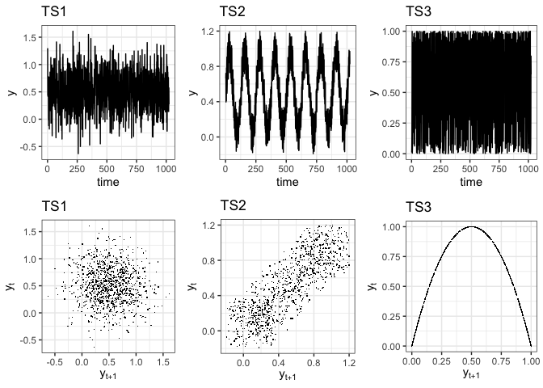<!-- -->


Now we'll add two additional time series, a synthetic 1/f noise signal using the function `noise_powerlaw()`, and an actual heart rate recording. 

Run the code below:

```r
library(casnet)

series$TS_4 <- noise_powerlaw(alpha = -1, N = 1024, standardise = TRUE)
series$TS_5 <- noise_powerlaw(alpha = -2, N = 1024, standardise = TRUE)
```


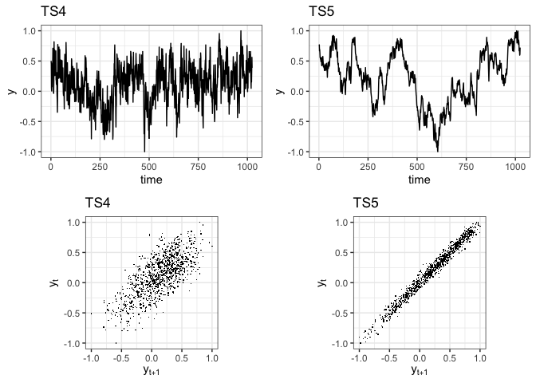<!-- -->


###  Standardised Dispersion Analysis {.tabset .tabset-fade .tabset-pills}


#### Questions {-}

* Common data preparation before running fluctuation analyses like `SDA`:
    + Normalize the time series (using `sd` based on `N`, not `N-1`, e.g. by using `ts_standardise()`, or use the arguments of the function `fd_sda()`)
    + Check whether time series length is a power of `2`. If you use `nextn(length(TS),factors=2)`, the number you get is the length your time series should be to create equal bin sizes. You can pad the series with 0s before analysis, look at package `invctr` at the infix function `%+]%`.
* Perform `sda` on the 5 time series, use `dataMin = 6` to exclude the larger bin sizes from estimating  the scaling relation.
* Compare what you find for `fd_sda()` to the other techniques (`fd_RR`,`SampEn`, `acf`, `pacf`)


#### Answers {-}


```r
library(casnet)

# All N are already a power of 2
N1 <- nextn(length(series$TS_1), factors = 2)
N2 <- nextn(length(series$TS_2), factors = 2)
N3 <- nextn(length(series$TS_3), factors = 2)
N4 <- nextn(length(series$TS_4), factors = 2)
N5 <- nextn(length(series$TS_5), factors = 2)

#Suppose the time series Y had length 10, you could have used:
library(invctr)
Y <- 1:10
Y %+]% 6
##  [1]  1  2  3  4  5  6  7  8  9 10  0  0  0  0  0  0

# The default of fd_sda() is to standardise in the mean and sd
fdSDA1 <- fd_sda(series$TS_1, dataMin = 6, doPlot = TRUE, tsName = "TS1")
## 
## 
## (mf)dfa:	Sample rate was set to 1.
```

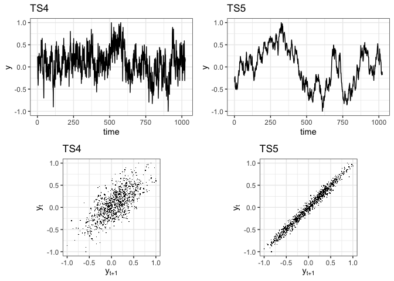<!-- --><!-- -->

```
## 
## ~~~o~~o~~casnet~~o~~o~~~
## 
##  Standardised Dispersion Analysis 
## 
##  Full range (n = 10)
## Slope = -0.62 | FD = 1.62 
## 
##  Fit range (n = 8)
## Slope = -0.56 | FD = 1.56
## 
## ~~~o~~o~~casnet~~o~~o~~~
fdSDA2 <- fd_sda(series$TS_2, dataMin = 6, doPlot = TRUE, tsName = "TS2")
## 
## 
## (mf)dfa:	Sample rate was set to 1.
```

<!-- --><!-- -->

```
## 
## ~~~o~~o~~casnet~~o~~o~~~
## 
##  Standardised Dispersion Analysis 
## 
##  Full range (n = 10)
## Slope = -0.45 | FD = 1.45 
## 
##  Fit range (n = 8)
## Slope = -0.32 | FD = 1.32
## 
## ~~~o~~o~~casnet~~o~~o~~~
fdSDA3 <- fd_sda(series$TS_3, dataMin = 6, doPlot = TRUE, tsName = "TS3")
## 
## 
## (mf)dfa:	Sample rate was set to 1.
```

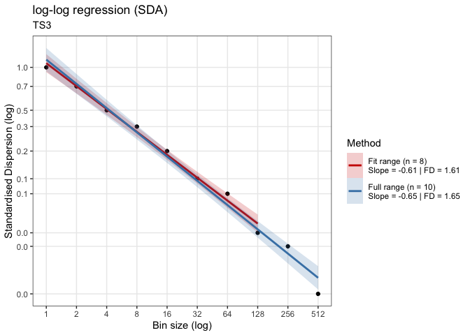<!-- --><!-- -->

```
## 
## ~~~o~~o~~casnet~~o~~o~~~
## 
##  Standardised Dispersion Analysis 
## 
##  Full range (n = 10)
## Slope = -0.65 | FD = 1.65 
## 
##  Fit range (n = 8)
## Slope = -0.61 | FD = 1.61
## 
## ~~~o~~o~~casnet~~o~~o~~~
fdSDA4 <- fd_sda(series$TS_4, dataMin = 6, doPlot = TRUE, tsName = "TS4")
## 
## 
## (mf)dfa:	Sample rate was set to 1.
```

<!-- -->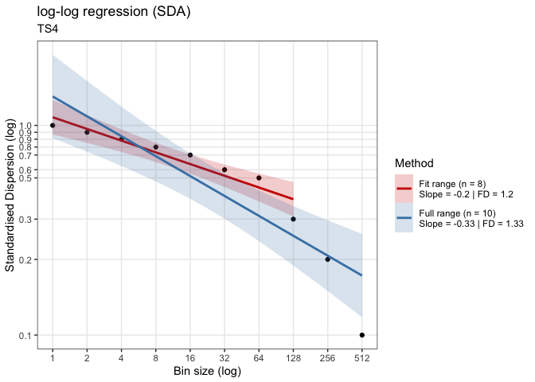<!-- -->

```
## 
## ~~~o~~o~~casnet~~o~~o~~~
## 
##  Standardised Dispersion Analysis 
## 
##  Full range (n = 10)
## Slope = -0.33 | FD = 1.33 
## 
##  Fit range (n = 8)
## Slope = -0.2 | FD = 1.2
## 
## ~~~o~~o~~casnet~~o~~o~~~
fdSDA5 <- fd_sda(series$TS_5, dataMin = 6, doPlot = TRUE, tsName = "TS5")
## 
## 
## (mf)dfa:	Sample rate was set to 1.
```

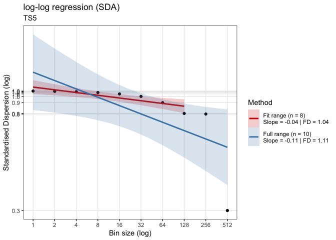<!-- --><!-- -->

```
## 
## ~~~o~~o~~casnet~~o~~o~~~
## 
##  Standardised Dispersion Analysis 
## 
##  Full range (n = 10)
## Slope = -0.11 | FD = 1.11 
## 
##  Fit range (n = 8)
## Slope = -0.04 | FD = 1.04
## 
## ~~~o~~o~~casnet~~o~~o~~~

# If you ask to return the powerlaw (returnPLAW = TRUE) the function plotFD_loglog() can make the plot as well
fdS5 <- fd_sda(series$TS_5, returnPLAW = TRUE, dataMin = 6, doPlot = TRUE, tsName = "TS5")
## 
## 
## (mf)dfa:	Sample rate was set to 1.
```

<!-- --><!-- -->

```
## 
## ~~~o~~o~~casnet~~o~~o~~~
## 
##  Standardised Dispersion Analysis 
## 
##  Full range (n = 10)
## Slope = -0.11 | FD = 1.11 
## 
##  Fit range (n = 8)
## Slope = -0.04 | FD = 1.04
## 
## ~~~o~~o~~casnet~~o~~o~~~
plotFD_loglog(fdS5, title = "SDA", subtitle = "TS5")
```

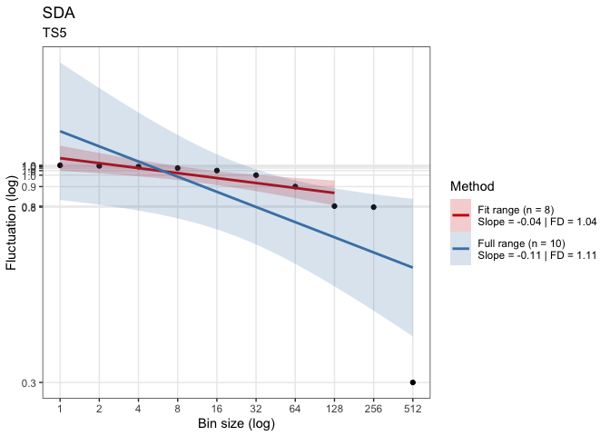<!-- -->


###  Spectral Slope {.tabset .tabset-fade .tabset-pills}


#### Questions {-}

* Common data preparation before running spectral analyses:
    + Normalize the time series (using `sd` based on `N`, not `N-1`, e.g. by using `ts_standardise()`, or use the arguments of the function `fd_psd()`)
    + Check whether time series length is a power of `2`. If you use `nextn(length(TS),factors=2)`, the number you get is the length your time series should be to create equal bin sizes. You can pad the series with 0s before analysis, look at package `invctr` at the infix function `%+]%`.
* Perform `fd_psd()` on the 3 time series.
* Compare to what you find for `fd_psd` to the other measures (`fd_RR`,`SampEn`, `acf`, `pacf`)


#### Answers {-}


```r
library(casnet)

# All N are already a power of 2
N1 <- nextn(length(series$TS_1), factors = 2)
N2 <- nextn(length(series$TS_2), factors = 2)
N3 <- nextn(length(series$TS_3), factors = 2)
N4 <- nextn(length(series$TS_4), factors = 2)
N5 <- nextn(length(series$TS_5), factors = 2)

#Suppose the time series Y had length 10, you could have used:
library(invctr)
Y <- 1:10
Y %+]% 6
##  [1]  1  2  3  4  5  6  7  8  9 10  0  0  0  0  0  0

# The default of fd_psd() is to standardises on the mean and sd, and detrended
fdPSD1 <- fd_psd(series$TS_1, doPlot = TRUE, tsName = "TS1")
## 
## 
## (mf)dfa:	Sample rate was set to 1.
```

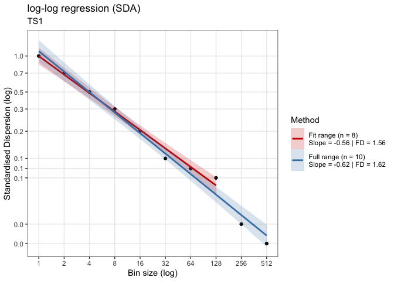<!-- --><!-- -->

```
## 
## ~~~o~~o~~casnet~~o~~o~~~
## 
##  Power Spectral Density Slope 
## 
##  All frequencies (n = 512)
## Slope = 0.09 | FD = 1.53 
## 
##  Hurvich-Deo (n = 35)
## Slope = 0.13 | FD = 1.55
## 
## ~~~o~~o~~casnet~~o~~o~~~
fdPSD2 <- fd_psd(series$TS_2, doPlot = TRUE, tsName = "TS2")
## 
## 
## (mf)dfa:	Sample rate was set to 1.
```

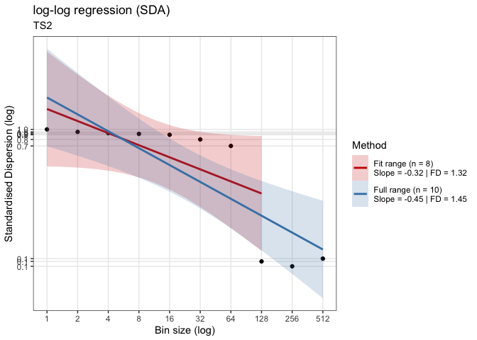<!-- --><!-- -->

```
## 
## ~~~o~~o~~casnet~~o~~o~~~
## 
##  Power Spectral Density Slope 
## 
##  All frequencies (n = 512)
## Slope = -0.18 | FD = 1.43 
## 
##  Hurvich-Deo (n = 55)
## Slope = -0.34 | FD = 1.38
## 
## ~~~o~~o~~casnet~~o~~o~~~
fdPSD3 <- fd_psd(series$TS_3, doPlot = TRUE, tsName = "TS3")
## 
## 
## (mf)dfa:	Sample rate was set to 1.
```

<!-- --><!-- -->

```
## 
## ~~~o~~o~~casnet~~o~~o~~~
## 
##  Power Spectral Density Slope 
## 
##  All frequencies (n = 512)
## Slope = 0.09 | FD = 1.53 
## 
##  Hurvich-Deo (n = 28)
## Slope = 0.39 | FD = 1.64
## 
## ~~~o~~o~~casnet~~o~~o~~~
fdPSD4 <- fd_psd(series$TS_4, doPlot = TRUE, tsName = "TS4")
## 
## 
## (mf)dfa:	Sample rate was set to 1.
```

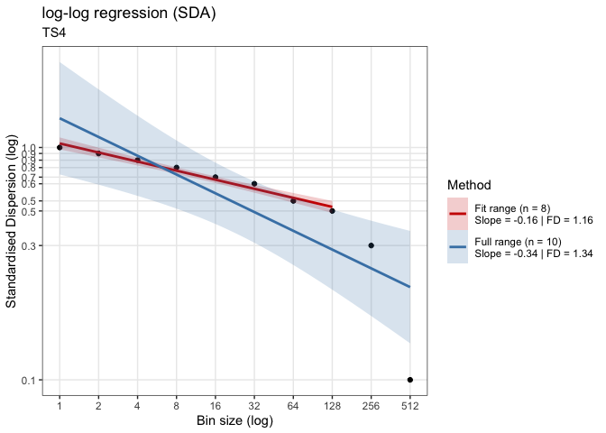<!-- --><!-- -->

```
## 
## ~~~o~~o~~casnet~~o~~o~~~
## 
##  Power Spectral Density Slope 
## 
##  All frequencies (n = 512)
## Slope = -1.05 | FD = 1.19 
## 
##  Hurvich-Deo (n = 55)
## Slope = -1.03 | FD = 1.19
## 
## ~~~o~~o~~casnet~~o~~o~~~
fdPSD5 <- fd_psd(series$TS_5, doPlot = TRUE, tsName = "TS5")
## 
## 
## (mf)dfa:	Sample rate was set to 1.
```

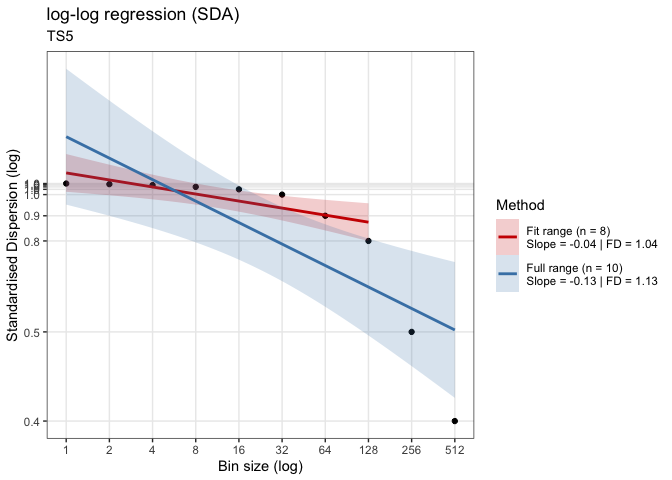<!-- -->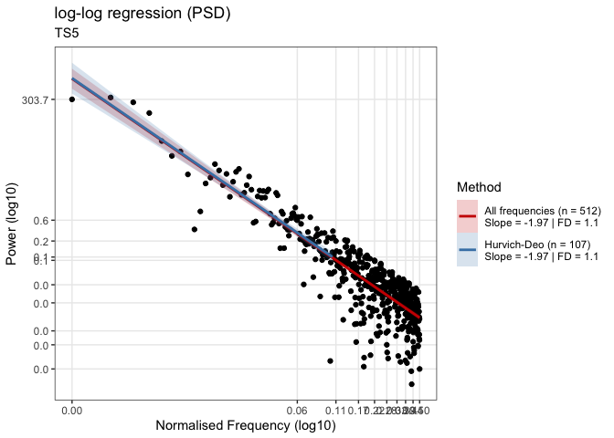<!-- -->

```
## 
## ~~~o~~o~~casnet~~o~~o~~~
## 
##  Power Spectral Density Slope 
## 
##  All frequencies (n = 512)
## Slope = -1.97 | FD = 1.1 
## 
##  Hurvich-Deo (n = 107)
## Slope = -1.97 | FD = 1.1
## 
## ~~~o~~o~~casnet~~o~~o~~~
```


###  Detrended Fluctuation Analysis {.tabset .tabset-fade .tabset-pills}


#### Questions {-}

* Data preparation before running `DFA` analyses are not really necessary, except perhaps:
    + Check whether time series length is a power of `2`. If you use `nextn(length(TS),factors=2)`, the number you get is the length your time series should be to create equal bin sizes. You can pad the series with 0s before analysis, look at package `invctr` at the infix function `%+]%`.
* Perform `fd_dfa()` on the 5 time series.
* Compare to what you find for `fd_dfa` to the other measures (`fd_RR`,`SampEn`, `acf`, `pacf`)


#### Answers {-}


```r
library(casnet)

# All N are already a power of 2
N1 <- nextn(length(series$TS_1), factors = 2)
N2 <- nextn(length(series$TS_2), factors = 2)
N3 <- nextn(length(series$TS_3), factors = 2)
N4 <- nextn(length(series$TS_4), factors = 2)
N5 <- nextn(length(na.exclude(series$TS_5)), factors = 2)

#Suppose the time series Y had length 10, you could have used:
library(invctr)
Y <- 1:10
Y %+]% 6
##  [1]  1  2  3  4  5  6  7  8  9 10  0  0  0  0  0  0

# The default of fd_psd() is to standardises on the mean and sd, and detrended
fdDFA1 <- fd_dfa(series$TS_1, doPlot = TRUE, tsName = "TS1")
## 
## 
## (mf)dfa:	Sample rate was set to 1.
```

<!-- -->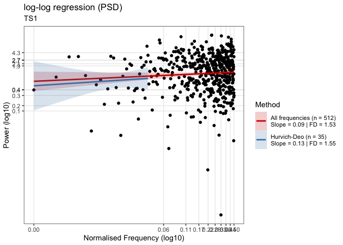<!-- -->

```
## 
## ~~~o~~o~~casnet~~o~~o~~~
## 
##  Detrended FLuctuation Analysis 
## 
##  Full range (n = 8)
## Slope = 0.39 | FD = 1.6 
## 
##  Exclude large bin sizes (n = 8)
## Slope = 0.39 | FD = 1.6 
## 
##  Detrending: poly
## 
## ~~~o~~o~~casnet~~o~~o~~~
fdDFA2 <- fd_dfa(series$TS_2, doPlot = TRUE, tsName = "TS2")
## 
## 
## (mf)dfa:	Sample rate was set to 1.
```

<!-- -->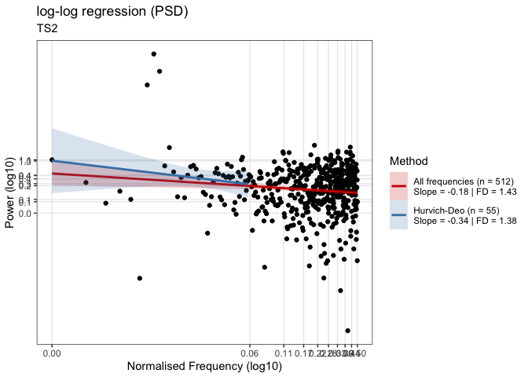<!-- -->

```
## 
## ~~~o~~o~~casnet~~o~~o~~~
## 
##  Detrended FLuctuation Analysis 
## 
##  Full range (n = 8)
## Slope = 1.36 | FD = 1.1 
## 
##  Exclude large bin sizes (n = 8)
## Slope = 1.36 | FD = 1.1 
## 
##  Detrending: poly
## 
## ~~~o~~o~~casnet~~o~~o~~~
fdDFA3 <- fd_dfa(series$TS_3, doPlot = TRUE, tsName = "TS3")
## 
## 
## (mf)dfa:	Sample rate was set to 1.
```

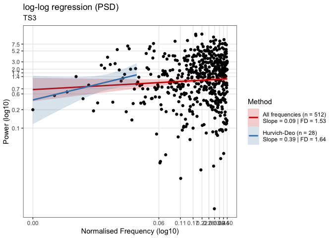<!-- --><!-- -->

```
## 
## ~~~o~~o~~casnet~~o~~o~~~
## 
##  Detrended FLuctuation Analysis 
## 
##  Full range (n = 8)
## Slope = 0.4 | FD = 1.58 
## 
##  Exclude large bin sizes (n = 8)
## Slope = 0.4 | FD = 1.58 
## 
##  Detrending: poly
## 
## ~~~o~~o~~casnet~~o~~o~~~
fdDFA4 <- fd_dfa(series$TS_4, doPlot = TRUE, tsName = "TS4")
## 
## 
## (mf)dfa:	Sample rate was set to 1.
```

<!-- -->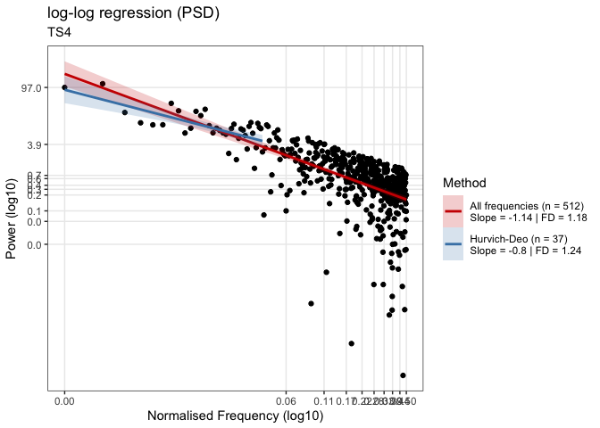<!-- -->

```
## 
## ~~~o~~o~~casnet~~o~~o~~~
## 
##  Detrended FLuctuation Analysis 
## 
##  Full range (n = 8)
## Slope = 0.91 | FD = 1.24 
## 
##  Exclude large bin sizes (n = 8)
## Slope = 0.91 | FD = 1.24 
## 
##  Detrending: poly
## 
## ~~~o~~o~~casnet~~o~~o~~~
fdDFA5 <- fd_dfa(na.exclude(series$TS_5), doPlot = TRUE, tsName = "TS5")
## 
## 
## (mf)dfa:	Sample rate was set to 1.
```

<!-- -->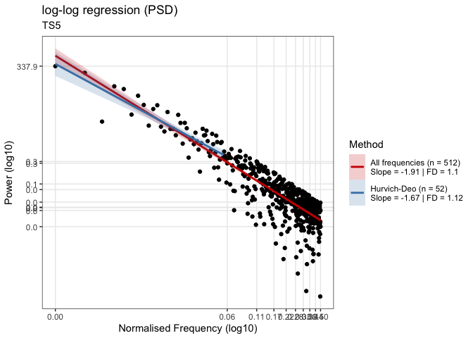<!-- -->

```
## 
## ~~~o~~o~~casnet~~o~~o~~~
## 
##  Detrended FLuctuation Analysis 
## 
##  Full range (n = 8)
## Slope = 1.3 | FD = 1.11 
## 
##  Exclude large bin sizes (n = 8)
## Slope = 1.3 | FD = 1.11 
## 
##  Detrending: poly
## 
## ~~~o~~o~~casnet~~o~~o~~~
```


### Compare results {.tabset .tabset-fade .tabset-pills}


#### Questions {-}

* Create a table that compares the Fractal Dimension estimates based on the limited fit range for all time series (columns) with for each analysis (rows)
* Create the same for the full fitrange.
* What can you conclude about these series based on these results?


#### Answers {-}


```r
# Fitrange FD
knitr::kable(data.frame(
           TS1 = c(fdSDA1$fitRange$FD,fdPSD1$fitRange$FD,fdDFA1$fitRange$FD),
           TS2 = c(fdSDA2$fitRange$FD,fdPSD2$fitRange$FD,fdDFA2$fitRange$FD),
           TS3 = c(fdSDA3$fitRange$FD,fdPSD3$fitRange$FD,fdDFA3$fitRange$FD),
           TS4 = c(fdSDA4$fitRange$FD,fdPSD4$fitRange$FD,fdDFA4$fitRange$FD),
           TS5 = c(fdSDA5$fitRange$FD,fdPSD5$fitRange$FD,fdDFA5$fitRange$FD),
           row.names = c("SDA","PSD","DFA")
           ),digits = 2,caption = "FD based on limited fit range")
```


Table: (\#tab:unnamed-chunk-9)FD based on limited fit range

|    |  TS1|  TS2|  TS3|  TS4|  TS5|
|:---|----:|----:|----:|----:|----:|
|SDA | 1.56| 1.32| 1.61| 1.20| 1.04|
|PSD | 1.55| 1.38| 1.64| 1.19| 1.10|
|DFA | 1.60| 1.10| 1.58| 1.24| 1.11|

</br>


```r
# Full range FD
knitr::kable(data.frame(
           TS1 = c(fdSDA1$fullRange$FD,fdPSD1$fullRange$FD,fdDFA1$fullRange$FD),
           TS2 = c(fdSDA2$fullRange$FD,fdPSD2$fullRange$FD,fdDFA2$fullRange$FD),
           TS3 = c(fdSDA3$fullRange$FD,fdPSD3$fullRange$FD,fdDFA3$fullRange$FD),
           TS4 = c(fdSDA4$fullRange$FD,fdPSD4$fullRange$FD,fdDFA4$fullRange$FD),
           TS5 = c(fdSDA5$fullRange$FD,fdPSD5$fullRange$FD,fdDFA5$fullRange$FD),
           row.names = c("SDA","PSD","DFA")
           ),digits = 2,caption = "FD based on full fit range")
```


Table: (\#tab:unnamed-chunk-10)FD based on full fit range

|    |  TS1|  TS2|  TS3|  TS4|  TS5|
|:---|----:|----:|----:|----:|----:|
|SDA | 1.62| 1.45| 1.65| 1.33| 1.11|
|PSD | 1.53| 1.43| 1.53| 1.19| 1.10|
|DFA | 1.60| 1.10| 1.58| 1.24| 1.11|


## **Heart Beat Noise**

Download three different time series of heartbeat intervals (HBI) [here](https://github.com/complexity-methods/CSA-assignments/raw/master/assignment_data/RelativeRoughness/). If you use `R` and have package `rio` installed you can run this code and the load the data into a `data.frame` directly from `Github`.


```r
library(rio)
HBI1 <- rio::import("https://github.com/complexity-methods/CSA-assignments/raw/master/assignment_data/RelativeRoughness/TS1.xlsx", col_names=FALSE)
HBI2 <- rio::import("https://github.com/complexity-methods/CSA-assignments/raw/master/assignment_data/RelativeRoughness/TS2.xlsx", col_names=FALSE)
HBI3 <- rio::import("https://github.com/complexity-methods/CSA-assignments/raw/master/assignment_data/RelativeRoughness/TS3.xlsx", col_names=FALSE)
```

The Excel files did not have any column names, so let's create them in the `data.frame`

```r
HBI1 <- HBI1[[1]]
HBI2 <- HBI2[[1]]
HBI3 <- HBI3[[1]]
```

### The recordings {.tabset .tabset-fade .tabset-pills}

These HBIs were constructed from the R-R intervals in electrocardiogram (ECG) recordings, as defined in Figure \@ref(fig:RRf1) (note that RR refers to the interval, not Relative Roughness).

<div class="figure" style="text-align: center">

<p class="caption">(\#fig:RRf1)Definition of Heart Beat Periods.</p>
</div>

 * One HBI series is a sample from a male adult, 62 years old (called *Jimmy*). Approximately two years before the recording, the subject has had a coronary artery bypass, as advised by his physician following a diagnosis of congestive heart failure. *Jimmy* used anti-arrhythmic medicines at the time of measurement.

 * Another HBI series is a sample from a healthy male adult, 21 years old (called *Tommy*). This subject never reported any cardiac complaint. Tommy was playing the piano during the recording.

 * A third supposed HBI series is fictitious, and was never recorded from a human subject (let's call this counterfeit *Dummy*).
 

**Your challenge**

The assignment is to scrutinise the data and find out which time series belongs to *Jimmy*, *Tommy*, and *Dummy* respectively. ^[The HBI intervals were truncated (not rounded) to a multiple of 10 ms (e.g., an interval of 0.457s is represented as 0.450s), and to 750 data points each. The means and standard deviations among the HBI series are approximately equidistant, which might complicate your challenge.]


#### Questions {-}

The chances that you are an experienced cardiologist are slim. We therefore suggest you proceed your detective work as follows:

*	Construct a graphical representation of the time series, and inspect their dynamics visually (plot your time series).

* Write down your first guesses about which time series belongs to which subject. Take your time for this visual inspection (i.e., which one looks more like a line than a plane, which one looks more 'smooth' than 'rough').

*	Next, explore some measures of central tendency and dispersion, calculate an estimate of the Fractal Dimension.


#### Answers {-}


*	Construct a graphical representation of the time series, and inspect their dynamics visually (plot your time series).


```r
plot(ts(HBI1),type="l")
plot(ts(HBI2),type="l")
plot(ts(HBI3),type="l")
```


* Write down your first guesses about which time series belongs to which subject. Take your time for this visual inspection (i.e., which one looks more like a line than a plane, which one looks more 'smooth' than 'rough').

> HBI1 looks in-between a line and white noise (less rough)
> HBI2 looks like a line / Brownian noise (not rough)
> HBI3 looks like white noise (rough)

*	Next, explore some measures of central tendency and dispersion, etc.


```r
summary(data.frame(HBI1=HBI1,HBI2=HBI2,HBI3=HBI3))
```

```
##       HBI1             HBI2             HBI3       
##  Min.   :0.6200   Min.   :0.8000   Min.   :0.7461  
##  1st Qu.:0.7400   1st Qu.:0.9000   1st Qu.:0.8493  
##  Median :0.7700   Median :0.9300   Median :0.8803  
##  Mean   :0.7687   Mean   :0.9231   Mean   :0.8731  
##  3rd Qu.:0.8000   3rd Qu.:0.9600   3rd Qu.:0.9112  
##  Max.   :0.9200   Max.   :1.0000   Max.   :0.9525
```

```r
# HBI1
fd_sda(HBI1)
```

```
## 
## 
## (mf)dfa:	Sample rate was set to 1.
## 
## 
## ~~~o~~o~~casnet~~o~~o~~~
## 
##  Standardised Dispersion Analysis 
## 
##  Full range (n = 10)
## Slope = -0.38 | FD = 1.38 
## 
##  Fit range (n = 4)
## Slope = -0.13 | FD = 1.13
## 
## ~~~o~~o~~casnet~~o~~o~~~
```

```r
fd_dfa(HBI1)
```

```
## 
## 
## (mf)dfa:	Sample rate was set to 1.
## 
## 
## ~~~o~~o~~casnet~~o~~o~~~
## 
##  Detrended FLuctuation Analysis 
## 
##  Full range (n = 8)
## Slope = 0.93 | FD = 1.23 
## 
##  Exclude large bin sizes (n = 8)
## Slope = 0.93 | FD = 1.23 
## 
##  Detrending: poly
## 
## ~~~o~~o~~casnet~~o~~o~~~
```

```r
fd_psd(HBI1)
```

```
## 
## 
## (mf)dfa:	Sample rate was set to 1.
## 
## 
## ~~~o~~o~~casnet~~o~~o~~~
## 
##  Power Spectral Density Slope 
## 
##  All frequencies (n = 384375)
## Slope = -0.88 | FD = 1.22 
## 
##  Hurvich-Deo (n = 5037)
## Slope = 0.52 | FD = 1.68
## 
## ~~~o~~o~~casnet~~o~~o~~~
```

```r
# HBI2
fd_sda(HBI2)
```

```
## 
## 
## (mf)dfa:	Sample rate was set to 1.
## 
## 
## ~~~o~~o~~casnet~~o~~o~~~
## 
##  Standardised Dispersion Analysis 
## 
##  Full range (n = 10)
## Slope = -0.34 | FD = 1.34 
## 
##  Fit range (n = 4)
## Slope = -0.03 | FD = 1.03
## 
## ~~~o~~o~~casnet~~o~~o~~~
```

```r
fd_dfa(HBI2)
```

```
## 
## 
## (mf)dfa:	Sample rate was set to 1.
## 
## 
## ~~~o~~o~~casnet~~o~~o~~~
## 
##  Detrended FLuctuation Analysis 
## 
##  Full range (n = 8)
## Slope = 1.27 | FD = 1.12 
## 
##  Exclude large bin sizes (n = 8)
## Slope = 1.27 | FD = 1.12 
## 
##  Detrending: poly
## 
## ~~~o~~o~~casnet~~o~~o~~~
```

```r
fd_psd(HBI2)
```

```
## 
## 
## (mf)dfa:	Sample rate was set to 1.
## 
## 
## ~~~o~~o~~casnet~~o~~o~~~
## 
##  Power Spectral Density Slope 
## 
##  All frequencies (n = 384375)
## Slope = -0.88 | FD = 1.22 
## 
##  Hurvich-Deo (n = 5406)
## Slope = 0.36 | FD = 1.63
## 
## ~~~o~~o~~casnet~~o~~o~~~
```

```r
# HBI3
fd_sda(HBI3)
```

```
## 
## 
## (mf)dfa:	Sample rate was set to 1.
## 
## 
## ~~~o~~o~~casnet~~o~~o~~~
## 
##  Standardised Dispersion Analysis 
## 
##  Full range (n = 10)
## Slope = -0.69 | FD = 1.69 
## 
##  Fit range (n = 4)
## Slope = -0.54 | FD = 1.54
## 
## ~~~o~~o~~casnet~~o~~o~~~
```

```r
fd_dfa(HBI3)
```

```
## 
## 
## (mf)dfa:	Sample rate was set to 1.
## 
## 
## ~~~o~~o~~casnet~~o~~o~~~
## 
##  Detrended FLuctuation Analysis 
## 
##  Full range (n = 8)
## Slope = 0.33 | FD = 1.66 
## 
##  Exclude large bin sizes (n = 8)
## Slope = 0.33 | FD = 1.66 
## 
##  Detrending: poly
## 
## ~~~o~~o~~casnet~~o~~o~~~
```

```r
fd_psd(HBI3)
```

```
## 
## 
## (mf)dfa:	Sample rate was set to 1.
## 
## 
## ~~~o~~o~~casnet~~o~~o~~~
## 
##  Power Spectral Density Slope 
## 
##  All frequencies (n = 384375)
## Slope = 0.18 | FD = 1.57 
## 
##  Hurvich-Deo (n = 2279)
## Slope = -0.26 | FD = 1.41
## 
## ~~~o~~o~~casnet~~o~~o~~~
```


### Who is healthy? {.tabset .tabset-fade .tabset-pills}

Any updates on Jimmy's, Tommy's and Dummy's health? You may start to wonder about the 'meaning' of these dynamics, and not find immediate answers.

Don't worry; we'll cover the interpretation over the next two weeks in further depth. Let's focus the dynamics just a little further for now. It might give you some clues.

#### Questions {-}

* Use the function `randperm()` (in package  [`pracma`](http://www.inside-r.org/packages/cran/pracma)) or `sample()` to randomize the temporal ordering of the HBI series.
* Visualize the resulting time series to check whether they were randomized successfully
* Next estimate the Fractal Dimension of the randomized series. How do the estimates compare to your outcomes on the original series?


#### Answers {-}

* Use the function `randperm()` (in package  [`pracma`](http://www.inside-r.org/packages/cran/pracma)) or `sample()` to randomize the temporal ordering of the HBI series.


```r
# Using sample() you need to shuffle the index
HBI1_rnd <- HBI1[sample(1:NROW(HBI1),NROW(HBI1))]
HBI2_rnd <- HBI2[sample(1:NROW(HBI2),NROW(HBI2))]
HBI3_rnd <- HBI3[sample(1:NROW(HBI3),NROW(HBI3))]

# Using pracma::randperm() you can use the data
HBI1_rnd <- pracma::randperm(HBI1,NROW(HBI1))
HBI2_rnd <- pracma::randperm(HBI2,NROW(HBI2))
HBI3_rnd <- pracma::randperm(HBI3,NROW(HBI3))
```

* Visualize the resulting time series to check whether they were randomized successfully


```r
plot(ts(HBI1_rnd),type="l")
plot(ts(HBI2_rnd),type="l")
plot(ts(HBI3_rnd),type="l")
```

* Next estimate the Fractal Dimension of the randomized series. How do the estimates compare to your outcomes on the original series?


```r
summary(data.frame(HBI1rnd=HBI1_rnd,HBI2rnd=HBI2_rnd,HBI3rnd=HBI3_rnd))
```

```
##     HBI1rnd          HBI2rnd          HBI3rnd      
##  Min.   :0.6200   Min.   :0.8000   Min.   :0.7461  
##  1st Qu.:0.7400   1st Qu.:0.9000   1st Qu.:0.8493  
##  Median :0.7700   Median :0.9300   Median :0.8803  
##  Mean   :0.7687   Mean   :0.9231   Mean   :0.8731  
##  3rd Qu.:0.8000   3rd Qu.:0.9600   3rd Qu.:0.9112  
##  Max.   :0.9200   Max.   :1.0000   Max.   :0.9525
```

```r
# HBI1
fd_sda(HBI1_rnd)
```

```
## 
## 
## (mf)dfa:	Sample rate was set to 1.
## 
## 
## ~~~o~~o~~casnet~~o~~o~~~
## 
##  Standardised Dispersion Analysis 
## 
##  Full range (n = 10)
## Slope = -0.48 | FD = 1.48 
## 
##  Fit range (n = 4)
## Slope = -0.53 | FD = 1.53
## 
## ~~~o~~o~~casnet~~o~~o~~~
```

```r
fd_dfa(HBI1_rnd)
```

```
## 
## 
## (mf)dfa:	Sample rate was set to 1.
## 
## 
## ~~~o~~o~~casnet~~o~~o~~~
## 
##  Detrended FLuctuation Analysis 
## 
##  Full range (n = 8)
## Slope = 0.39 | FD = 1.6 
## 
##  Exclude large bin sizes (n = 8)
## Slope = 0.39 | FD = 1.6 
## 
##  Detrending: poly
## 
## ~~~o~~o~~casnet~~o~~o~~~
```

```r
fd_psd(HBI1_rnd)
```

```
## 
## 
## (mf)dfa:	Sample rate was set to 1.
## 
## 
## ~~~o~~o~~casnet~~o~~o~~~
## 
##  Power Spectral Density Slope 
## 
##  All frequencies (n = 384375)
## Slope = 0.02 | FD = 1.51 
## 
##  Hurvich-Deo (n = 4810)
## Slope = -0.52 | FD = 1.32
## 
## ~~~o~~o~~casnet~~o~~o~~~
```

```r
# HBI2
fd_sda(HBI2_rnd)
```

```
## 
## 
## (mf)dfa:	Sample rate was set to 1.
## 
## 
## ~~~o~~o~~casnet~~o~~o~~~
## 
##  Standardised Dispersion Analysis 
## 
##  Full range (n = 10)
## Slope = -0.47 | FD = 1.47 
## 
##  Fit range (n = 4)
## Slope = -0.49 | FD = 1.49
## 
## ~~~o~~o~~casnet~~o~~o~~~
```

```r
fd_dfa(HBI2_rnd)
```

```
## 
## 
## (mf)dfa:	Sample rate was set to 1.
## 
## 
## ~~~o~~o~~casnet~~o~~o~~~
## 
##  Detrended FLuctuation Analysis 
## 
##  Full range (n = 8)
## Slope = 0.48 | FD = 1.52 
## 
##  Exclude large bin sizes (n = 8)
## Slope = 0.48 | FD = 1.52 
## 
##  Detrending: poly
## 
## ~~~o~~o~~casnet~~o~~o~~~
```

```r
fd_psd(HBI2_rnd)
```

```
## 
## 
## (mf)dfa:	Sample rate was set to 1.
## 
## 
## ~~~o~~o~~casnet~~o~~o~~~
## 
##  Power Spectral Density Slope 
## 
##  All frequencies (n = 384375)
## Slope = 0.03 | FD = 1.51 
## 
##  Hurvich-Deo (n = 9431)
## Slope = -0.36 | FD = 1.37
## 
## ~~~o~~o~~casnet~~o~~o~~~
```

```r
# HBI3
fd_sda(HBI3_rnd)
```

```
## 
## 
## (mf)dfa:	Sample rate was set to 1.
## 
## 
## ~~~o~~o~~casnet~~o~~o~~~
## 
##  Standardised Dispersion Analysis 
## 
##  Full range (n = 10)
## Slope = -0.42 | FD = 1.42 
## 
##  Fit range (n = 4)
## Slope = -0.51 | FD = 1.51
## 
## ~~~o~~o~~casnet~~o~~o~~~
```

```r
fd_dfa(HBI3_rnd)
```

```
## 
## 
## (mf)dfa:	Sample rate was set to 1.
## 
## 
## ~~~o~~o~~casnet~~o~~o~~~
## 
##  Detrended FLuctuation Analysis 
## 
##  Full range (n = 8)
## Slope = 0.58 | FD = 1.44 
## 
##  Exclude large bin sizes (n = 8)
## Slope = 0.58 | FD = 1.44 
## 
##  Detrending: poly
## 
## ~~~o~~o~~casnet~~o~~o~~~
```

```r
fd_psd(HBI3_rnd)
```

```
## 
## 
## (mf)dfa:	Sample rate was set to 1.
## 
## 
## ~~~o~~o~~casnet~~o~~o~~~
## 
##  Power Spectral Density Slope 
## 
##  All frequencies (n = 384375)
## Slope = -0.05 | FD = 1.48 
## 
##  Hurvich-Deo (n = 11018)
## Slope = -0.03 | FD = 1.49
## 
## ~~~o~~o~~casnet~~o~~o~~~
```


## **Surrogate testing: Beyond the straw-man null-hypothesis** 

Look at the explanation of surrogate analysis on the [TiSEAN website](https://www.pks.mpg.de/~tisean/Tisean_3.0.1/)
(Here is [direct link](https://www.pks.mpg.de/~tisean/Tisean_3.0.1/docs/surropaper/node5.html) to the relevant sections)


### Constrained realisations of complex signals {.tabset .tabset-fade .tabset-pills}

We'll look mostly at three different kinds of surrogates:

* *Randomly shuffled*: $H_0:$ The time series data are independent random numbers drawn from some probability distribution.
* *Phase Randomised*: $H_0:$ The time series data were generated by a stationary linear stochastic process
* *Amplitude Adjusted, Phase Randomised*: $H_0:$ The time series data were generated by a rescaled linear stochastic process.

For this assignment, create an actual statistical test to answer the question about the Heart beat intervals. Create a number of randomly shuffled surrogates, calculate the slopes and plot the results.


#### Questions {-}

* Figure out how many surrogates you would minimally need for a 2-sided [surrogate test](https://www.pks.mpg.de/tisean//Tisean_3.0.1/docs/surropaper/node5.html).
* Package `tseries` has a function `surrogate()` and `nonlinearTseries` has a function `FFTsurrogate()`. Look them up and try to create a surrogate test for time series `HBI1`, and `HBI2`and `HBI3` of the previous assignment based on a random shuffle. Compare the Fractal Dimension of the original to the surrogate time series.
    + `tseries::surrogate()` can create a random shuffle, phase randomised and AAFT surrogates.
    + `nonlinearTseries::FFTsurrogate()` will only calculate phase randomised surrogates. 
* In package `casnet` there's a function that will calculate and display a point-probability based on a distribution of surrogate measures and one observed measure: `plotSUR_hist`


#### Answers {-}

* First let's get the values we found earlier (here we'll use the FD from `sda`, but you can take any other measure).


```r
HBI1_FDsda <- fd_sda(HBI1)$fitRange$FD
```

```
## 
## 
## (mf)dfa:	Sample rate was set to 1.
## 
## 
## ~~~o~~o~~casnet~~o~~o~~~
## 
##  Standardised Dispersion Analysis 
## 
##  Full range (n = 10)
## Slope = -0.38 | FD = 1.38 
## 
##  Fit range (n = 4)
## Slope = -0.13 | FD = 1.13
## 
## ~~~o~~o~~casnet~~o~~o~~~
```

```r
HBI2_FDsda <- fd_sda(HBI2)$fitRange$FD
```

```
## 
## 
## (mf)dfa:	Sample rate was set to 1.
## 
## 
## ~~~o~~o~~casnet~~o~~o~~~
## 
##  Standardised Dispersion Analysis 
## 
##  Full range (n = 10)
## Slope = -0.34 | FD = 1.34 
## 
##  Fit range (n = 4)
## Slope = -0.03 | FD = 1.03
## 
## ~~~o~~o~~casnet~~o~~o~~~
```

```r
HBI3_FDsda <- fd_sda(HBI3)$fitRange$FD
```

```
## 
## 
## (mf)dfa:	Sample rate was set to 1.
## 
## 
## ~~~o~~o~~casnet~~o~~o~~~
## 
##  Standardised Dispersion Analysis 
## 
##  Full range (n = 10)
## Slope = -0.69 | FD = 1.69 
## 
##  Fit range (n = 4)
## Slope = -0.54 | FD = 1.54
## 
## ~~~o~~o~~casnet~~o~~o~~~
```

* Once you have the surrogates in a data frame, repeatedly calculate the measure you want to compare, in this case `fd_sda()`.


```r
# NOW CREATE SURROGATES
library(plyr)
library(tidyverse)
library(tseries)

# For a two-sided test at alpha = .05 we need N=39
Nsurrogates <- 39

HBI1surrogates <- data.frame(tseries::surrogate(x = HBI1, ns = Nsurrogates, fft = FALSE, amplitude = FALSE))
colnames(HBI1surrogates) <- paste0("S",1:NCOL(HBI1surrogates))

# Add the observed data
HBI1surrogates$Obs <- HBI1
plotTS_multi(HBI1surrogates)
```

<!-- -->


```r
# Now we calculate FD for each series
HBI1surrogates_FD <- plyr::laply(1:Nsurrogates,function(s) fd_sda(y=HBI1surrogates[,s], silent = TRUE)$fitRange$FD)

# TS_4 Surrogates
HBI2surrogates <- data.frame(tseries::surrogate(x = HBI2, ns = Nsurrogates, fft = FALSE, amplitude = FALSE))
colnames(HBI2surrogates) <- paste0("S",1:NCOL(HBI2surrogates))

HBI2surrogates_FD <- plyr::laply(1:Nsurrogates,function(s) fd_sda(y=HBI2surrogates[,s], silent = TRUE)$fitRange$FD)

# TS_5 surrogates
HBI3surrogates <- data.frame(tseries::surrogate(x = HBI3, ns = Nsurrogates, fft = FALSE, amplitude = FALSE))
colnames(HBI3surrogates) <- paste0("S",1:NCOL(HBI3surrogates))

HBI3surrogates_FD <- plyr::laply(1:Nsurrogates,function(s) fd_sda(y=HBI3surrogates[,s], silent = TRUE)$fitRange$FD)
```

* Collect the results in a dataframe, so we can compare.


```r
x <- data.frame(Source = c("HBI1", "HBI2", "HBI3"),
                FDsda = c(HBI1_FDsda, HBI2_FDsda, HBI3_FDsda),
                FDsdaPhaseRND.median= c(median(HBI1surrogates_FD),median(HBI2surrogates_FD),median(HBI3surrogates_FD)))
```


* Call function `plotSUR_hist()` to see the results of the test.


```r
plotSUR_hist(surrogateValues = HBI1surrogates_FD, observedValue = HBI1_FDsda, sides = "two.sided", doPlot = TRUE, measureName = "dfa FD HBI1")
```

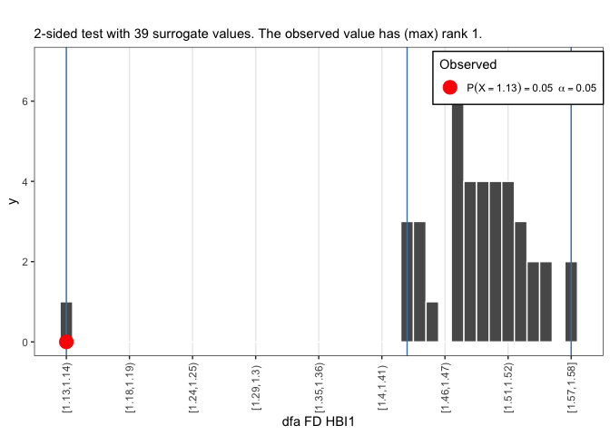<!-- -->

```r
plotSUR_hist(surrogateValues = HBI2surrogates_FD, observedValue = HBI2_FDsda, sides = "two.sided", doPlot = TRUE, measureName = "dfa FD HBI2")
```

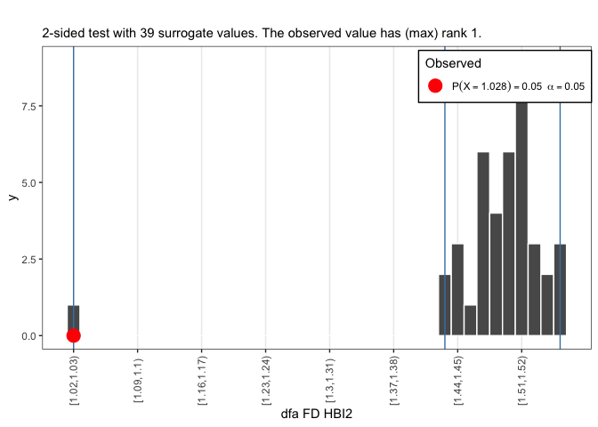<!-- -->

```r
plotSUR_hist(surrogateValues = HBI3surrogates_FD, observedValue = HBI3_FDsda, sides = "two.sided", doPlot = TRUE, measureName = "dfa FD HBI3")
```

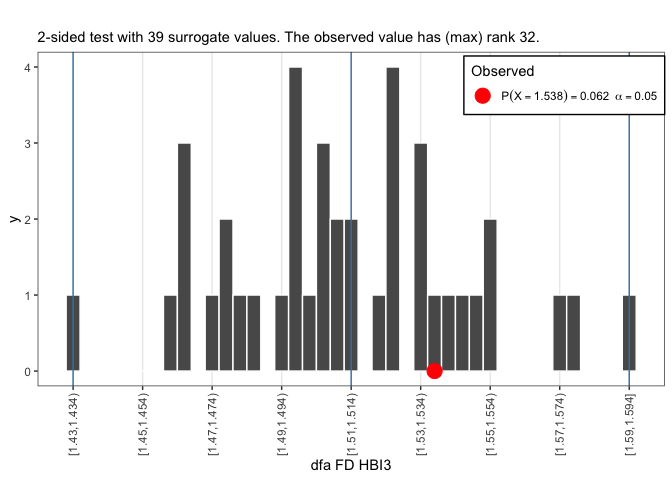<!-- -->


 * Let's print the results into a table
 


```r
x$FDsda <- c(HBI1_FDsda,HBI2_FDsda,HBI3_FDsda)
x$FDsdaPhaseRND.median <- c(median(HBI1surrogates_FD),median(HBI2surrogates_FD),median(HBI3surrogates_FD)) 
knitr::kable(x, digits = 2, booktabs=TRUE,formt="html")
```


|Source | FDsda| FDsdaPhaseRND.median|
|:------|-----:|--------------------:|
|HBI1   |  1.13|                 1.49|
|HBI2   |  1.03|                 1.50|
|HBI3   |  1.54|                 1.51|


<!-- **FD: SPECTRAL SLOPE** -->

<!-- ```{r echo=TRUE, message=FALSE, warning=FALSE, cache=TRUE} -->
<!-- # TS1,TS4,TS5 -->
<!-- TS1_FDpsd <- fd_psd(series$TS_1)$fitRange$FD -->
<!-- TS4_FDpsd <- fd_psd(series$TS_4)$fitRange$FD -->
<!-- TS5_FDpsd <- fd_psd(series$TS_5)$fitRange$FD -->
<!-- ``` -->


<!-- ```{r echo=TRUE, message=FALSE, warning=FALSE, cache=TRUE} -->
<!-- # CREATE SURROGATES (see the dfa assignment) -->

<!-- # For a two-sided test at alpha = .05 we need N=39 -->
<!-- Nsurrogates <- 19 -->

<!-- TS1surrogates_FD <- laply(1:Nsurrogates,function(s){fd_psd(y=TS1surrogates[,s], silent = TRUE)$fitRange$FD}) -->

<!-- TS4surrogates_FD <- laply(1:Nsurrogates,function(s) fd_psd(y=TS4surrogates[,s], silent = TRUE)$fitRange$FD) -->

<!-- TS5surrogates_FD <- laply(1:Nsurrogates,function(s) fd_psd(y=TS5surrogates[,s], silent = TRUE)$fitRange$FD) -->

<!-- ``` -->


<!-- * Call function `plotSUR_hist()` to get the results of the test. -->

<!-- ```{r message=FALSE, warning=FALSE,cache=TRUE} -->
<!-- plotSUR_hist(surrogateValues = TS1surrogates_FD, observedValue = TS1_FDpsd, sides = "two.sided", doPlot = TRUE, measureName = "psd FD TS1", binWidth = 0.005) -->

<!-- plotSUR_hist(surrogateValues = TS4surrogates_FD, observedValue = TS4_FDpsd,sides = "two.sided", doPlot = TRUE, measureName = "psd FD TS4", binWidth = 0.005) -->

<!-- plotSUR_hist(surrogateValues = TS5surrogates_FD, observedValue = TS5_FDpsd,sides = "two.sided", doPlot = TRUE, measureName = "psd FD TS5", binWidth = 0.005) -->
<!-- ``` -->


<!--  * Let's print the results into a table -->


<!-- ```{r message=FALSE, paged.print=TRUE,cache=TRUE} -->
<!-- xx <-x -->
<!-- xx$FDpsd <- c(TS1_FDpsd,TS4_FDpsd,TS5_FDpsd) -->
<!-- xx$FDpsdPhaseRND.median <- c(median(TS1surrogates_FD),median(TS4surrogates_FD),median(TS5surrogates_FD))  -->
<!-- knitr::kable(xx, digits = 2, booktabs=TRUE,formt="html") -->
<!-- ``` -->


