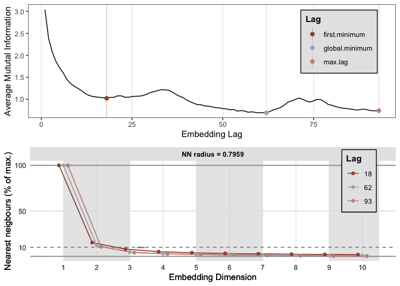
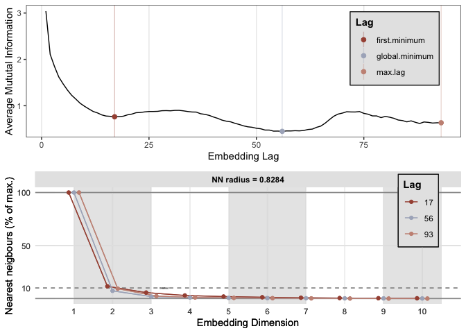
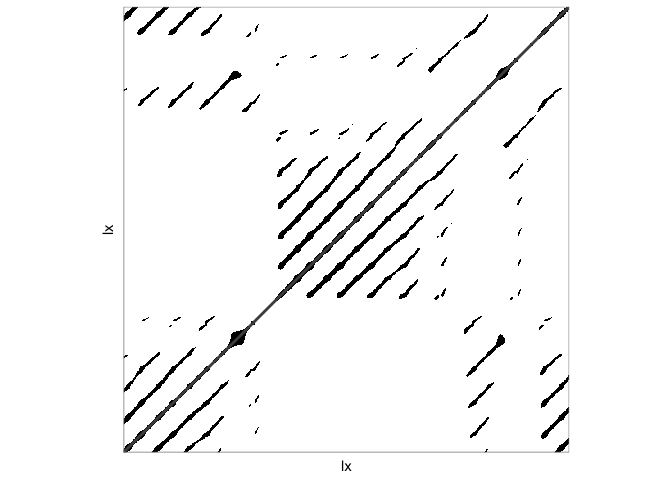
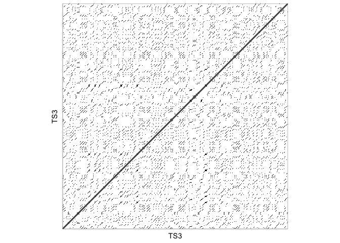

# (Cross-) Recurrence Quantification Analysis Software

There are several packages in `R` you could use to do `(C)RQA` analyses, but you can also find a `Matlab` toolbox for `(C)RQA` here: [CRP toolbox](http://tocsy.pik-potsdam.de/CRPtoolbox/), there are `Python` libraries as well, see [this page](http://www.recurrence-plot.tk/programmes.php) for an overview of software. We will use the functions in package `casnet`.

\BeginKnitrBlock{rmdimportant}<div class="rmdimportant"> The package `crqa()` was mainly designed to run categorical Cross-Recurrence Quantification Analysis (see [Coco & Dale (2014)](http://journal.frontiersin.org/Journal/10.3389/fpsyg.2014.00510/abstract) and for R code see appendices in [Coco & Dale (2013)](http://arxiv.org/abs/1310.0201)). The article itself is a good reference work for details on how to conduct RQA analysis.</div>\EndKnitrBlock{rmdimportant}


See [Chapter 10 of the CSA-book](https://complexity-methods.github.io/book/notes-on-running-recurrence-quantification-analysis-in-r.html) for more information about conducting RQA in `R` (with `casnet`).


## **Categorical Auto-RQA** 


### RQA by 'hand' {.tabset .tabset-fade .tabset-pills}

Let's start with a small time series... open and/or download this Google sheet: https://docs.google.com/spreadsheets/d/1k4FYDbszfCReCM5_wcw6NIEgSFtTPIy3qmf-kFiZjy8/edit?usp=sharing 

The spreadsheet displays a short categorical time series of 5 observed categories labelled `A` through `E`.
Below the time series a matrix is displayed with zeroes in the upper triangle. The columns and rows of the matrix are labelled according to the categorical time series **y** in `B2:B13`, starting in the lower left corner. The *Line Of Incidence* (LOI) is the diagonal of the matrix going from the lower left corner to the upper right corner. Like the diagonal of a correlation matrix, the LOI in Auto-RQA will contain only recurrent points (`1`), because that's where the column labels will be identical to the row labels.


#### Questions {-}

Because this is Auto-RQA and we are comparing the time series to itself, the recurrence matrix will be symmetrical, so we only have to look at the upper triangle.

* Fill the upper triangle with recurrent points by changing a `0` into a `1`
  - Start with the label in cell `C29` (**A**) and look upwards (`C27` to `C17`). If you see the value **A** recurring, change the `0` into a `1`
   - Proceed to `D29` and find recurrences of the value **B** in the future (in `D26` to `D17`)
   - Continue to fill the upper triangle
* Count the number of `1`s, the recurrent points (`RN`) and put the value in cell `B32` (*Total*)
* Count how many recurrent points are part of a vertical line, and how many are on a diagonal line, put the values in cell `B33` and `B34` respectively.
* Diagonal line lengths:
  - Determine the frequency of occurrence of specific lengths of diagonal lines, record the values in cells `Q17` to `Q20`
  - Record the maximal diagonal line length in `V22`
  - The mean of the lengths of diagonal lines (*L*) will be calculated in cell `V21`
* Vertical line lengths: 
  - Determine the frequency of occurrence of specific lengths of vertical lines, record the values in cells `Q24` to `Q27`
  - Record the maximal vertical line length in `V27`
  - The mean of the lengths of vertical lines (*Trapping Time*) will be calculated in cell `V21`
* Several values are auto-calculated, if you click on the cell you can see how this is done, by looking at the formula bar.
  - Can you understand the calculation of the number of possible recurrent points in `X17`?
* Suppose you randomise the time series... which of the following values do you think would change, and in what way (larger/smaller)
  - Recurrence Rate (`RR`)
  - Mean diagonal line length (`L`, or `MEAN_dl`)
  - Maximum diagonal line length (`L_max`, or `MAX_dl`)
  - Entropy of distribution of diagonal line lengths (`L_entr`, or `ENT_dl`)

#### Answers {-}

* The correct matrix is on the second tab of the spreadsheet.
* The calculation of the number of possible recurrent points in cell `X17` is the size of the matrix (12*12) divided by 2 (because we are only looking at the upper triangle), minus the length of the diagonal, because these aren't actually recurrent points.
* Which of the following values do you think would change if `y` is randomised?
  - Recurrence Rate (`RR`) - **No change**, none of the values are changed, so the number of values that will recur is the unchanged.
  - Mean diagonal line length (`L`, or `MEAN_dl`) - **Likely to be lower**, shuffling will likely break up line structures, but if there are just a few categories and/or the time series is short, it could be the same or higher.
  - Maximum diagonal line length (`L_max`, or `MAX_dl`) - **Very likely to be lower**, shuffling will likely break up line structures, but if there are just a few categories and/or the time series is short, it could be the same or higher.
  - Entropy of distribution of diagonal line lengths (`L_entr`, or `ENT_dl`) - - **Difficult to predict**, shuffling will break up line structures and could increase entropy (more different line lengths), but it is also possible that there will be only lines of length 2 or 3 left after randomisation, this will be a very homogeneous distribution which has a high entropy. This is more likely if there are just a few categories and/or the time series is short.


## **Phase Space Reconstruction and Continuous Auto-RQA**

Here is a great video summary of the phase space reconstruction technique: https://youtu.be/6i57udsPKms


\BeginKnitrBlock{rmdnote}<div class="rmdnote">**R-packages for Phase Space Reconstruction**

You can use package `rgl` to visualize an interactive 3D state space. Package `rgl` is used for plotting and can cause problems on some Windows machines. On Windows You'll need to check if you have the [X Window System](http://www.x.org/wiki/) for interactive 3D plotting. This Linux desktop system comes installed in some way or form on most Mac and Windows systems. You can test if it is present by running `rgl::open3d()` in `R`, which will try to open an interactive plotting device.

If this fails you can try package `plot3D` which is not interactive, for example `lines3D()`, or, `scatter3D()`. </div>\EndKnitrBlock{rmdnote}


### Reconstruct the Lorenz attractor {.tabset .tabset-fade .tabset-pills}

The dataset `lorenz` includes the 3 dimensions of the Lorenz system in the chaotic regime. Running the code below will produce an interactive 3D plot of the strange attractor.


```r
library(rio)
library(rgl)
library(plot3D)

lorenz <- rio::import("https://complexity-methods.github.io/assignments/Data/lorenz.csv")

rgl::plot3d(lorenz,type="l")
```

We'll reconstruct the attractor based on just dimension `X` of the system using the data in `lorenz` and functions from package `casnet`. 

> Don't forget: **always look at the manual pages of a function** you are running.


#### Questions {-}

* Use `lx <- lorenz[1:1024,1]` to reconstruct the phase space based on `lx`. 
    + Find an optimal embedding lag and dimension by calling `est_parameters()`.
    + Use `nnThres = .01`. This is the proportion of remaining nearest neighbours below which we consider the number of dimensions optimal. Because this time series was generated by a simulation of a system, we can use a much lower threshold. For real data, which is much noisier, you can use `0.1` or `0.2`.
    + **NOTE:** If you have a slow computer don't use `1024`, but use e.g. `512`.
    
This `est_parameters()` function will call several other functions (e.g. `nonlinearTseries::findAllNeighbours()` for the false nearest neighbourhood search). Look at the manual page, you can run the `est_parameters()` function with the defaults settings, it will show a diagnostic plot. Because we have to search over a range of parameters it can take a while to get the results...

* Based on the output:
    + Choose an embedding lag $\tau$ (in `casnet` functions this is the argument `emLag`). Remember, this is just an optimisation choice. Sometimes there is no first minimum, or no global minimum.
    + Find an appropriate embedding dimension by looking when the false nearest neighbours drop below 1\%. 
    
* Now you can use this information to reconstruct the phase space: 
    + Embed the time series using `ts_embed()`).
    + Inspect the object that was returned
    + Use  `rgl::plot3d()` to plot the reconstructed space. Plot the reconstructed phase space.

#### Answers {-}

* Use `lx <- lorenz[1:1024,1]` to reconstruct the phase space based on `lx`. 
    + Find an optimal embedding lag and dimension by calling `est_parameters()`.


```r
library(rgl)
library(plot3D)
library(ggplot2)
library(invctr)
library(casnet)

# The X data
lx <- lorenz[1:1024,1]

# Search for the parameters,
params <- est_parameters(lx)
```

```
## Registered S3 method overwritten by 'quantmod':
##   method            from
##   as.zoo.data.frame zoo
```

<!-- -->

```r
# Assign the optimal parameters
emLag <- params$optimLag
emDim <- params$optimDim
```

* Now you can use this information to reconstruct the phase space


```r
# For X
lx_emb <- data.frame(ts_embed(y=lx,emLag = emLag, emDim = emDim))

rgl::plot3d(lx_emb, type="l")

# Or use plot3D
plot3D::lines3D(lx_emb$tau.0, lx_emb$tau.1, lx_emb$tau.2,  xlab= "Xt0", ylab = "Xt1", zlab ="Xt2", bty = "b2", lwd=1, theta = 40, phi = 40)
```

<!-- -->

```r
# For Y
ly <- lorenz[1:1024,2]

# Search for the parameters,
params <- est_parameters(ly)
```

<!-- -->

```r
# Assign the optimal parameters
emLag <- params$optimLag
emDim <- params$optimDim

# Embed the time series
ly_emb <- data.frame(ts_embed(y=ly,emLag = emLag, emDim = emDim))
rgl::plot3d(ly_emb,type="l")

# Or use plot3D
plot3D::lines3D(ly_emb$tau.0, ly_emb$tau.1, ly_emb$tau.2,  xlab= "Yt0", ylab = "Yt1", zlab ="Yt2", bty = "b2", lwd=1, theta = 40, phi = 40)
```

<!-- -->

```r
# For Z
lz <- lorenz[1:2048,3]

# Search for the parameters,
params <- est_parameters(lz)
```

<!-- -->

```r
# Assign the optimal parameters
emLag <- params$optimLag
emDim <- params$optimDim

# Embed the time series
lz_emb <- data.frame(ts_embed(y=lz,emLag = emLag, emDim = emDim))
rgl::plot3d(lz_emb,type="l")

# Or use plot3D
plot3D::lines3D(lz_emb$tau.0, lz_emb$tau.1, lz_emb$tau.2,  xlab= "Zt0", ylab = "Zt1", zlab ="Zt2", bty = "b2", lwd=1, theta = 0, phi = 30)
```

<!-- -->


## Continuous Auto-RQA


### RQA of the Lorenz attractor {.tabset .tabset-fade .tabset-pills}

Perform an RQA on the reconstructed state space of the Lorenz system. You'll need a radius (also called: threshold, or $\epsilon$) in order to decide which points are close together (recurrent). You have already seen `casnet` provides a function which will automatically select the best parameter settings for phase space reconstruction: `est_parameters()`. 


#### Questions {-}

* First get a radius that gives you a fixed recurrence rate use `est_radius()` look at the manual pages. The function `rp()` will also call `est_radius` if you provide `emRad = NA`.

* Best way to ensure you are using the same parameters in each function is to create some lists with parameter settings (check the `rp_cl()` or `rp()` manual to figure out what these parameters mean)


#### Answers{-}


```r
library(casnet)

# Lorenz X
lx <- lorenz[1:1024,1]
emLag = 17
emDim = 3

(emRad <- est_radius(y1 = lx, emLag = emLag, emDim = emDim)$Radius)
```

```
## 
## Auto-recurrence: Setting diagonal to (1 + max. distance) for analyses
## 
## Searching for a radius that will yield 0.05 for RR
```

```
## 
## Converged! Found an appropriate radius...
```

```
## [1] 3.718435
```

```r
# RQA analysis
#(out <- rp_cl(lx,emDim = emDim, emLag = emLag, emRad = emRad))
RMx <- rp(y1 = lx, emDim = emDim, emLag = emLag, emRad = emRad)
out <- rp_measures(RMx)
```


We can plot the recurrence matrix...


```r
library(casnet)

# Unthresholded matrix (no radius applied)
RM <- rp(y1 = lx, emDim = emDim, emLag = emLag)

# plot it
rp_plot(RM)
```

<!-- -->

```r
# Thresholded by the radius
RMth <- di2bi(RM,emRad = emRad)

# You cam also call rp wth emRad = NA
RMth <- rp(y1 = lx, emDim = emDim, emLag = emLag, emRad = NA)
```

```
## 
## Auto-recurrence: Setting diagonal to (1 + max. distance) for analyses
## 
## Searching for a radius that will yield 0.05 for RR
```

```
## 
## Converged! Found an appropriate radius...
```

```r
rp_plot(RMth, plotDimensions = TRUE, plotMeasures = TRUE)
```

<!-- -->


### Distinguish between Logistic Map and White noise? {.tabset .tabset-fade .tabset-pills}

RQA promises to be able to distinguish between different dynamical regimes, for example dynamics due to different parameter settings of the logistic map, see e.g. https://en.wikipedia.org/wiki/Recurrence_quantification_analysis#Time-dependent_RQA 


#### Questions {-}

* Use RQA to compare white noise (TS_1) to the deterministic chaos series of previous assignments (TS_3).
   + You can shorten the time series by half to run RQA on a slow computer.
* Estimate the parameters
   + Did you expect to get these values?
   + Choose the same lag and dimension for both series, use the median of the lags and the maximum of the dimension.
* Produce an unthresholded matrix
* Choose a recurrence threshold to get `RR = 0.05` (either by looking at the color bar or by estimating with a function) and plot the recurrence plot.
* Compare the RQA measures.
   + Think about the properties of deterministic chaos when you interpret the results.
   + RQA is very powerful when detecting different dynamical regimes: 
https://en.wikipedia.org/wiki/Recurrence_quantification_analysis#Example


```r
# Reload the data
library(rio)
series <- rio::import("https://github.com/complexity-methods/CSA-assignments/raw/master/assignment_data/BasicTSA_arma/series.xlsx")
```

#### Answers {-}

* Shorten the series

```r
TS1 <- series$TS_1[1:512]
TS3 <- series$TS_3[1:512]
```


* Parameters
  + Remember that you need at least 3 coupled differential equations to get deterministic chaos.
  

```r
library(casnet)
out1 <- est_parameters(TS1) 
```

```
## Registered S3 method overwritten by 'quantmod':
##   method            from
##   as.zoo.data.frame zoo
```

<!-- -->

```r
out3 <- est_parameters(TS3) 
```

<!-- -->

```r
emLag <- median(out1$optimLag,out3$optimLag)
emDim <- max(out1$optimDim,out3$optimDim)
```

* Plots

```r
# Unthresholded
RM1 <- rp(y1 = TS1, emDim = emDim, emLag = emLag)
rp_plot(RM1, plotDimensions = TRUE)
```

<!-- -->

```r
# Thresholded
RM1t <- rp(y1 = TS1, emDim = emDim, emLag = emLag, emRad = NA)
```

```
## 
## Auto-recurrence: Setting diagonal to (1 + max. distance) for analyses
## 
## Searching for a radius that will yield 0.05 for RR
```

```
## 
## Converged! Found an appropriate radius...
```

```r
rp_plot(RM1t, plotDimensions = TRUE)
```

<!-- -->

```r
# Unthresholded
RM3 <- rp(y1 = TS3, emDim = emDim, emLag = emLag)
rp_plot(RM3, plotDimensions = TRUE)
```

<!-- -->

```r
# Thresholded
RM3t <- rp(y1 = TS3, emDim = emDim, emLag = emLag, emRad = NA)
```

```
## 
## Auto-recurrence: Setting diagonal to (1 + max. distance) for analyses
## 
## Searching for a radius that will yield 0.05 for RR
```

```
## 
## Converged! Found an appropriate radius...
```

```r
rp_plot(RM3t, plotDimensions = TRUE)
```

<!-- -->

* Measures 

```r
library(casnet)
rqa1 <- rp_measures(RM1t, silent = FALSE) 
```

```
## 
## ~~~o~~o~~casnet~~o~~o~~~
## 
##  Global Measures 
##              Global Max.rec.points N.rec.points Recurrence.Rate Singular.points
## 1 Recurrence Matrix         258572        12930      0.05000541           11732
##   Divergence Repetitiveness Anisotropy
## 1  0.1428571       1.532554          1
## 
## 
##  Line-based Measures 
##   Line.based N.lines N.points.on.lines      Measure       Rate     Mean Max
## 1   Diagonal     514              1198  Determinism 0.09265275 2.330739   7
## 2   Vertical     883              1836 V Laminarity 0.14199536 2.079275   5
## 3 Horizontal     883              1836 H Laminarity 0.14199536 2.079275   5
##   Entropy.of.lengths Relative.entropy CoV.of.lengths
## 1          0.7415069        0.1190128      0.2969722
## 2          0.2718409        0.0436308      0.1639122
## 3          0.2718409        0.0436308      0.1639122
## 
## ~~~o~~o~~casnet~~o~~o~~~
```

```r
rqa3 <- rp_measures(RM3t, silent = FALSE) 
```

```
## 
## ~~~o~~o~~casnet~~o~~o~~~
## 
##  Global Measures 
##              Global Max.rec.points N.rec.points Recurrence.Rate Singular.points
## 1 Recurrence Matrix         258572        12930      0.05000541            3946
##   Divergence Repetitiveness Anisotropy
## 1 0.05555556     0.03995993          1
## 
## 
##  Line-based Measures 
##   Line.based N.lines N.points.on.lines      Measure       Rate     Mean Max
## 1   Diagonal    2880              8984  Determinism 0.69481825 3.119444  18
## 2   Vertical     141               359 V Laminarity 0.02776489 2.546099   5
## 3 Horizontal     141               359 H Laminarity 0.02776489 2.546099   5
##   Entropy.of.lengths Relative.entropy CoV.of.lengths
## 1          1.4588483         0.234147      0.4972465
## 2          0.9423292         0.151245      0.3095254
## 3          0.9423292         0.151245      0.3095254
## 
## ~~~o~~o~~casnet~~o~~o~~~
```


