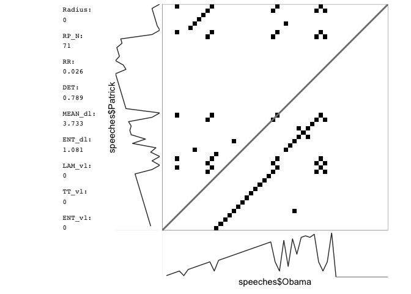
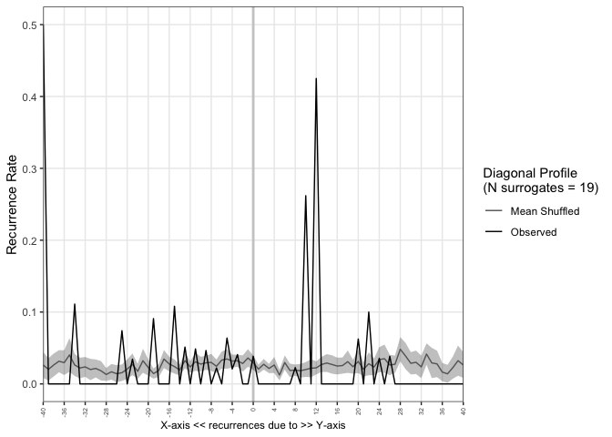
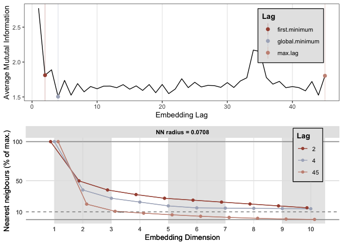
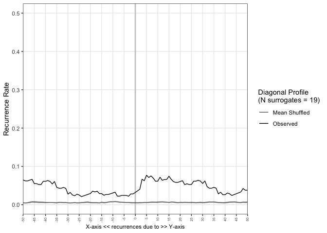
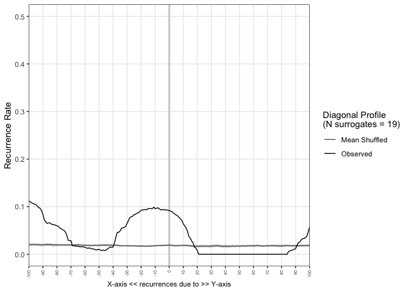

</br>

\BeginKnitrBlock{rmdimportant}<div class="rmdimportant">* Watch the [**Assignment Lecture: Cross RQA**](https://youtu.be/6knxIS4gKjY) video before you make these assignments.
* [Chapter 8, 9](https://complexity-methods.github.io/book/unordered-categorical-data.html) summarises most of the information in the video lecture. 
* Install R package *casnet*, [follow these instructions](https://fredhasselman.com/casnet/).</div>\EndKnitrBlock{rmdimportant}

</br>


## **Cross-Recurrence Analysis**

Cross recurrence analysis can be used to study synchronisation and coupling direction. There are other several other packages and software that can run (C)RQA:

* The paper accompanying package `crqa` by Coco & Dale (2014) gives a good introduction and of RQA and CRQA: https://www.frontiersin.org/articles/10.3389/fpsyg.2014.00510/full 
* Here's a tutorial on Multidimensional RQA and diagonal profiles: https://www.frontiersin.org/articles/10.3389/fpsyg.2018.02232/full 
* Here's a site comparing different analysis software packages for CRQA: https://github.com/JuliaDynamics/RecurrenceAnalysis.jl/wiki/Comparison-of-software-packages-for-RQA 


### Categorical Cross-RQA and the Diagonal Recurrence Profile {.tabset .tabset-fade .tabset-pills}


In 2008 there was some commotion about a speech held by Barack Obama in Milwaukee ([news item](https://www.cbsnews.com/news/obama-accused-of-plagiarism-in-speech/)). According to the media the speech was very similar to a speech held the governor of Massachusetts (Deval Patrick) some years earlier. Here are some fragments of the speeches,

Obama (2008):

> Don't tell me words don't matter. "I have a dream." Just words? "We hold these truths to be self-evident, that all men are created equal." Just words? "We have nothing to fear but fear itself"—just words? Just speeches?

Patrick (2006): 

> "We hold these truths to be self-evident, that all men are created equal." Just words—just words! "We have nothing to fear but fear itself." Just words! "Ask not what your country can do for you, ask what you can do for your country." Just words! "I have a dream." Just words!


```r
# Load the speeches as timeseries
library(casnet)
obama2008 <- strsplit(x = "dont tell me words dont matter I have a dream just words we hold these truths to be selfevident that all men are created equal just words We have nothing to fear but fear itself just words just speeches", split = " ")[[1]]

patrick2006 <- strsplit(x = "we hold these truths to be selfevident that all men are created equal just words just words we have nothing to fear but fear itself just words ask not what your country can do for you ask what you can do for your country just words I have a dream just words", split = " ")[[1]]

uniqueID <- as.numeric_discrete(c(obama2008,patrick2006))

speeches <- as.data.frame(ts_trimfill(x=uniqueID[1:length(obama2008)], y=uniqueID[(length(obama2008)+1):length(uniqueID)]))
colnames(speeches) <- c("Obama","Patrick")
```


#### Questions {-}

* Plot both time series. 

* Because both fragments weren't of equal size, one series is "filled" at the end with the value `0`
    - Do you think this has an effect on the CRQA measures? 
    - What & why?

* Perform a categorical CRQA:
   - First create a cross recurrence matrix using function `rp()`. 
   - Look at the manual page what the values mean, look at last the categorical RQA assignment for the values of `emLag`, `emDim` and `emRad`
   - Get recurrence measures using `rp()` (ignore the warning),
   - Plot the recurrence plot using `rp_plot()`
   - Also look at the diagonal recurrence profile using `rp_diagProfile()`
   
* What is your opinion about the similarity of these speeches?


#### Answers {-}

* Adding a value which occurs in just 1 series (whether it is `-2`, or `0`), but not the other makes sure that value will not be recurring in a Cross Recurrence Plot.


```r
# Plot the speech series
plot(ts(speeches))

# Cross recurrence matrix
RM <- rp(y1 = speeches$Obama, 
         y2 = speeches$Patrick, emDim = 1, emLag = 1, emRad = 0)

# Measures
crqa_out <- rp_measures(RM, silent = FALSE)
```

```
## 
## ~~~o~~o~~casnet~~o~~o~~~
##  Global Measures
##   Global Max.points N.points     RR Singular Divergence Repetitiveness
## 1 Matrix       2704       71 0.0263       15     0.0667              0
## 
## 
##  Line-based Measures
##        Lines N.lines N.points Measure  Rate Mean Max.  ENT ENT_rel   CoV
## 1   Diagonal      15       56     DET 0.789 3.73   15 1.08   0.273 0.989
## 2   Vertical       1        0   V LAM 0.000 0.00    0 0.00   0.000    NA
## 3 Horizontal       1        0   H LAM 0.000 0.00    0 0.00   0.000    NA
## 4  V+H Total       2        0 V+H LAM 0.000 0.00    0 0.00   0.000   NaN
## 
## ~~~o~~o~~casnet~~o~~o~~~
```

```r
# Plot
rp_plot(RM, plotDimensions = TRUE, plotMeasures = TRUE)
```

<!-- --><!-- -->

```r
# Diagonal profile
drp <- rp_diagProfile(RM = RM, y1 = speeches$Obama, y2 = speeches$Patrick, diagWin = 40, doShuffle = TRUE, Nshuffle = 19)
```

```
## Calculating diagonal recurrence profiles...
```

<!-- -->

```r
head(drp$data)
```

```
## # A tibble: 6 × 7
##   Diagonal labels sdRRrnd   ciHI    ciLO `Mean Shuffled` Observed
##      <dbl> <ord>    <dbl>  <dbl>   <dbl>           <dbl>    <dbl>
## 1        1 -40     0.0398 0.0442 0.00842          0.0263      0.5
## 2        2 -39     0.0348 0.0359 0.00459          0.0202      0  
## 3        3 -38     0.0354 0.0422 0.0104           0.0263      0  
## 4        4 -37     0.0342 0.0470 0.0162           0.0316      0  
## 5        5 -36     0.0382 0.0468 0.0124           0.0296      0  
## 6        6 -35     0.0521 0.0637 0.0168           0.0402      0
```


### Continuous CRQA and the Diagonal Profile {.tabset .tabset-fade .tabset-pills}


#### Questions {-}

* Create two sinewave variables for CRQA analysis and use the $x$ and $y$ coordinates of a circletracing experiment:


```r
library(rio)
y1 <- sin(1:500*2*pi/67)
y2 <- sin(.01*(1:500*2*pi/67)^2)

# Here are the circle trace data
xy <- import("https://raw.githubusercontent.com/FredHasselman/The-Complex-Systems-Approach-Book/master/assignments/assignment_data/RQA_circletrace/mouse_circle_xy.csv") 

circle_x <- xy$x[1:500]
circle_y <- xy$y[1:500]
```

* You have just created two sine(-like) waves. We’ll examine if and how they are coupled in a shared phase space. 
   + As a first step plot them.
   + Also plot the cirlce trace state space

* Find a common embedding delay and an embedding dimension (if you calculate an embedding dimension for each signal separately, as a rule of thumb use the highest embedding dimension you find in further analyses).

* We can now create an unthresholded cross recurrence matrix. 
    + use function `rp()`
    + Fill in the values you decided on for embedding delay and embedding dimension
    
* Run the CRQA using `rp_cl()` using th time series as input, or `rp()` using a thresholded matrix as input.
    + You can find a radius automatically, look in the `casnet` manual for function `est_radius()`. 
    + Most functions, like `rp_plot()` will call `est_radius()` if no radius is provided in the argument `emRad`.
    + Request a radius which will give us about 5\% recurrent points (default setting).
    + You can create a thresholded matrix by calling function `mat_di2bi()`,
* Produce a plot of the recurrence matrix using `rp_plot()`. Look at the manual pages.

* Can you understand what is going on? 
  + For the simulated data: Explain the the lack of recurrent points at the beginning of the time series.
  + For the circle trace: How could one see these are not deterministic sine waves?

* Examine the synchronisation under the diagonal LOS. Look in the manual of `rp_diagProfile()`. More elaborate explanation can be found in [Coco & Dale (2014)](http://journal.frontiersin.org/Journal/10.3389/fpsyg.2014.00510/abstract). 
  + To get the diagonal profile from a recurrence matrix `rp_diagProfile(RM, winDiag = , ...)`. Where `winDiag` is will indicate the window size `-winDiag ... 0 ... +winDiag`.
  + How far is the peak in RR removed from 0 (Line of Synchronisation)? 

* To check whether the patterns are real by conducting a Cross-RQA with a shuffled/surrogate version of e.g. time series $y2$.
   + Function `rp_diagProfile()` can do a shuffled analysis, check the manual pages. 
   + Use `Nshuffle = 1` (or wait a long time)

> NOTE: If you generate surrogate timeseries, make sure the RR is the same for all surrogates. Try to keep the RR in the same range by using.


#### Answers Sine Waves {-}


* You have just created two sine(-like) waves. We’ll examine if and how they are coupled in a shared phase space. 
   + As a first step plot them.
   + Also plot the cirlce trace state space


```r
library(rio)
y1 <- sin(1:500*2*pi/67)
y2 <- sin(.01*(1:500*2*pi/67)^2)

# Time series
plot(cbind(ts(y1),ts(y2)))
```

<!-- -->

```r
# State space
plot(y1,y2,type="l", pty="s",main = "Sine waves")
```

<!-- -->

* Find a common embedding delay and an embedding dimension (if you calculate an embedding dimension for each signal separately, as a rule of thumb use the highest embedding dimension you find in further analyses).


```r
# sines
params_y1 <- est_parameters(y1)
```

```
## Registered S3 method overwritten by 'quantmod':
##   method            from
##   as.zoo.data.frame zoo
```

<!-- -->

```r
params_y2 <- est_parameters(y2)
```

<!-- -->

> The diagnostic plot of the sine wave `y1` looks a bit odd. This is due to the fact that mutual information will discretize the time series, and the sine will  fill all bins with the same values, because it is perfectly repeating itself. We'll use emLag = 1, emDim = 2. When in doubt, do not embed the time series... here we know it is a 2D 'system'.


```r
emLag <- 1
emDim <- 2

RM <- rp(y1=y1, y2=y2,emDim = emDim, emLag = emLag)

# Unthresholded Matrix
rp_plot(RM, plotDimensions = TRUE)
```

<!-- -->

```r
# Thresholded Matrix, based on 5% RR
(emRad <- est_radius(RM = RM, targetValue = .05)$Radius)
```

```
## 
## Searching for a radius that will yield 0.05 ?? 0.01 for RR 
## Iteration 1
```

```
## 
## Converged! Found an appropriate radius...
```

```
## [1] 0.06948034
```

```r
RP <- mat_di2bi(RM, emRad = emRad)
rp_plot(RP, plotDimensions = TRUE)
```

<!-- -->

```r
# The diagonal profile
drp <- rp_diagProfile(RP,y1 = y1, y2 = y2, diagWin = 50, doShuffle = TRUE, Nshuffle = 19)
```

```
## Calculating diagonal recurrence profiles...
```

<!-- -->


#### Answers Circle Tracing {-}

* Load data and plot the data.


```r
# Here are the circle trace data
xy <- import("https://raw.githubusercontent.com/FredHasselman/The-Complex-Systems-Approach-Book/master/assignments/assignment_data/RQA_circletrace/mouse_circle_xy.csv") 

circle_x <- xy$x[1:1000]
circle_y <- xy$y[1:1000]

# Time Series
plot(cbind(ts(circle_x),ts(circle_y)))
```

<!-- -->

```r
# State Space
plot(circle_x,circle_y,type="l", pty="s",main = "Mouse Circle Trace")
```

<!-- -->

* Estimate parameters


```r
params_cx <- est_parameters(circle_x)
```

<!-- -->

```r
params_cy <- est_parameters(circle_y)
```

<!-- -->

> The circle trace data can be embedded in 3 dimensions. This is not so strange, even though the circle was drawn in 2 dimensions, there are also speed/acceleration and accuracy constraints.


* Recurrence matrix and diagonal profile


```r
emLag <- median(params_cx$optimLag, params_cy$optimLag)
emDim <- max(params_cx$optimDim, params_cy$optimDim)

RM <- rp(y1=circle_x, y2=circle_y, emDim = emDim, emLag = emLag)

# Unthresholded Matrix
rp_plot(RM, plotDimensions = TRUE)
```

<!-- -->

```r
# Thresholded Matrix, based on 5% RR
(emRad <- est_radius(RM = RM, targetValue = .05)$Radius)
```

```
## 
## Searching for a radius that will yield 0.05 ?? 0.01 for RR 
## Iteration 1 
## Iteration 2
```

```
## 
## Converged! Found an appropriate radius...
```

```
## [1] 175.5259
```

```r
RP <- mat_di2bi(RM, emRad = emRad)
rp_plot(RP, plotDimensions = TRUE)
```

<!-- -->

```r
# The diagonal profile
drp <- rp_diagProfile(RP, diagWin = 100, y1 = circle_x, y2 = circle_y, doShuffle = TRUE, Nshuffle = 19)
```

```
## Calculating diagonal recurrence profiles...
```

<!-- -->


  

