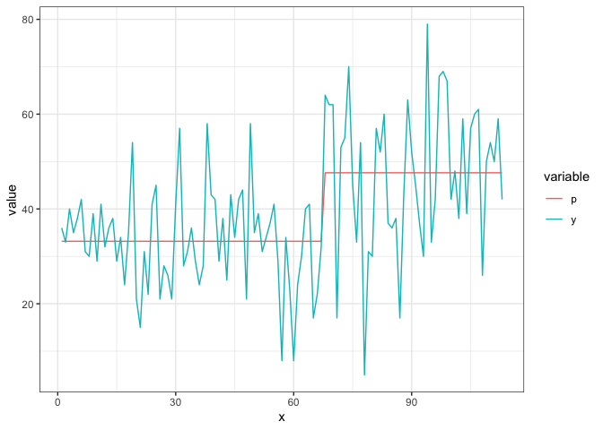
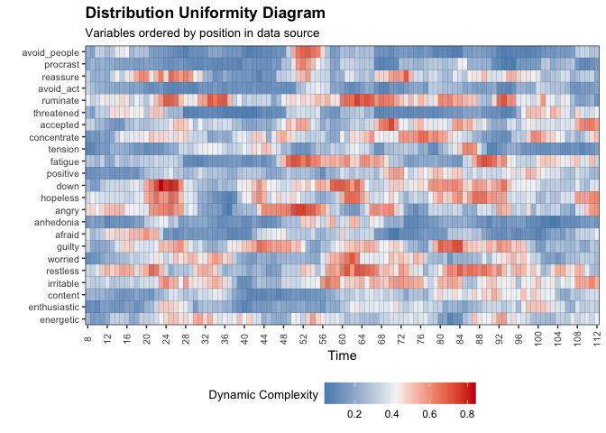
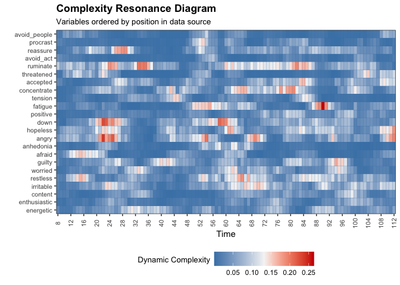
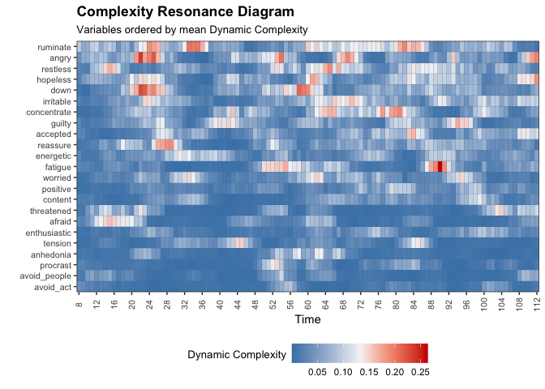
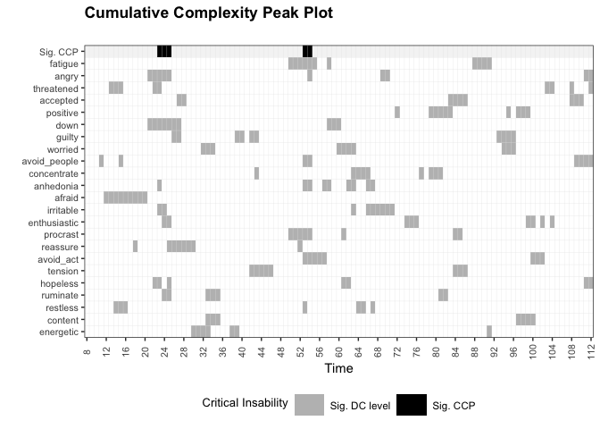
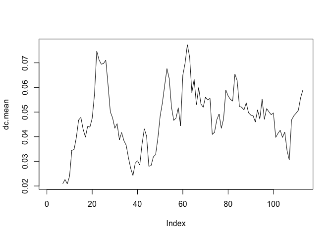
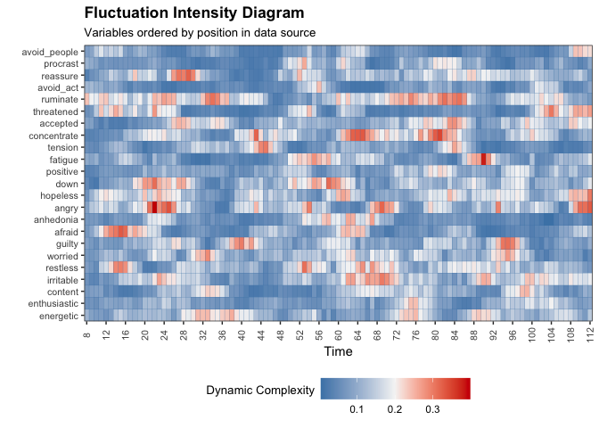

## **Set up**

Make sure that the following packages are installed and loaded.The OSFR package should be installed from GitHub. (you may wish/need to use more packages of course)

```r
library(invctr)
library(casnet)
library(plyr)
library(tidyverse)
```

## **Early Warning Signals in a Clinical Case Study**

Dynamic assessment (e.g. ecological momentary assesment) is increasingly used in the mental health field. Process monitoring with dynamic assessment can empower patients and benefit self-insight (van Os et al., 2017). Additionally, ecological momentary assesment (EMA) time series can be analyzed and the results can be used to inform the treatment process. 

In this assignment, you'll use complex systems theory and methodology developed to analyse fluctuations in rating scale time series to perform a new quantitative case study for real patient data. You'll analyze publicly available EMA data from 1 patient that was drawn from a personalized psychotherapy study (cf. Fisher & Boswell, 2016) and was analysed by several different teams in a 'Many Analysists' study: [*Time to get personal? The impact of researchers’ choices on the selection of treatment targets using the experience sampling methodology*](https://doi.org/10.31234/osf.io/c8vp7) by Bastiaansen et al. (2019). 


### First Steps {-}
Load the data from this study as follows:

```r
data("manyAnalystsESM")
```

Take a look at the dataset. You can learn the meaning of the variable names by looking at the open science framework project page: https://osf.io/h3djy/ 
Also, take a look at the paper by Bastiaansen et al. (2019).

### Data inspection {-}
Let's inspect the data. Run this code, which results in plots of the data with indicated missing values. 

```r
library(imputeTS)
```

```
## Registered S3 method overwritten by 'quantmod':
##   method            from
##   as.zoo.data.frame zoo
```

```r
vars <- c(seq("energetic"%ci%manyAnalystsESM,"procrast"%ci%manyAnalystsESM),"avoid_people"%ci%manyAnalystsESM)


op <- par(mfrow = c(ceiling(length(vars)/4),4),mar =c(2,2,2,2))
l_ply(vars, function(c) imputeTS::ggplot_na_distribution(x = manyAnalystsESM[,c],title =  colnames(manyAnalystsESM)[c],xlab = "",ylab = ""))
par(op)
```


## New dataset {.tabset .tabset-fade .tabset-pills}
As you might have concluded from inspecting the data, it might make sense to split the items 'difficult', 'unsatisfy' and 'hours' from the other items since these three items are measured daily, instead of four times a day. 

### Questions {-}

Create a new dataset (called df.ema) with all EMA items expect the three items named above.  
Omit all missing values, as these will lead to errors in the use of ts_levels and dyn_comp. (Of course, you could and maybe should do time series imputation as well, but we won't do that now). 

### Answers {-}


```r
df.ema <- manyAnalystsESM[, 4:25]
df.ema$avoid_people <- manyAnalystsESM$avoid_people
df.ema <- df.ema[!is.na(df.ema$energetic),]
```

## Phase Transitions and Early-Warning Signals {.tabset .tabset-fade .tabset-pills}

Before we continue, read this short summary of what you've learned about phase transitions and early-warning signals: 

> Change from one attractor to another is called a phase transition. Phase transitions are preceded by a destabilization period in which the stability of the existing state decreases (as a consequence of increasing control parameters). During destabilization, the system loses its resilience to external influences leading to increased fluctuations and disorder in the systems behaviour (critical fluctuations) and an increased return time to the existing state after perturbation (critical slowing down). Destabilization ends abruptly when the system makes a phase transition towards a new stable state. Critical fluctuations and critical slowing down can therefore serve as early-warning signals (EWS) for imminent phase transitions. 
Phase transitions are identified as qualitative changes in the macro-level behaviour of the system by looking at so-called 'collective variables' (Thelen & Ullrich, 1991). As was already explained in the opening lecture of this summerschool, finding the right collective variable to look at for identification of phase transitions can be difficult. In clinical data, a symptom severity measure might be the most sensible collective variable. 
This dataset has no symptom severity measure, but let's use the item 'feeling positive' as collective variable. 'Feeling positive' is of course cleary related to both diagnosis of this patient (major depressive disorder and generalized anxiety disorder) and it provides a nice illustration of a transition, as we will see next...


### Questions {-}

Search for mean-shifts in the item 'feeling positive' using the function ts_levels()

### Answers {-}


```r
lvl <- ts_levels(df.ema$positive, minDataSplit = 12, minLevelDuration = 7, changeSensitivity = 0.05, maxLevels=30, method="anova")

lvl_long <- lvl$pred %>% 
  gather(key=variable, value=value, -x)
  
ggplot(lvl_long, aes(x=x, y=value, colour=variable)) + geom_line() + theme_bw()
```

<!-- -->

## Dynamic Complexity {.tabset .tabset-fade .tabset-pills}

Now it is time to analyze the dynamic complexity of the ESM time series and see if we can find early-warning signals. 

Use `dc_win()` to calculate Dynamic Complexity. The function can also call `plotDC_res()` to produce a *Complexity Resonance Diagram*. Also, the resonance diagrams for only measure D or F can simply be obtained by adding `doPlotF = TRUE` and `doPlotD = TRUE`.

We need to make sure all variables are on the same scale, for this dataset there's no need to transform, all data are on a scale of `0-100`. The arguments `scale_min` and `scale_max` have to be given manually as they refer to the theoretical limits of the scale. If the data contain a mix of known scale ranges, transformation should be done manually.


### Questions {-}

a) Calculate the dynamic complexity of the EMA items using the function `dc_win()` and ask for a plot, set the window size to 16 measurement points (4 days)
b) Plot the dynamic complexity resonance diagram with variables ordered on mean dynamic complexity
c) Calculate cumulative complexity peaks with the function `dc_ccp()` 
d) Make a cumulative complexity peak plot using the function `plotDC_ccp()`
e) Plot the 'dynamic complexity profile', i.e. the time series of the average dynamic complexity of all items 


### Answers {-}


```r
win <- 7 

dc.case <- dc_win(df.ema, win = win, scale_min=0, scale_max=100, doPlot = TRUE, colOrder = TRUE, doPlotF = TRUE, doPlotD = TRUE)
```

```
## Warning: Removed 184 rows containing missing values (geom_raster).
```

```
## Warning: Removed 1 rows containing missing values (geom_vline).
```

<!-- -->

```
## Warning: Removed 184 rows containing missing values (geom_raster).

## Warning: Removed 1 rows containing missing values (geom_vline).
```

<!-- -->

```
## Warning: Removed 184 rows containing missing values (geom_raster).

## Warning: Removed 1 rows containing missing values (geom_vline).
```

<!-- -->

```r
plotDC_res(df_win = dc.case, win = win, doPlot = TRUE, colOrder = NA)
```

```
## Warning: Removed 184 rows containing missing values (geom_raster).

## Warning: Removed 1 rows containing missing values (geom_vline).
```

<!-- -->

```r
ccp.case <- dc_ccp(df_win = dc.case)
plotDC_ccp(df_ccp = ccp.case, win = win, colOrder = NA, title = "Cumulative Complexity Peak Plot")
```

```
## Warning: Removed 54 rows containing missing values (geom_raster).

## Warning: Removed 1 rows containing missing values (geom_vline).
```

<!-- -->

```r
dc.mean <- rowMeans(as.matrix(dc.case))
plot(dc.mean, type='l')
```

<!-- -->


## Dynamic Complexity as an Early-Warning Signal? {.tabset .tabset-fade .tabset-pills}

We can visualize the relation between dynamic complexity and the transition in 'feeling positive' in multiple ways.
   
### Questions {-}

a) Plot the dynamic complexity profile and `feeling positive` (both raw data and levels) in one figure. You can use the code in the answer. 


### Answers {-}

a) Plot the dynamic complexity profile and `feeling positive` (both raw data and levels) in one figure. You can use the code in the answer. 


```r
df.ema$measure <- (1:nrow(df.ema)) #as a time index variable
df.ema$lvl <- lvl$pred$p

df.ema %>% 
  mutate(Level=ts_standardise(lvl),
         CollectiveVariable=ts_standardise(df.ema$positive),
         MeanDC=ts_standardise(dc.mean)) %>% 
  select(measure,CollectiveVariable,MeanDC, Level) %>% 
  gather(key=variable,value=value,-measure) %>%
  ggplot(aes(x=measure, y=value, colour=variable)) + geom_line() + theme_bw()
```

```
## Warning: attributes are not identical across measure variables;
## they will be dropped
```

```
## Warning: Removed 6 row(s) containing missing values (geom_path).
```

<!-- -->


